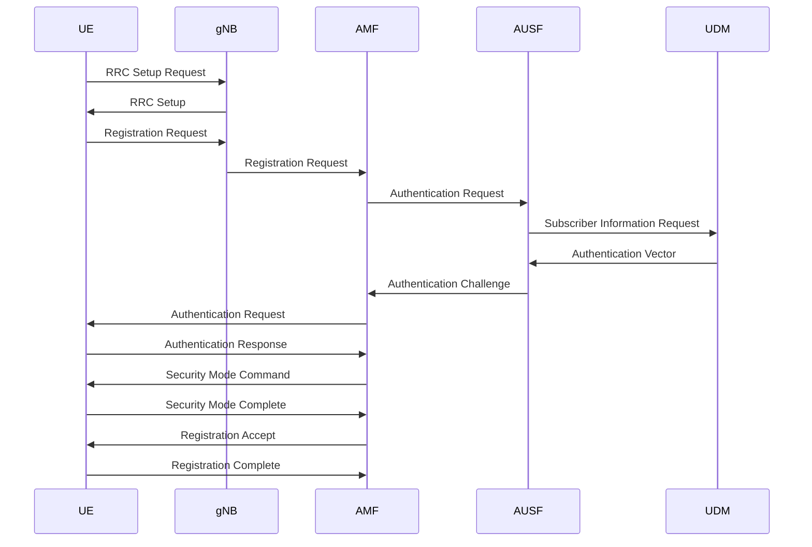
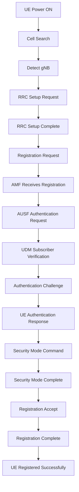

# 5G Registration Procedure

## Objective

The 5G Registration Procedure is the first signaling process executed when a User Equipment (UE) powers on and attempts to connect to a 5G network. Registration allows the network to identify, authenticate, authorize, and manage the mobility of the subscriber.

The registration process involves the following network entities:

* UE (User Equipment)
* gNB (5G Base Station)
* AMF (Access and Mobility Management Function)
* AUSF (Authentication Server Function)
* UDM (Unified Data Management)

---

# Registration Architecture

```text
UE
 ↓
gNB
 ↓
AMF
 ↓
AUSF
 ↓
UDM
```

### Responsibilities

| Entity | Function                              |
| ------ | ------------------------------------- |
| UE     | User device requesting network access |
| gNB    | Radio access node                     |
| AMF    | Registration and mobility management  |
| AUSF   | Authentication                        |
| UDM    | Subscriber database                   |

---

# Registration Procedure Overview

The complete registration process consists of:

1. Cell Search and Synchronization
2. RRC Connection Setup
3. Registration Request
4. Authentication Procedure
5. Security Setup
6. Registration Acceptance
7. Registration Completion

---

# Registration Flow Diagram




---

# Step 1: Cell Search and Synchronization

When the UE powers on:

```text
UE Power ON
       ↓
Search for Cell
       ↓
Detect gNB
```

The UE detects:

* Synchronization Signal Blocks (SSB)
* Physical Cell ID
* System Information

The UE identifies a suitable cell and begins access procedures.

---

# Step 2: RRC Connection Setup

Before registration, a radio connection must be established.

## Message Flow

```text
UE
 ↓
RRC Setup Request
 ↓
gNB

gNB
 ↓
RRC Setup
 ↓
UE
```

Purpose:

* Establish signaling channel
* Enable control-plane communication

---

# Step 3: Registration Request

The UE initiates registration.

## Message Flow

```text
UE
 ↓
Registration Request
 ↓
gNB
 ↓
AMF
```

### Information Included

* SUCI
* Registration Type
* UE Security Capabilities
* Tracking Area Information

---

# What is SUCI?

### SUCI

Subscription Concealed Identifier

In LTE:

```text
IMSI
```

was exposed.

In 5G:

```text
SUCI
```

is transmitted to protect subscriber privacy.

Benefits:

* Improved security
* Subscriber identity protection
* Reduced IMSI attacks

---

# Step 4: Authentication Request

After receiving the registration request:

```text
AMF
 ↓
AUSF
 ↓
UDM
```

The AMF requests authentication data.

---

## Authentication Architecture

```text
UE
 ↓
AMF
 ↓
AUSF
 ↓
UDM
```

---

# Step 5: Authentication Vector Generation

The UDM generates:

* RAND
* AUTN
* Expected Response

and sends authentication vectors to AUSF.

```text
UDM
 ↓
Authentication Vector
 ↓
AUSF
 ↓
AMF
```

---

# Step 6: Authentication Challenge

The network challenges the UE.

```text
AMF
 ↓
Authentication Request
 ↓
UE
```

The UE computes:

```text
Authentication Response
```

using SIM credentials.

---

# Step 7: Authentication Response

The UE responds.

```text
UE
 ↓
Authentication Response
 ↓
AMF
```

The response is verified by AUSF.

If successful:

```text
Authentication Successful
```

---

# Step 8: Security Mode Command

After successful authentication:

```text
AMF
 ↓
Security Mode Command
 ↓
UE
```

Purpose:

* Activate encryption
* Activate integrity protection

---

# Step 9: Security Mode Complete

The UE confirms:

```text
UE
 ↓
Security Mode Complete
 ↓
AMF
```

Now secure communication is enabled.

---

# Step 10: Registration Accept

The network accepts the UE.

```text
AMF
 ↓
Registration Accept
 ↓
UE
```

The UE receives:

* Registration confirmation
* Mobility parameters
* Tracking area information

---

# Step 11: Registration Complete

Final confirmation.

```text
UE
 ↓
Registration Complete
 ↓
AMF
```

The UE is now registered.

---

# Complete Registration State

```text
UE Registered
      ↓
Authenticated
      ↓
Secure Connection Established
      ↓
Mobility Managed
```

However:

```text
No Internet Yet
```

The UE still requires:

```text
PDU Session Establishment
```

for data connectivity.

---

# Detailed Registration Message Flow



---

# AMF Role During Registration

### Responsibilities

* User registration
* Mobility management
* Reachability management
* Connection management
* Security coordination

### Key Point

AMF is the central controller of the registration process.

---

# AUSF Role During Registration

### Responsibilities

* Subscriber authentication
* Security verification
* Authentication challenge generation

### Key Point

AUSF ensures only legitimate users access the network.

---

# UDM Role During Registration

### Responsibilities

* Store subscriber profiles
* Store authentication credentials
* Store subscription information

### Key Point

UDM acts as the subscriber database.

---

# Registration Performance Metrics

Important KPIs:

| KPI                         | Typical Target |
| --------------------------- | -------------- |
| Registration Success Rate   | > 99%          |
| Authentication Success Rate | > 99%          |
| Registration Latency        | < 100 ms       |
| Security Setup Time         | < 50 ms        |

---

# Registration Failure Scenarios

## Authentication Failure

Causes:

* Invalid SIM
* Incorrect credentials

Result:

```text
Registration Rejected
```

---

## Radio Failure

Causes:

* Weak signal
* Poor coverage

Result:

```text
RRC Setup Failure
```

---

## Core Network Failure

Causes:

* AMF unavailable
* AUSF unavailable
* UDM unavailable

Result:

```text
Registration Timeout
```

---

# Relevance to IOS-MCN and OpenAirInterface

During IOS-MCN deployment, registration is the first successful milestone.

Typical OAI logs show:

```text
Registration Request
Authentication Request
Authentication Response
Security Mode Command
Registration Accept
Registration Complete
```

If registration succeeds:

```text
UE Attached Successfully
```

The next step is:

```text
PDU Session Establishment
```

which enables Internet connectivity.

---

# Key Takeaways

1. Registration is the first procedure executed when a UE joins a 5G network.
2. AMF coordinates the registration process.
3. AUSF performs subscriber authentication.
4. UDM stores subscriber information.
5. Security is established before network access is granted.
6. Registration success does not provide Internet access.
7. PDU Session Establishment is required after registration.
8. Registration is one of the first procedures verified in IOS-MCN and OpenAirInterface deployments.
