# E2AP and E2SM-KPM Study

## Objective

This document provides an in-depth study of the E2 Interface used in O-RAN architecture, focusing on:

* E2 Interface
* E2AP Protocol
* E2SM Service Models
* E2SM-KPM
* KPI Collection
* RIC Subscriptions
* RIC Indications
* Performance Monitoring
* MAC Layer Telemetry
* RIS-Assisted KPI Optimization

This study forms the foundation for:

* O-RAN Deployment
* Near-RT RIC Development
* xApp Development
* KPI Analytics
* RIS-Assisted Scheduling Research
* AI-Native RAN Optimization

---

# 1. O-RAN Architecture Overview

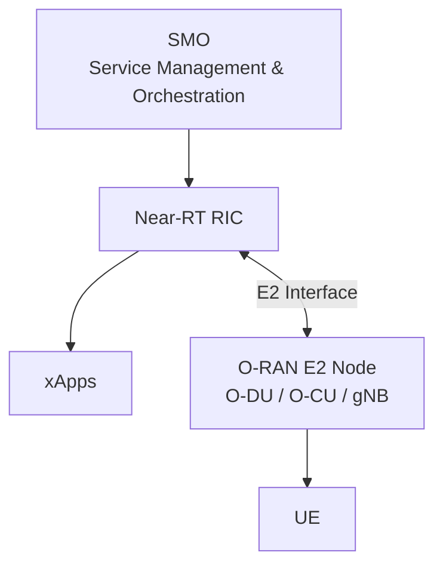

The E2 Interface is the primary communication channel between:

* Near-RT RIC
* O-RAN E2 Node

---

# 2. What is the E2 Interface?

The E2 Interface connects:

```text
Near-RT RIC
        ↔
   O-RAN Node
```

Purpose:

* KPI Monitoring
* Performance Reporting
* AI-based Optimization
* RAN Control
* Traffic Steering
* Load Balancing
* Beam Management

Without E2:

```text
RIC cannot observe network behavior
```

With E2:

```text
RIC receives live telemetry
RIC sends optimization decisions
```

---

# 3. E2 Interface Architecture

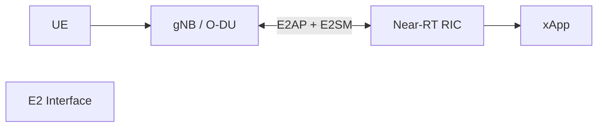

---

# 4. What is E2AP?

## Full Form

E2AP = E2 Application Protocol

E2AP defines:

```text
RIC ↔ E2 Node Communication Rules
```

It provides:

* Session establishment
* Subscription management
* Indication delivery
* Control procedures
* Error handling

---

# 5. Responsibilities of E2AP

E2AP manages:

### E2 Setup

```text
Node Registration
```

### Subscription Management

```text
KPI Requests
```

### Indication Delivery

```text
Measurement Reports
```

### Control Messaging

```text
RIC Commands
```

### Error Handling

```text
Failure Recovery
```

---

# 6. E2AP Protocol Stack

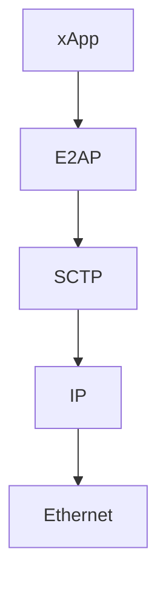

Transport protocol:

```text
SCTP
```

Same transport used by:

```text
NGAP
```

between:

```text
gNB ↔ AMF
```

---

# 7. E2 Setup Procedure

Before KPI collection starts:

```text
RIC
and
E2 Node

must connect
```

Procedure:

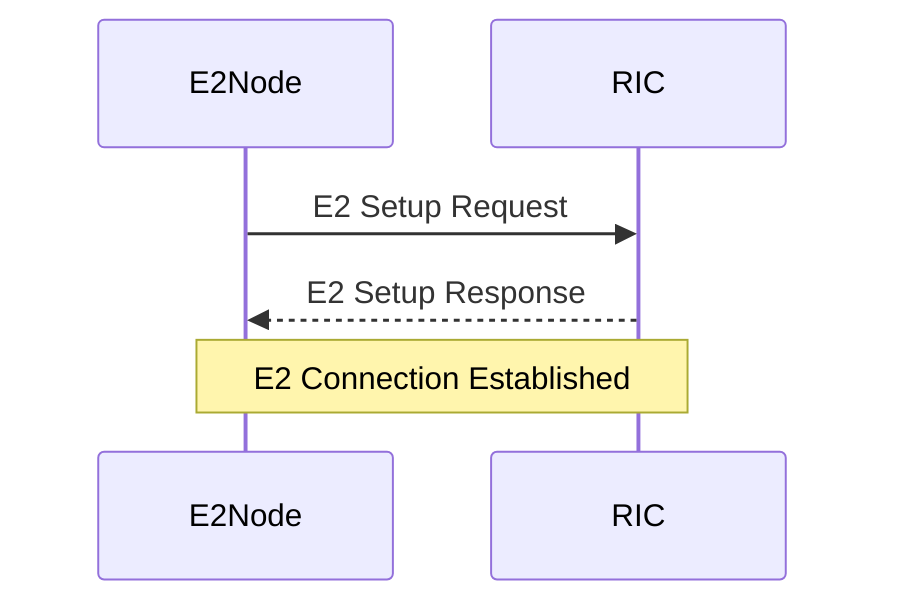

Result:

```text
E2 Association Active
```

---

# 8. What is E2SM?

## Full Form

E2SM = E2 Service Model

E2AP defines:

```text
HOW communication occurs
```

E2SM defines:

```text
WHAT information is exchanged
```

Examples:

* E2SM-KPM
* E2SM-RC
* E2SM-NI
* E2SM-CCC

---

# 9. E2SM Family

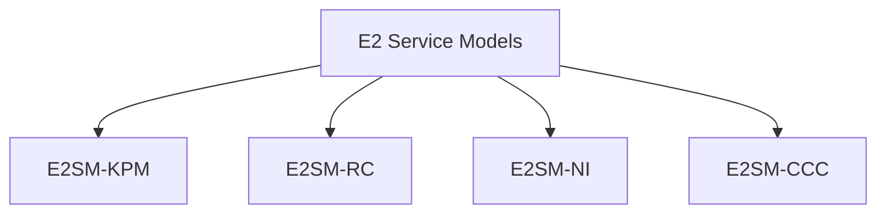

---

# 10. What is E2SM-KPM?

## Full Form

E2SM-KPM = E2 Service Model – Key Performance Measurement

Purpose:

Collect:

```text
Network KPIs
```

and send them to:

```text
Near-RT RIC
```

---

# 11. What are KPIs?

KPI = Key Performance Indicator

Examples:

| KPI          | Description                |
| ------------ | -------------------------- |
| Throughput   | Data rate                  |
| CQI          | Channel Quality            |
| PRB Usage    | Resource utilization       |
| SINR         | Signal quality             |
| Latency      | Delay                      |
| Packet Loss  | Reliability                |
| MCS          | Modulation efficiency      |
| HARQ Success | Retransmission performance |

---

# 12. KPI Collection Flow

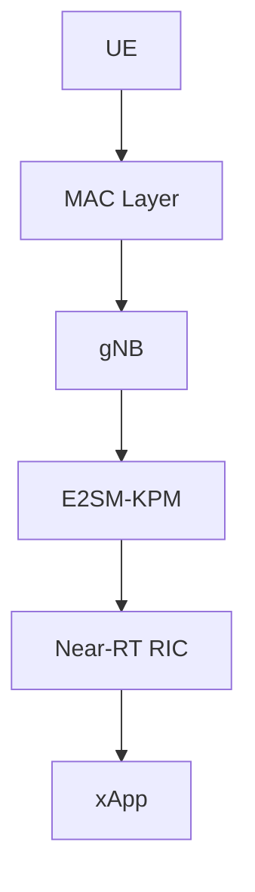

---

# 13. RIC Subscription Procedure

An xApp requests KPIs through a subscription.

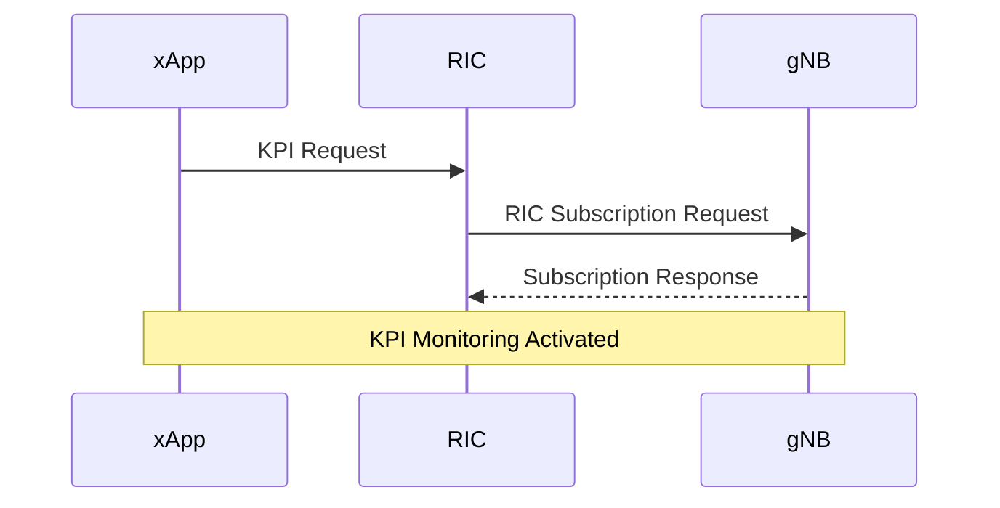

---

# 14. RIC Indication Procedure

After subscription:

```text
gNB continuously reports metrics
```

Flow:

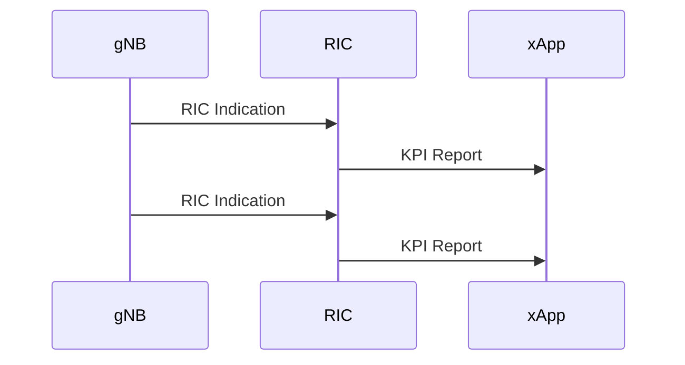

---

# 15. Example KPI Report

```text
CQI = 13

PRB Usage = 72%

Throughput = 145 Mbps

Latency = 7 ms

MCS = 24
```

These values become inputs for:

```text
AI Optimization
```

---

# 16. Relation to MAC Layer

E2SM-KPM heavily relies on MAC Layer metrics.

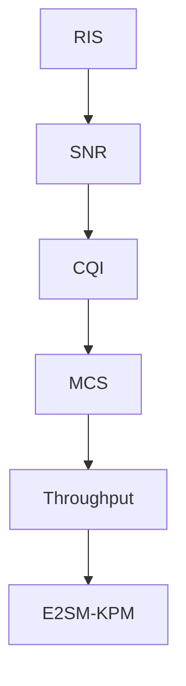

---

# 17. RIS and KPI Improvement

RIS modifies:

```text
Wireless Channel
```

Result:

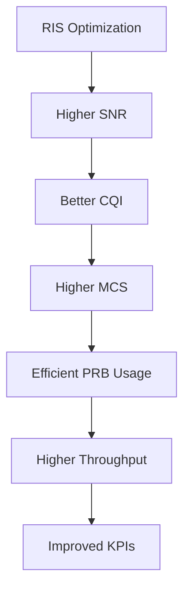

---

# 18. Future RIS-Aware xApp

Future architecture:

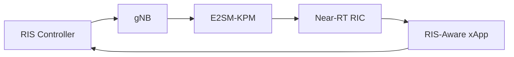

The xApp can:

* Monitor CQI
* Monitor Throughput
* Detect weak coverage
* Adjust RIS configuration
* Improve network performance

---

# 19. Interview Questions

### What is E2AP?

Protocol that manages communication between Near-RT RIC and E2 Nodes.

### What is E2SM?

Service model defining what information is exchanged over E2.

### What is E2SM-KPM?

Service model used for KPI monitoring and performance reporting.

### What is a KPI?

A measurable network performance metric.

### What is a RIC Subscription?

A request to receive KPI reports from an E2 Node.

### What is a RIC Indication?

A KPI report sent from the E2 Node to the RIC.

### Why is E2SM-KPM important?

It provides real-time telemetry for AI-based RAN optimization.

### How is RIS related?

RIS improves channel quality, which improves KPIs reported through E2SM-KPM.

---

# Conclusion

The E2 Interface is the intelligence bridge between the Near-RT RIC and O-RAN network elements. E2AP provides the communication framework, while E2SM-KPM delivers real-time performance metrics such as CQI, PRB utilization, MCS, latency, and throughput. These KPIs enable xApps to perform AI-driven optimization, making E2SM-KPM a critical component for future RIS-assisted and AI-native 6G networks.
