# E2SM-RC Study

## E2 Service Model – RAN Control

---

# Objective

This document provides a comprehensive study of:

* E2SM-RC
* RAN Control Architecture
* Near-RT RIC Control Framework
* RIC Control Messages
* xApp-Based Optimization
* Policy Control
* Resource Management
* Mobility Control
* QoS Optimization
* RIS-Aware Control

This study extends the E2SM-KPM study.

Relationship:

```text
E2SM-KPM = Monitoring

E2SM-RC = Control
```

Together they form the complete O-RAN closed-loop optimization framework.

---

# 1. O-RAN Control Framework

In O-RAN:

```text
Network Monitoring
         +
Network Control
```

enables:

```text
AI-Native Optimization
```

---

# 2. O-RAN Architecture

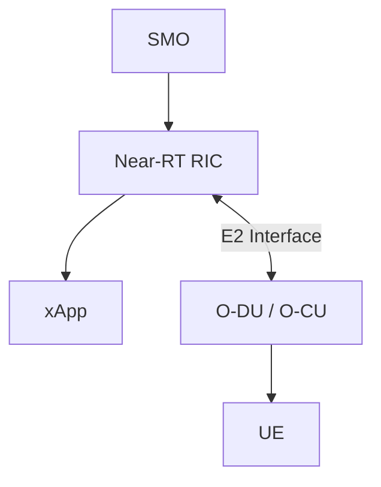

---

# 3. What is E2SM-RC?

## Full Form

E2SM-RC

= E2 Service Model – RAN Control

Purpose:

```text
Control Network Behaviour
```

through:

```text
Near-RT RIC
```

---

# 4. Why E2SM-RC Exists

E2SM-KPM only provides:

```text
Observability
```

Example:

```text
CQI = 5

Throughput = 10 Mbps
```

The network knows a problem exists.

However:

```text
How should the network react?
```

E2SM-RC provides the answer.

---

# 5. Monitoring vs Control

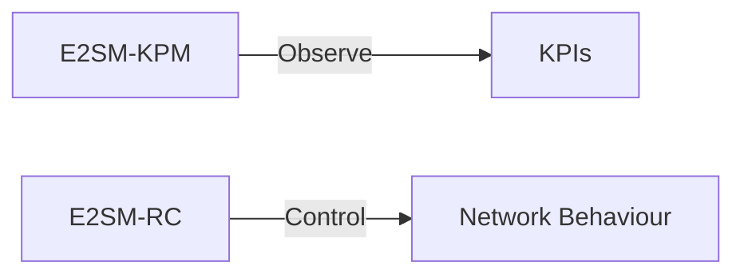

---

# 6. E2SM-RC Architecture

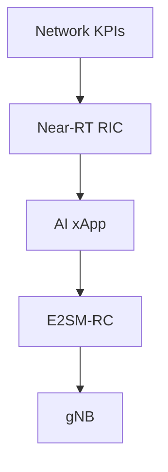

---

# 7. Role of E2SM-RC

E2SM-RC enables:

* Resource allocation
* QoS control
* Mobility optimization
* Traffic steering
* Admission control
* Beam management
* Energy optimization

---

# 8. RAN Control Categories

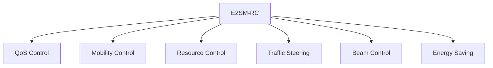

---

# 9. Resource Control

Resource Control manages:

```text
PRBs
Scheduling
Bandwidth
Cell Capacity
```

Example:

```text
Cell A = Congested

Cell B = Underutilized
```

The xApp can redistribute resources.

---

# 10. Mobility Control

Mobility Control manages:

```text
Handover Decisions
Cell Reselection
Load Balancing
```

---

# 11. Traffic Steering

Traffic Steering allows:

```text
Move Users
from
Congested Cell

to

Less Loaded Cell
```

---

# 12. QoS Control

QoS Control optimizes:

```text
Latency
Throughput
Reliability
```

Examples:

| Application        | Priority |
| ------------------ | -------- |
| VoIP               | High     |
| Video              | Medium   |
| Web Browsing       | Medium   |
| Background Traffic | Low      |

---

# 13. Beam Management

Beam Management controls:

```text
Beam Selection
Beam Switching
Beam Refinement
```

---

# 14. E2SM-RC Procedure

Step 1

KPIs collected.

---

Step 2

xApp analyzes network.

---

Step 3

Decision generated.

---

Step 4

RIC Control Request sent.

---

Step 5

gNB applies policy.

---

# 15. E2SM-RC Workflow

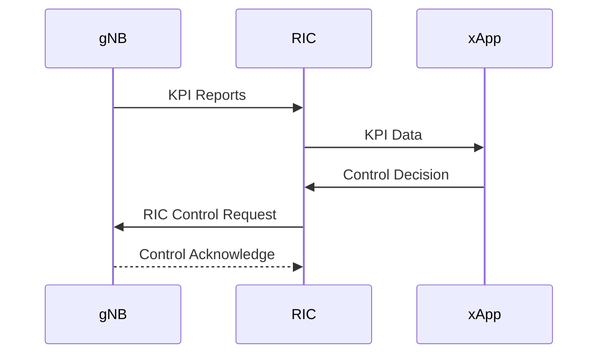

---

# 16. RIC Control Message

E2SM-RC uses:

```text
RIC Control Request
```

to deliver:

```text
Policies
Actions
Commands
```

---

# 17. Closed-Loop Optimization

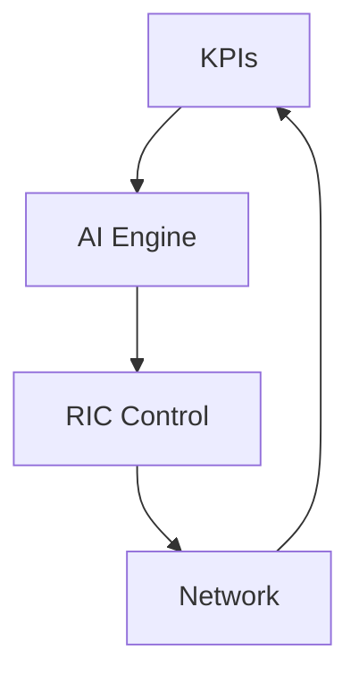

---

# 18. Relation with E2AP

E2AP provides:

```text
Communication Framework
```

E2SM-RC provides:

```text
Control Semantics
```

Together:

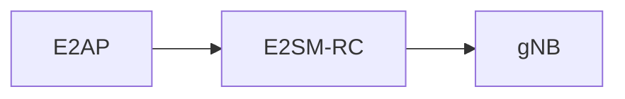

---

# 19. Relation with E2SM-KPM

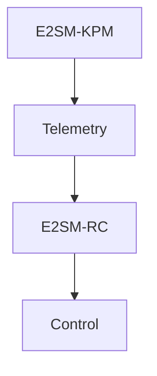

---

# 20. Example Throughput Optimization

Before:

```text
CQI = 4

MCS = 6

Throughput = 12 Mbps
```

KPM reports problem.

---

AI detects issue.

---

RC sends:

```text
Scheduling Optimization
```

---

After:

```text
CQI = 10

MCS = 18

Throughput = 75 Mbps
```

---

# 21. RIS Integration

RIS can become a controllable network element.

Future Architecture:

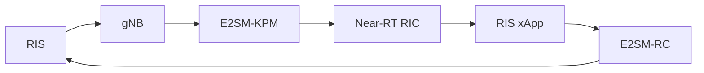

---

# 22. RIS-Aware Control Loop

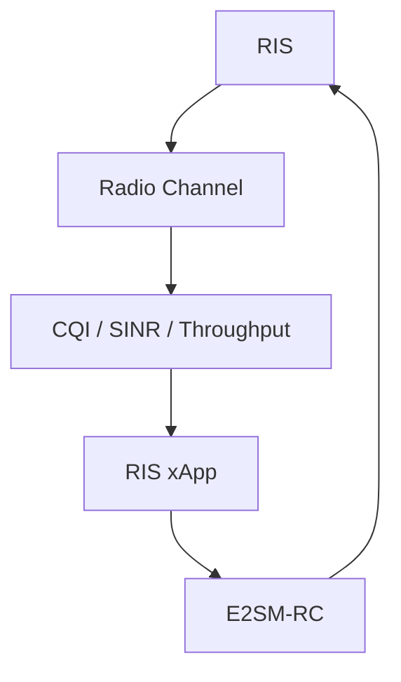

---

# 23. Future AI-Based RIC

Inputs:

```text
CQI
SINR
PRB Usage
MCS
Throughput
Latency
```

Outputs:

```text
RIS Configuration
Beam Selection
Scheduler Policy
Power Optimization
```

---

# 24. Reinforcement Learning Control

State:

```text
CQI
SINR
Traffic Load
```

Action:

```text
Control Policy
```

Reward:

```text
Higher Throughput
Lower Latency
Better Coverage
```

---

# 25. Research Vision

Future architecture:

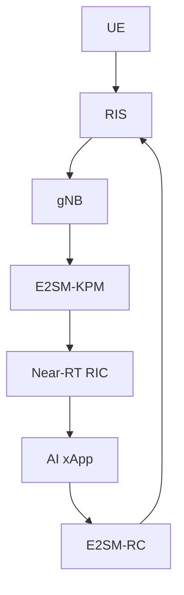

This creates:

```text
AI-Native Closed-Loop Optimization
```

---

# 26. Relation to Your Internship

Current Progress:

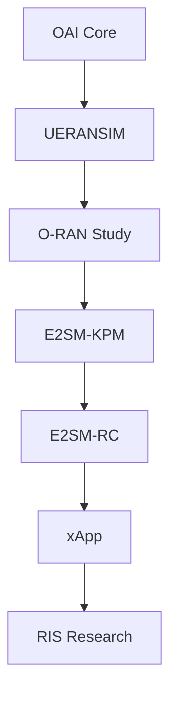

---

# Mentor Discussion Questions

### What is E2SM-RC?

A service model that enables Near-RT RIC to control network behaviour.

### What is the difference between KPM and RC?

KPM collects KPI measurements.

RC sends control actions.

### What can E2SM-RC control?

Resources, mobility, QoS, beam management, traffic steering, and future RIS configurations.

### Why is E2SM-RC important?

It converts AI decisions into actual network actions.

### How does RIS relate to E2SM-RC?

A RIS-aware xApp can use E2SM-RC to dynamically modify RIS configurations.

---

# Conclusion

E2SM-RC is the control counterpart of E2SM-KPM in O-RAN. While E2SM-KPM provides real-time network telemetry, E2SM-RC enables intelligent control actions that optimize network behaviour. Together, they form the foundation of AI-native RAN optimization. In future RIS-assisted 6G networks, E2SM-RC will allow RIS-aware xApps to dynamically reconfigure the radio environment, creating autonomous and self-optimizing wireless systems.
