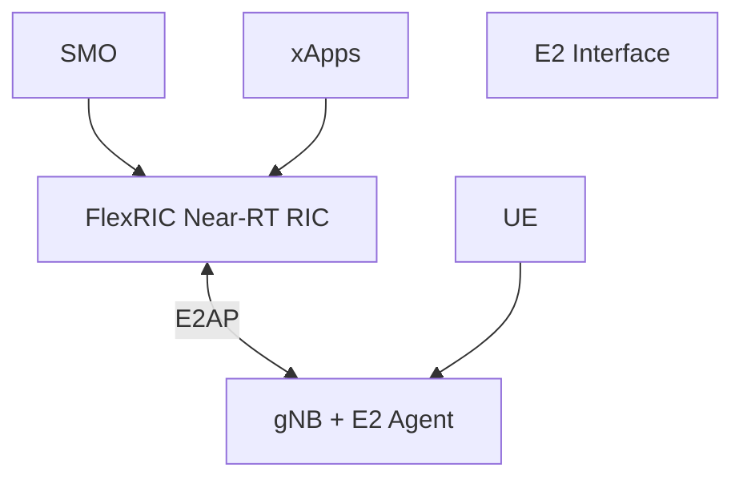
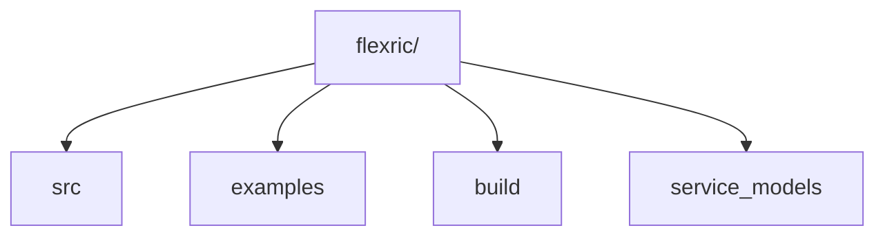
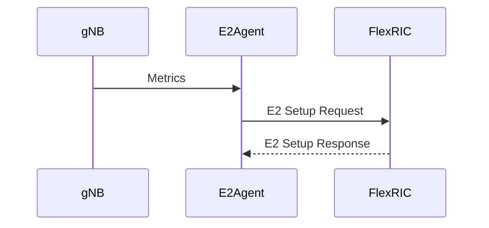
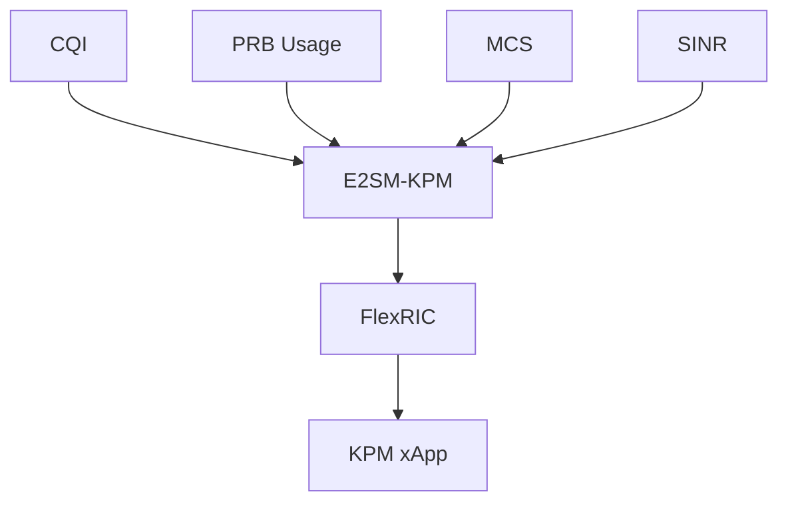
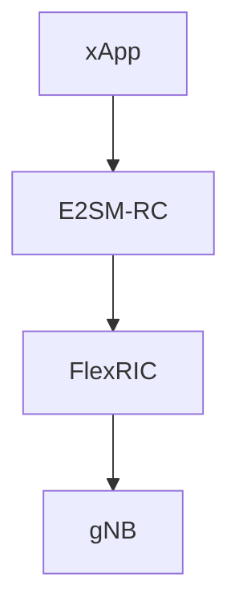
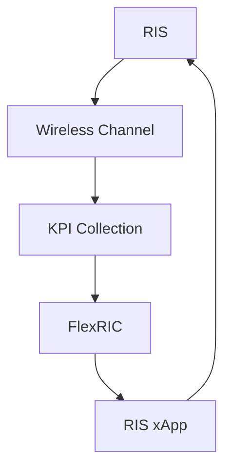
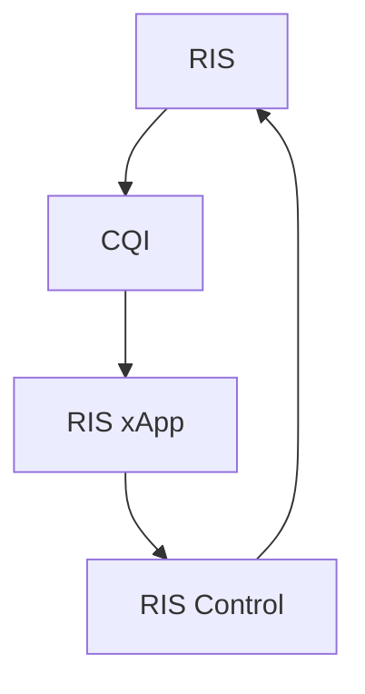
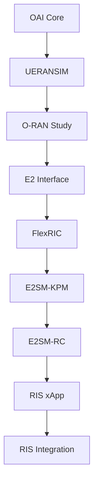

# FlexRIC Installation Guide

## Near-RT RIC Deployment for O-RAN Research

---

# Objective

This document provides a complete guide for installing and understanding FlexRIC, an open-source Near-Real-Time RAN Intelligent Controller (Near-RT RIC) used for O-RAN research.

This installation is the next step after:

```text
OAI Core Deployment
        ↓
UERANSIM Deployment
        ↓
5G SA Registration
        ↓
O-RAN Architecture Study
        ↓
E2 Interface Study
        ↓
FlexRIC Deployment
```

The ultimate goal is:

```text
FlexRIC
    ↓
xApps
    ↓
RIS-Aware xApps
    ↓
AI-Native O-RAN
```

---

# 1. What is FlexRIC?

FlexRIC is an open-source implementation of:

```text
Near-Real-Time RAN Intelligent Controller
```

defined by:

```text
O-RAN Alliance
```

Purpose:

* KPI Collection
* Network Monitoring
* RAN Control
* xApp Development
* AI Integration

---

# 2. FlexRIC Architecture



---

# 3. FlexRIC Components

## Near-RT RIC

Responsible for:

* KPI Collection
* Policy Management
* RAN Optimization

---

## xApps

Applications running inside RIC.

Examples:

* KPM Monitoring xApp
* QoS xApp
* Traffic Steering xApp
* RIS xApp

---

## E2 Agent

Runs inside:

```text
gNB
```

Purpose:

```text
Connect gNB to RIC
```

---

# 4. Supported Interfaces

| Interface | Purpose                 |
| --------- | ----------------------- |
| E2AP      | RIC ↔ gNB Communication |
| E2SM-KPM  | KPI Monitoring          |
| E2SM-RC   | RAN Control             |
| A1        | Policy Management       |
| O1        | Management Interface    |

---

# 5. System Requirements

Recommended:

```text
Ubuntu 22.04
```

Minimum:

```text
8 GB RAM
```

Recommended:

```text
16 GB RAM
```

CPU:

```text
4 Cores+
```

Storage:

```text
20 GB Free Space
```

---

# 6. Install Dependencies

Update system:

```bash
sudo apt update
sudo apt upgrade -y
```

Install build tools:

```bash
sudo apt install -y \
git \
cmake \
make \
gcc \
g++ \
libsctp-dev \
libpcre2-dev \
libssl-dev \
libcurl4-openssl-dev \
protobuf-compiler \
libprotobuf-dev \
pkg-config
```

Verify:

```bash
gcc --version
cmake --version
```

---

# 7. Create Research Folder

```bash
mkdir -p ~/Research/FlexRIC
cd ~/Research/FlexRIC
```

---

# 8. Clone FlexRIC

```bash
git clone https://github.com/openaicellular/flexric.git
```

Move inside:

```bash
cd flexric
```

Verify:

```bash
ls
```

Expected:

```text
src
examples
multiRAT
README.md
CMakeLists.txt
```

---

# 9. FlexRIC Source Tree



---

# 10. Create Build Directory

```bash
mkdir build
cd build
```

---

# 11. Configure Build

```bash
cmake ..
```

Expected:

```text
Configuring done
Generating done
Build files written
```

---

# 12. Compile FlexRIC

```bash
make -j$(nproc)
```

Compilation may take:

```text
5–15 minutes
```

---

# 13. Verify Build

Check binaries:

```bash
find . -type f | grep ric
```

Expected:

```text
nearRT-RIC
```

---

# 14. Install FlexRIC

```bash
sudo make install
```

Expected:

```text
Installation completed
```

---

# 15. Verify Installation

```bash
which nearRT-RIC
```

or

```bash
find /usr -name "*RIC*"
```

---

# 16. FlexRIC Runtime Architecture


---

# 17. Running Near-RT RIC

Move:

```bash
cd ~/Research/FlexRIC/flexric/build
```

Run:

```bash
./nearRT-RIC
```

Expected:

```text
RIC Started
Waiting for E2 Connections
```

---

# 18. E2 Connection Flow



---

# 19. KPI Collection Workflow



---

# 20. Control Workflow



---

# 21. FlexRIC and RIS

Future Architecture:



---

# 22. RIS Optimization Loop



---

# 23. Current Research Position

Completed:

```text
✓ OAI Core

✓ AMF

✓ SMF

✓ UPF

✓ UERANSIM gNB

✓ UERANSIM UE

✓ NG Setup

✓ UE Registration

✓ PDU Session
```

Current Stage:

```text
FlexRIC Installation
```

---

# 24. Research Roadmap



---

# Mentor Discussion Questions

### What is FlexRIC?

An open-source Near-RT RIC implementation.

### Why is FlexRIC important?

It enables programmable and AI-controlled RANs.

### What is E2AP?

The protocol used between RIC and gNB.

### What is E2SM-KPM?

KPI reporting service model.

### What is E2SM-RC?

RAN control service model.

### What is an xApp?

A microservice running inside the Near-RT RIC.

### Why is FlexRIC useful for RIS?

It enables RIS-aware xApps that can optimize radio propagation using real-time KPIs.

---

# Conclusion

FlexRIC is the practical implementation of the O-RAN Near-RT RIC. It enables KPI monitoring, intelligent control, AI-driven optimization, and xApp development through E2AP, E2SM-KPM, and E2SM-RC. After successful OAI and UERANSIM deployment, FlexRIC becomes the next critical step toward building RIS-aware xApps and AI-native O-RAN systems for future 6G networks.
