# FlexRIC Study

## Open RAN Near-RT RIC Platform for xApp Development

---

# Objective

This document provides a comprehensive study of:

* FlexRIC Architecture
* Near-RT RIC Concepts
* E2 Interface
* E2AP Protocol
* E2SM-KPM
* E2SM-RC
* xApps
* RAN Intelligent Control
* KPI Collection
* RIS-Aware xApps
* AI-Native O-RAN Research

This study forms the practical bridge between:

```text
O-RAN Theory
        ↓
Near-RT RIC
        ↓
FlexRIC
        ↓
xApp Development
        ↓
RIS-Aware xApps
```

---

# 1. What is FlexRIC?

FlexRIC is an open-source implementation of the:

```text
Near-Real-Time RAN Intelligent Controller
```

defined by O-RAN Alliance.

Purpose:

```text
Collect KPIs
Analyze Network State
Control RAN Behavior
```

using:

```text
E2 Interface
```

---

# 2. Why FlexRIC?

Traditional RAN:

```text
UE
 ↓
gNB
 ↓
5G Core
```

Decision making:

```text
Inside gNB only
```

No AI.

No external control.

---

FlexRIC introduces:

```text
External Intelligence
```

through:

```text
Near-RT RIC
```

---

# 3. FlexRIC in O-RAN Architecture

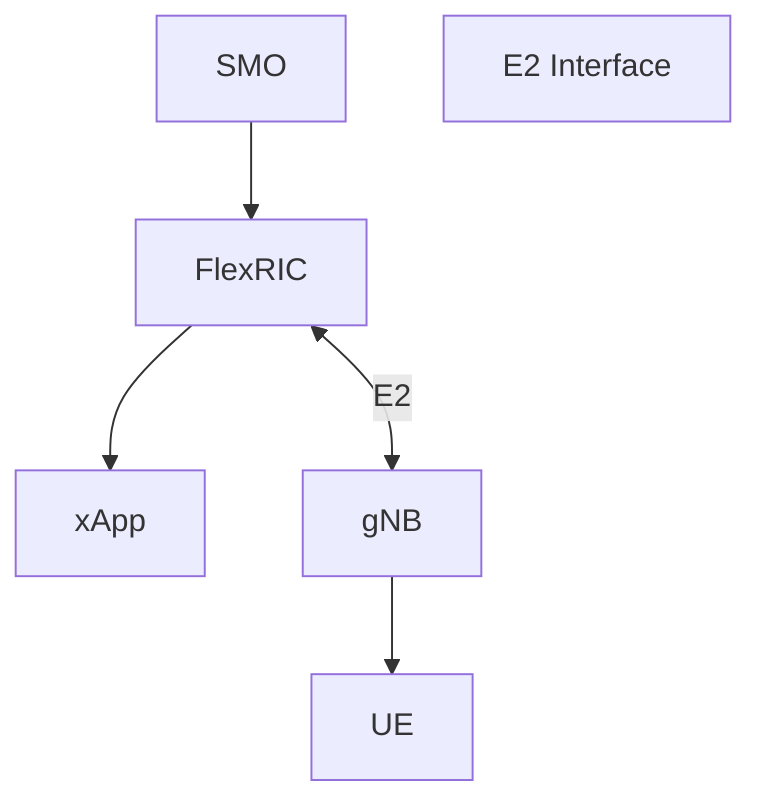

---

# 4. Position of FlexRIC

FlexRIC operates between:

```text
SMO
and
gNB
```

Architecture:

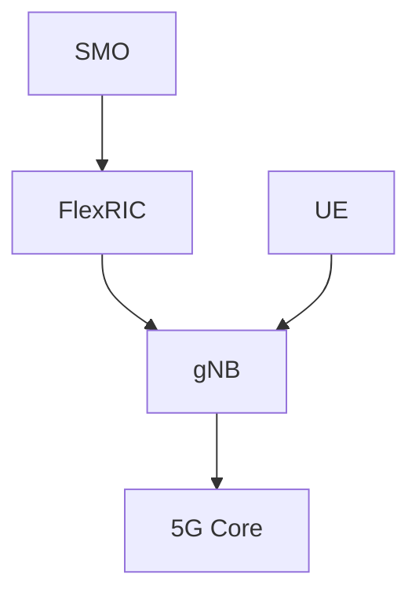

---

# 5. Main Components

FlexRIC consists of:

```text
Near-RT RIC
xApps
E2 Agent
Service Models
```

---

# 6. FlexRIC Architecture

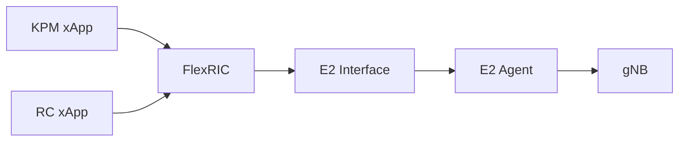

---

# 7. FlexRIC Components Explained

## Near-RT RIC

Responsible for:

```text
Control
Monitoring
Policy Decisions
```

Time scale:

```text
10 ms
to
1 second
```

---

## xApps

Small applications running inside RIC.

Examples:

```text
QoS Optimization
Traffic Steering
RIS Optimization
Scheduler Optimization
```

---

## E2 Agent

Runs inside:

```text
gNB
```

Acts as:

```text
RIC Gateway
```

---

# 8. What is an E2 Agent?

The E2 Agent:

```text
Collects KPIs
Receives Commands
Communicates with RIC
```

---

Architecture:


---

# 9. Supported Service Models

FlexRIC supports:

| Service Model | Purpose               |
| ------------- | --------------------- |
| E2SM-KPM      | KPI Monitoring        |
| E2SM-RC       | RAN Control           |
| E2SM-NI       | Network Information   |
| E2SM-GTP      | User Plane Monitoring |

---

# 10. E2SM-KPM in FlexRIC

Purpose:

```text
Monitor Network KPIs
```

Examples:

```text
CQI
PRB Usage
MCS
SINR
Throughput
Latency
```

---

# 11. KPI Collection Flow

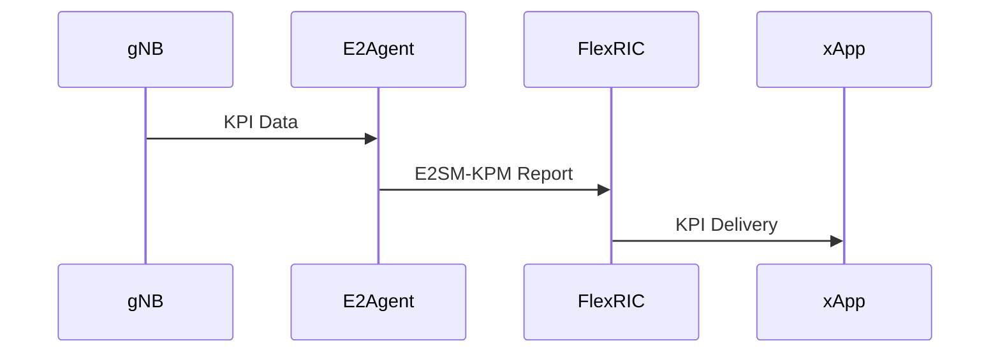

---

# 12. E2SM-RC in FlexRIC

Purpose:

```text
Control Network
```

Examples:

```text
Traffic Steering

QoS Policies

Scheduler Policies

Resource Allocation
```

---

# 13. Control Flow

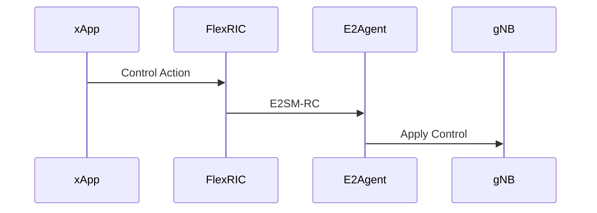

---

# 14. FlexRIC Closed Loop

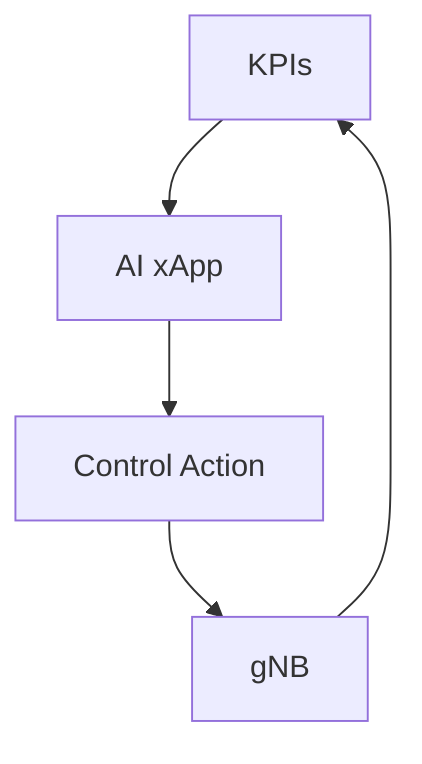

---

# 15. What is an xApp?

An xApp is:

```text
Microservice Application
```

running inside:

```text
Near-RT RIC
```

---

# 16. Examples of xApps

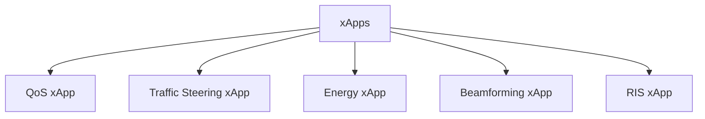

---

# 17. RIS-Aware xApp Concept

Future architecture:

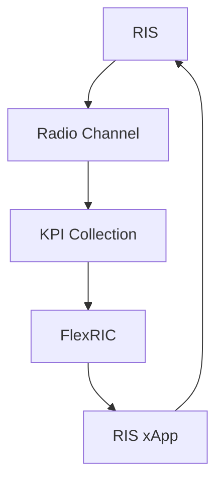

---

# 18. RIS-Aware Control Loop

Step 1:

RIS modifies propagation.

---

Step 2:

Network KPIs collected.

---

Step 3:

KPM sends measurements.

---

Step 4:

RIS xApp analyzes.

---

Step 5:

New RIS configuration generated.

---

Step 6:

Control command sent.

---

# 19. AI in FlexRIC

Inputs:

```text
CQI
SINR
PRB Utilization
Traffic Load
```

Outputs:

```text
RIS Phase Control

Beam Selection

Scheduling Policies

QoS Policies
```

---

# 20. Reinforcement Learning xApp

State:

```text
CQI
SINR
Throughput
```

Action:

```text
RIS Configuration
```

Reward:

```text
Higher Throughput
Lower Latency
Better Coverage
```

---

# 21. FlexRIC and OAI

Future deployment:

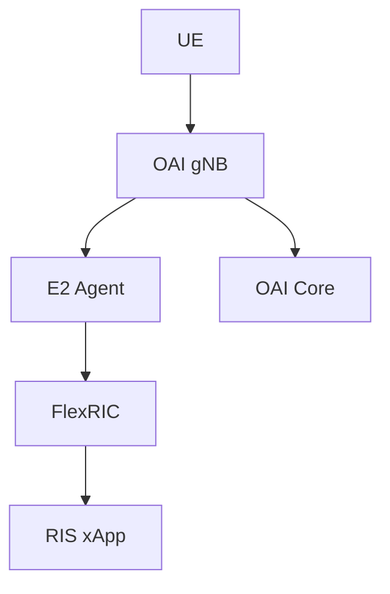

---

# 22. FlexRIC and UERANSIM

Current Study Path:

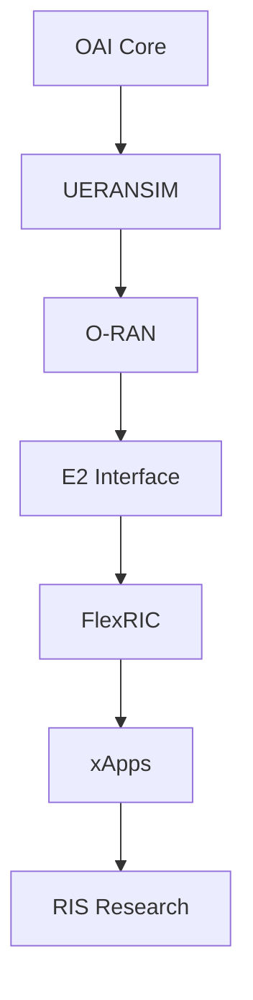

---

# 23. Why FlexRIC Matters

Without FlexRIC:

```text
Static Network
```

With FlexRIC:

```text
Programmable Network
```

With AI xApps:

```text
Self-Optimizing Network
```

---

# 24. Relation to Your Internship

Current Achievement:

```text
✓ OAI Core Running

✓ AMF Connected

✓ UERANSIM gNB Connected

✓ UE Registered

✓ PDU Session Established

✓ 5G SA Demo Completed
```

Next Research Stage:

```text
FlexRIC
```

---

# 25. Research Roadmap

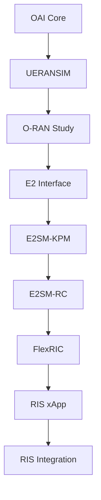

---

# Mentor Discussion Questions

### What is FlexRIC?

An open-source Near-RT RIC implementation for O-RAN research.

### What does FlexRIC do?

Collects KPIs and controls RAN behavior through xApps.

### What is an xApp?

An application running inside Near-RT RIC.

### What is the role of E2 Agent?

Connects the gNB to the RIC using E2AP.

### Why is FlexRIC important?

It enables programmable and AI-native radio networks.

### How does FlexRIC relate to RIS?

RIS-aware xApps can dynamically optimize RIS configurations using network KPIs.

---

# Conclusion

FlexRIC is one of the most important open-source O-RAN platforms because it provides a practical implementation of the Near-RT RIC. Through E2AP, E2SM-KPM, and E2SM-RC, FlexRIC enables KPI collection, intelligent decision-making, and real-time network control. It serves as the ideal platform for developing RIS-aware xApps and AI-native optimization algorithms for future 6G networks.
