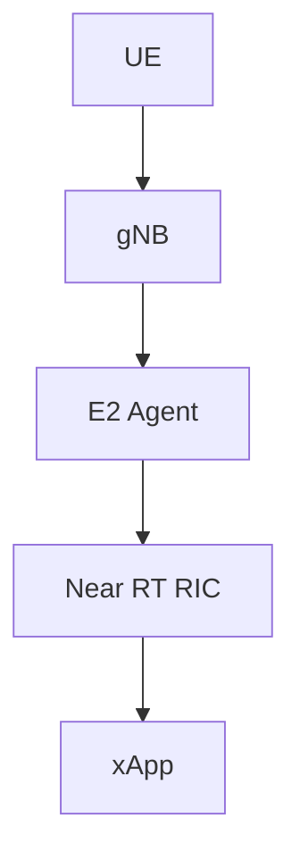
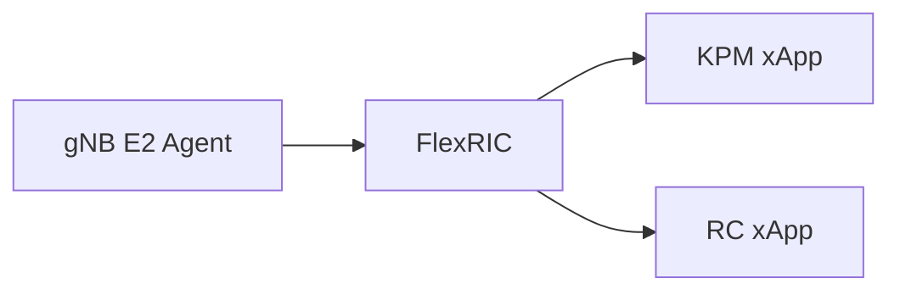
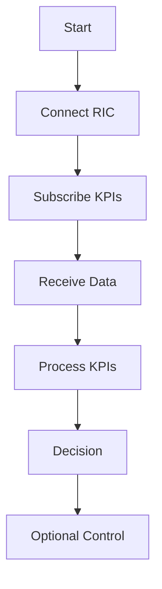
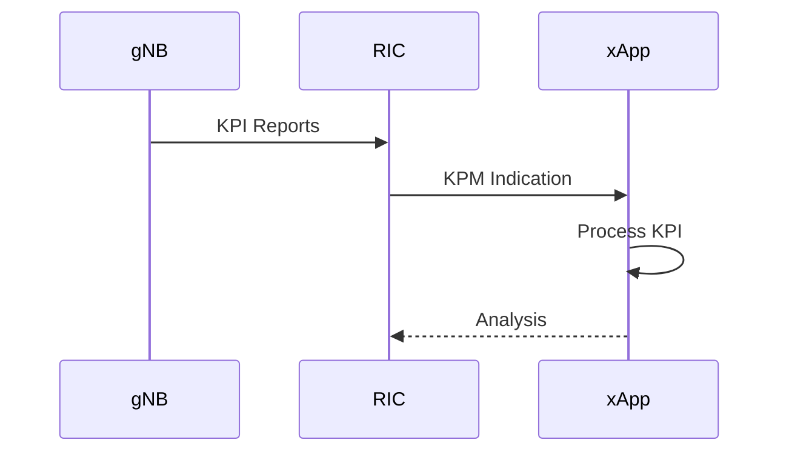
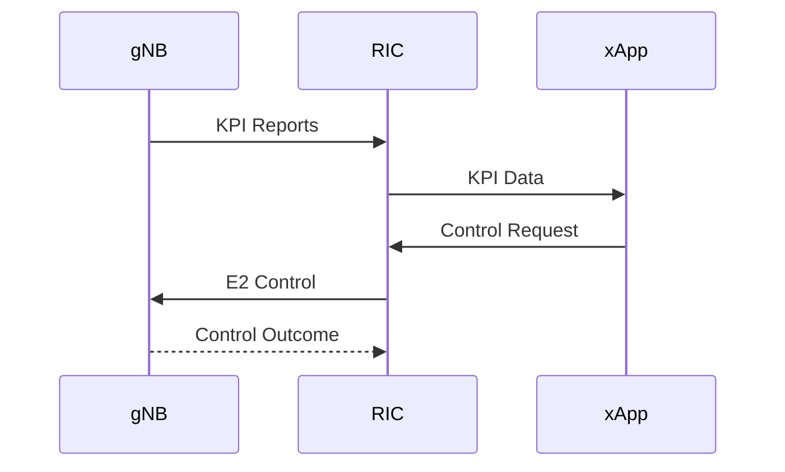
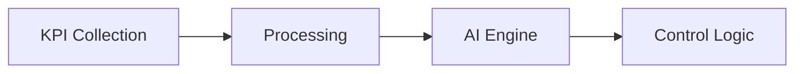
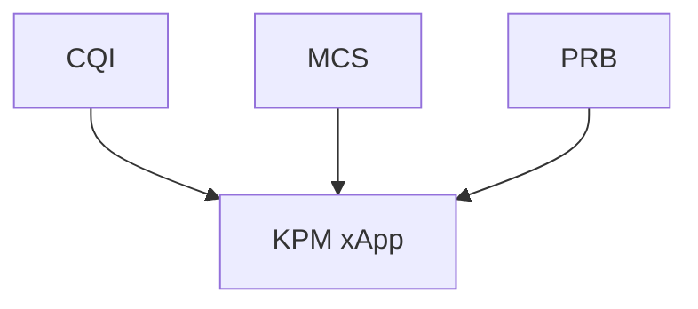
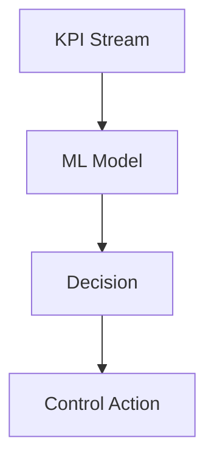
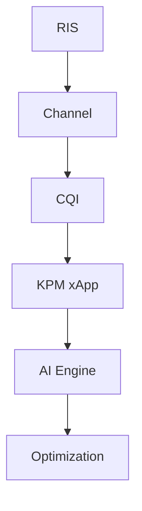

# FlexRIC xApp Development Guide

## Objective

This document explains how to build, deploy, and test a custom xApp using FlexRIC.

After completing this guide, you will be able to:

* Understand xApp architecture
* Understand FlexRIC SDK
* Create your first xApp
* Receive KPI reports
* Process E2 messages
* Build RIS-aware xApps
* Develop AI-enabled xApps

---

# 1. What is an xApp?

An xApp is an application that runs inside the Near-RT RIC.

Purpose:

* Collect network KPIs
* Analyze network conditions
* Make decisions
* Send control actions

---

# 2. xApp Position in O-RAN



---

# 3. FlexRIC Architecture



---

# 4. FlexRIC Components

### E2 Agent

Located inside:

```text
gNB
```

Functions:

* Sends KPI reports
* Receives control commands

---

### Near-RT RIC

Functions:

* E2AP processing
* E2SM processing
* xApp hosting

---

### xApps

Functions:

* Analytics
* Monitoring
* Optimization

---

# 5. xApp Lifecycle



---

# 6. KPM xApp Workflow



---

# 7. RC xApp Workflow



---

# 8. FlexRIC Development Flow



---

# 9. KPI Metrics Available

Typical KPM metrics:

```text
CQI
PRB Utilization
MCS
SINR
Throughput
Latency
BLER
```

---

# 10. Example KPI Pipeline



---

# 11. Why KPIs Matter

These metrics allow:

```text
Resource Allocation

Scheduling

QoS Optimization

RIS Optimization
```

---

# 12. AI-based xApp



---

# 13. RIS-Aware xApp

Future target.

Inputs:

```text
SINR

CQI

Channel Quality
```

Outputs:

```text
RIS Reconfiguration

Scheduler Adjustment
```

---

# 14. RIS-Aware Workflow



---

# 15. Development Roadmap

Phase 1

```text
Deploy FlexRIC
```

Phase 2

```text
Connect E2 Node
```

Phase 3

```text
Run KPM xApp
```

Phase 4

```text
Parse KPI Reports
```

Phase 5

```text
Create Custom xApp
```

Phase 6

```text
Create RC xApp
```

Phase 7

```text
RIS-Aware xApp
```

---

# 16. Expected Deliverables

You should eventually demonstrate:

* KPI collection
* KPI visualization
* CQI monitoring
* PRB monitoring
* Scheduler analytics
* AI-based decisions
* RIS-aware optimization

---

# Conclusion

FlexRIC enables development of O-RAN xApps for monitoring and control. The first milestone is receiving KPI reports through a KPM xApp. Once KPI data is available, AI-enabled and RIS-aware xApps can be developed for intelligent radio optimization.
