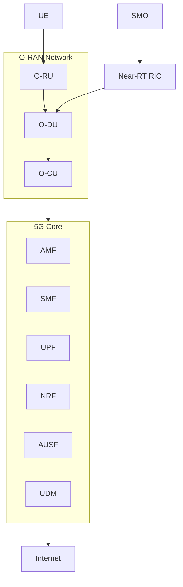
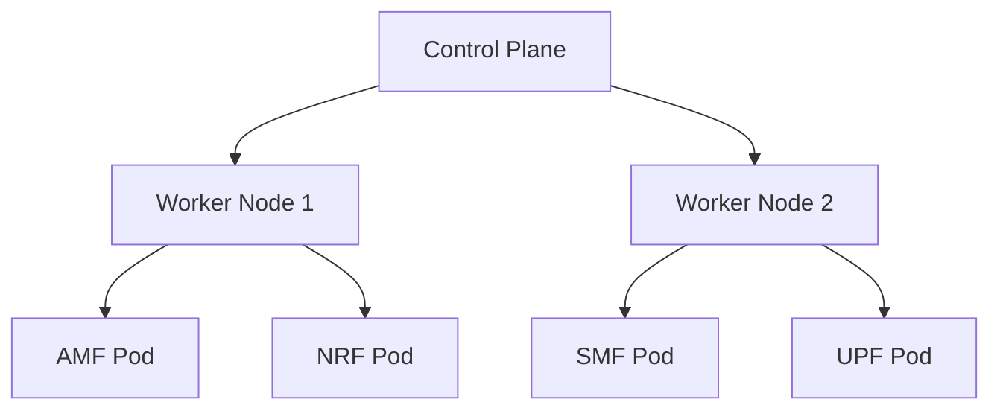
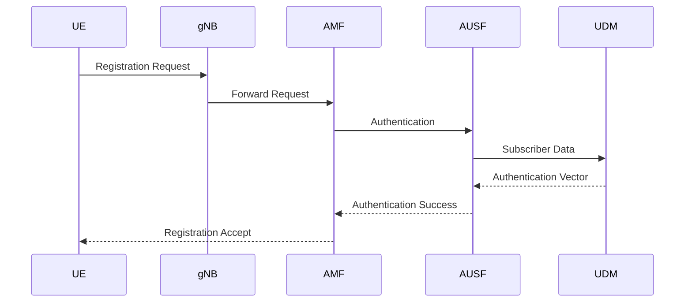
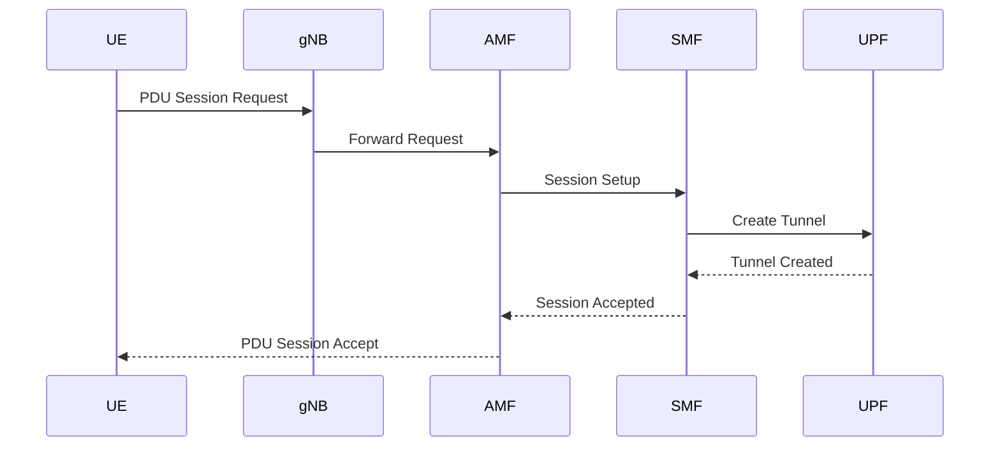
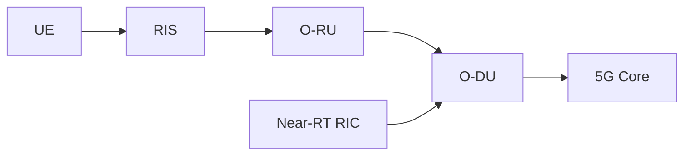

# IOS-MCN Deployment and OpenAirInterface (OAI) Study Notes

# Introduction

The Indian Open Source Mobile Communication Network (IOS-MCN) is an open-source 5G ecosystem developed to enable indigenous deployment of 5G and Beyond-5G communication networks.

The platform integrates:

* O-RAN
* 5G Core
* OpenAirInterface (OAI)
* Near-RT RIC
* SMO
* Cloud Native Infrastructure
* Containerized Deployments

The objective is to create an interoperable, scalable, and intelligent mobile communication ecosystem.

---

# What is OpenAirInterface (OAI)?

OpenAirInterface (OAI) is an open-source implementation of:

* 4G LTE
* 5G NR
* 5G Core Network

It provides software implementations of:

```text
UE
gNB
5GC
```

allowing researchers to deploy complete 5G networks on commodity hardware.

---

# IOS-MCN Technology Stack



---

# OpenAirInterface Components

## OAI gNB

Acts as the 5G base station.

Responsibilities:

* Radio communication
* Scheduling
* Resource allocation
* Mobility support

---

## OAI 5G Core

Implements:

```text
AMF
SMF
UPF
NRF
AUSF
UDM
```

Provides:

* Registration
* Authentication
* Session Management
* Data Connectivity

---

# OAI Deployment Models

## Bare Metal Deployment

```text
Ubuntu
 ├── OAI gNB
 ├── OAI Core
 └── Local Services
```

Advantages:

* High performance
* Low latency

Disadvantages:

* Difficult scaling

---

## Docker Deployment

```text
Ubuntu
 └── Docker
       ├── AMF Container
       ├── SMF Container
       ├── UPF Container
       ├── NRF Container
       └── AUSF Container
```

Advantages:

* Easy deployment
* Reproducibility
* Isolation

---

## Kubernetes Deployment

```text
Ubuntu
 └── Kubernetes Cluster
         ├── AMF Pod
         ├── SMF Pod
         ├── UPF Pod
         ├── NRF Pod
         └── AUSF Pod
```

Advantages:

* High scalability
* Automation
* Production readiness

---

# Why Docker Matters

Modern 5G deployments rarely run directly on the host OS.

Most components run as containers.

Example:

```bash
docker ps
```

Output:

```text
AMF
SMF
UPF
NRF
AUSF
UDM
```

Each service runs independently.

---

# Important Docker Commands

## List Containers

```bash
docker ps
```

---

## List All Containers

```bash
docker ps -a
```

---

## List Images

```bash
docker images
```

---

## View Logs

```bash
docker logs <container_name>
```

Example:

```bash
docker logs amf
```

---

## Enter Container

```bash
docker exec -it amf bash
```

---

## Stop Container

```bash
docker stop amf
```

---

# Kubernetes in IOS-MCN

Kubernetes manages large deployments.

Responsibilities:

* Container scheduling
* Service discovery
* Auto-healing
* Scaling

---

# Kubernetes Architecture



---

# O-RAN Interfaces

## Open Fronthaul

```text
O-RU ↔ O-DU
```

Carries:

* IQ samples
* Timing information

---

## F1 Interface

```text
O-DU ↔ O-CU
```

Carries:

* User data
* Control signaling

---

## E2 Interface

```text
Near-RT RIC ↔ O-DU/O-CU
```

Used for:

* AI optimization
* Scheduling control
* Resource management

---

# Near-RT RIC

## Purpose

Provides intelligent control of the RAN.

Applications:

* Load balancing
* Scheduling optimization
* Beam management
* Mobility optimization

---

# SMO

Service Management and Orchestration.

Responsibilities:

* Deployment
* Monitoring
* Configuration
* Analytics

SMO manages:

```text
RIC
O-RU
O-DU
O-CU
Core Network
```

---

# OAI Registration Flow



---

# OAI PDU Session Flow



---

# Where MAC Layer Exists

The MAC layer resides inside:

```text
O-DU
```

Protocol Stack:

```text
RRC
PDCP
RLC
MAC
PHY
```

Responsibilities:

* Scheduling
* PRB Allocation
* HARQ
* QoS

---

# RIS Integration with IOS-MCN

Future architecture:



---

# RIS and MAC Interaction

RIS improves:

```text
SNR
 ↓
CQI
 ↓
MCS
 ↓
Scheduling Efficiency
 ↓
Throughput
```

This is a major research direction in Beyond-5G systems.

---

# Deployment Workflow

Typical IOS-MCN deployment process:

```text
Ubuntu Setup
      ↓
Docker Installation
      ↓
Container Deployment
      ↓
5G Core Deployment
      ↓
OAI gNB Deployment
      ↓
UE Registration
      ↓
PDU Session Establishment
      ↓
Traffic Validation
      ↓
O-RAN Integration
      ↓
RIC Integration
      ↓
RIS Integration
```

---

# Practical Skills Required

For successful IOS-MCN deployment:

## Linux

* File system
* Networking
* Process management

---

## Docker

* Images
* Containers
* Logs
* Networking

---

## Kubernetes

* Pods
* Services
* Deployments

---

## Wireshark

* Packet capture
* Protocol analysis

---

## O-RAN

* O-RU
* O-DU
* O-CU
* RIC

---

## 5G Core

* AMF
* SMF
* UPF
* Registration
* PDU Session

---

# Internship Relevance

This deployment knowledge directly supports:

* IOS-MCN deployment
* OAI deployment
* O-RAN studies
* MAC-layer research
* RIS-assisted communication
* 5G testbed validation
* UGV communication
* IoT connectivity

---

# Key Takeaways

1. IOS-MCN combines O-RAN, OAI, and 5G Core technologies.
2. OAI provides open-source implementations of gNB and 5GC.
3. Docker is the foundation of modern 5G deployments.
4. Kubernetes enables scalable orchestration.
5. MAC-layer functionality primarily resides in the O-DU.
6. Near-RT RIC provides intelligent radio optimization.
7. SMO manages the overall network lifecycle.
8. Registration and PDU Session Establishment are the first deployment milestones.
9. RIS can be integrated with O-RAN and RIC for intelligent beam control.
10. Understanding the relationship between IOS-MCN, OAI, MAC, O-RAN, and RIS is critical for contributing to advanced 5G testbeds.
