# KPM Metrics Analysis for RIS-Assisted O-RAN Networks

## Author

Mrigank Jaiswal

## Internship

COMET Foundation – IIIT Bangalore

## Domain

O-RAN • Near-RT RIC • FlexRIC • RIS-Assisted Wireless Networks • 5G/6G

---

# 1. Introduction

The O-RAN architecture enables intelligent and programmable Radio Access Networks (RANs) through the Near-Real-Time RAN Intelligent Controller (Near-RT RIC). One of the most important Service Models defined by O-RAN is the E2SM-KPM (Key Performance Measurement) Service Model.

KPM provides real-time radio performance measurements from the RAN to the Near-RT RIC through the E2 interface. These measurements are consumed by xApps for monitoring, analytics, optimization, and AI-driven decision making.

For RIS-assisted wireless systems, KPM metrics become especially important because RIS directly affects radio propagation conditions. Any improvement in channel quality introduced by RIS is reflected through measurable changes in throughput, delay, spectral efficiency, and resource utilization.

---

# 2. KPM Service Model Architecture

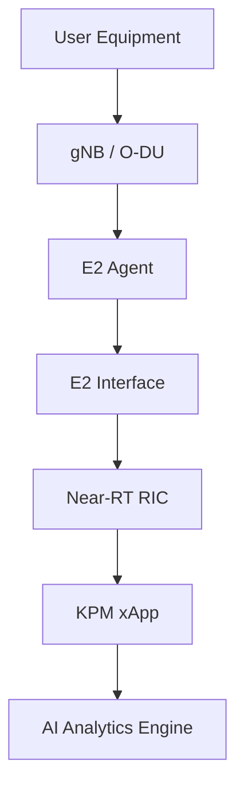

The KPM Service Model continuously exports radio performance metrics from the RAN to the Near-RT RIC.

---

# 3. KPM Data Collection Process

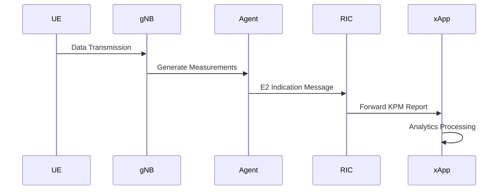

---

# 4. KPM Metrics Observed in FlexRIC

During FlexRIC experimentation, the following metrics were successfully collected.

## Throughput Metrics

```text
DRB.UEThpDl
DRB.UEThpUl
```

## Delay Metrics

```text
DRB.RlcSduDelayDl
```

## Volume Metrics

```text
DRB.PdcpSduVolumeDL
DRB.PdcpSduVolumeUL
```

## Resource Metrics

```text
RRU.PrbTotDl
RRU.PrbTotUl
```

These metrics form the primary inputs for future RIS-aware xApps.

---

# 5. Throughput Analysis

## DRB.UEThpDl

Downlink User Throughput

Measures:

* User data rate
* Scheduler efficiency
* Radio channel quality

Observed Values:

```text
DRB.UEThpDl = 5.24 kbps
DRB.UEThpDl = 6.30 kbps
DRB.UEThpDl = 7.06 kbps
```

### Relationship with RIS

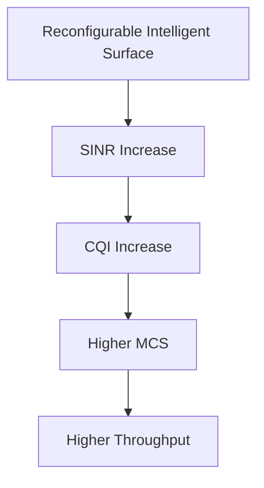

Expected Result:

```text
DRB.UEThpDl ↑
```

---

## DRB.UEThpUl

Uplink User Throughput

Measures:

* UE transmission efficiency
* Uplink radio quality
* Resource utilization

Observed Values:

```text
DRB.UEThpUl = 5.36 kbps
DRB.UEThpUl = 6.87 kbps
```

RIS can improve uplink propagation by reflecting signals toward the base station.

Expected Effect:

```text
DRB.UEThpUl ↑
```

---

# 6. PDCP Volume Analysis

## DRB.PdcpSduVolumeDL

Measures:

Total downlink PDCP payload successfully delivered.

Observed Example:

```text
1021 kb
971 kb
678 kb
```

### Impact of RIS

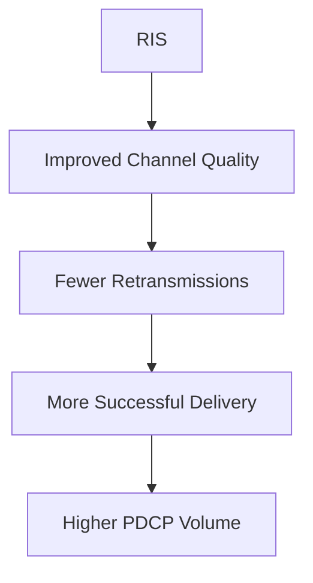

Expected Effect:

```text
PDCP Volume DL ↑
```

---

## DRB.PdcpSduVolumeUL

Measures:

Total uplink payload delivered.

Observed Example:

```text
510 kb
446 kb
306 kb
```

Expected Effect:

```text
PDCP Volume UL ↑
```

---

# 7. RLC Delay Analysis

## DRB.RlcSduDelayDl

Measures:

Average RLC delay.

Observed Values:

```text
5.26 µs
5.49 µs
7.33 µs
```

### Without RIS

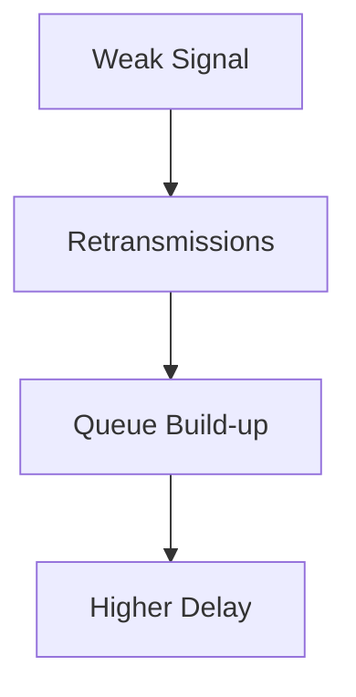

### With RIS

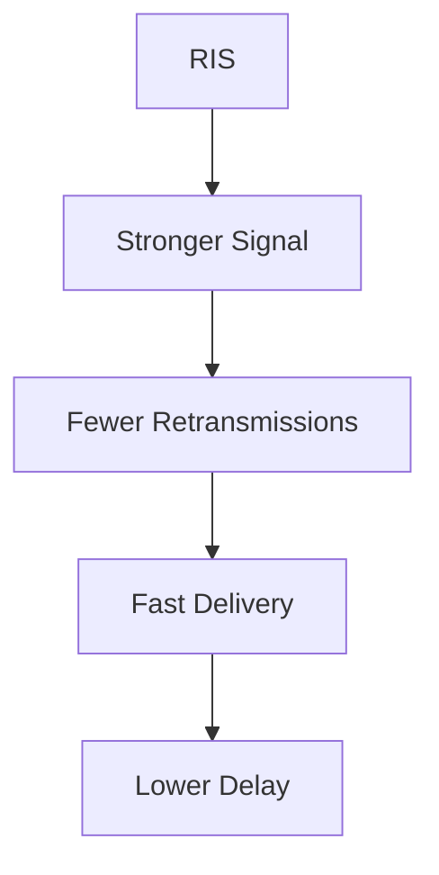

Expected Effect:

```text
RLC Delay ↓
```

---

# 8. PRB Utilization Analysis

## RRU.PrbTotDl

Measures:

Total downlink Physical Resource Blocks.

Observed Examples:

```text
652 PRBs
859 PRBs
282 PRBs
```

### RIS Impact

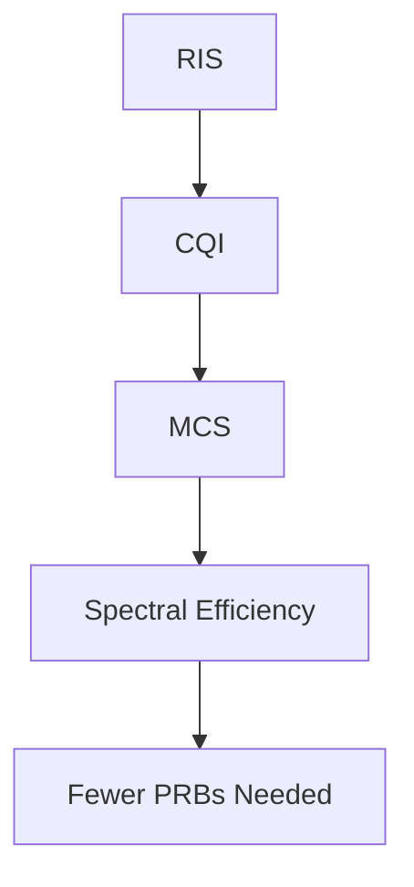

Expected Effect:

```text
PRB Efficiency ↑
```

---

## RRU.PrbTotUl

Measures:

Total uplink PRBs.

Observed Examples:

```text
382 PRBs
597 PRBs
420 PRBs
```

Expected Effect:

```text
Resource Efficiency ↑
```

---

# 9. RIS and CQI Relationship

RIS primarily affects the radio channel.


Example:

| Scenario    | SINR  | CQI |
| ----------- | ----- | --- |
| Without RIS | 8 dB  | 5   |
| With RIS    | 15 dB | 11  |

---

# 10. KPM Metrics Used by RIS-Aware xApps

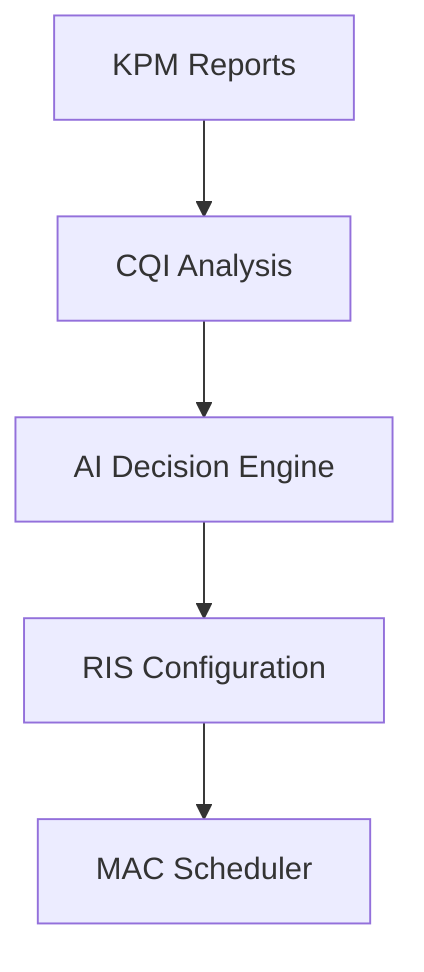

The xApp receives KPM reports and decides whether RIS reconfiguration is required.

---

# 11. RIS-Aware Optimization Loop

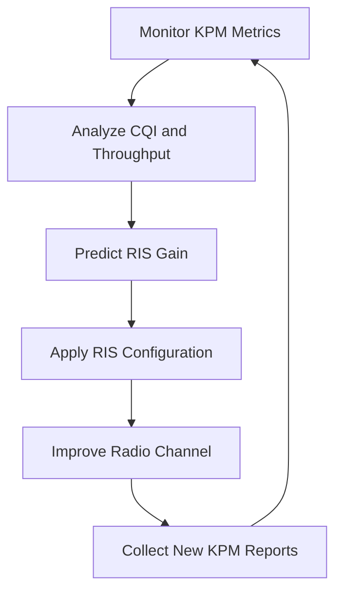

This forms a closed-loop O-RAN optimization framework.

---

# 12. Integration with MAC Scheduler

The MAC Scheduler does not directly control RIS.

Instead RIS indirectly influences scheduling decisions.

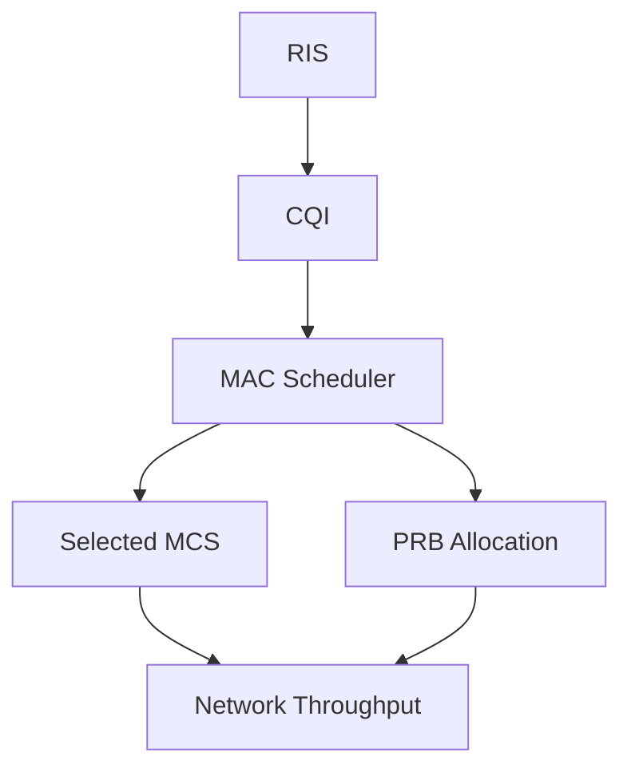

---

# 13. End-to-End RIS-Aware O-RAN Architecture

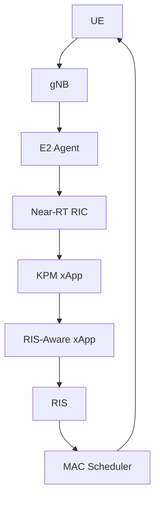

---

# 14. Key Findings

The FlexRIC KPM xApp successfully collected real-time O-RAN measurements through the E2 interface.

Important observations:

* KPM metrics can monitor radio performance in real time.
* Throughput metrics increase when channel quality improves.
* Delay metrics decrease when retransmissions are reduced.
* PRB utilization becomes more efficient under better CQI conditions.
* RIS effects can be observed indirectly through KPM reports.
* KPM metrics provide the primary feedback mechanism for RIS-aware xApps.

---

# 15. Future Work

The next phase of research will implement a RIS-Aware xApp capable of:

1. Collecting KPM reports.
2. Estimating CQI trends.
3. Predicting RIS gains.
4. Selecting RIS beam configurations.
5. Triggering adaptive MAC scheduling decisions.

Target Workflow:

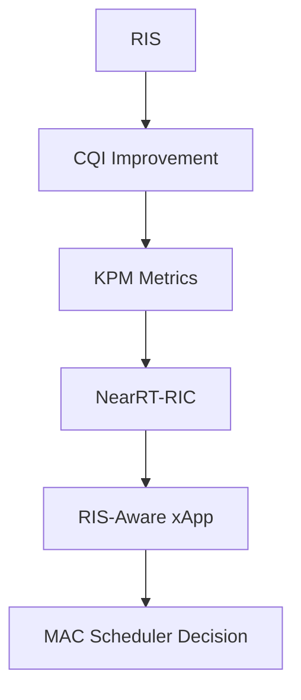

This workflow represents the core objective of RIS-assisted O-RAN optimization.
