# KPM xApp Implementation Guide

## Building Your First O-RAN xApp Using FlexRIC

---

# Objective

This document explains how a Key Performance Measurement (KPM) xApp is implemented in a Near-RT RIC environment using FlexRIC.

By the end of this guide, you will understand:

* KPM xApp Architecture
* E2SM-KPM Workflow
* KPI Subscription Mechanism
* KPI Report Processing
* FlexRIC SDK Structure
* xApp Development Flow
* RIS-Aware KPI Collection

This guide marks the transition from:

```text
Theory
```

to

```text
Implementation
```

---

# 1. Current Progress

Completed:

```text
✓ OAI Core Deployment

✓ UERANSIM Deployment

✓ UE Registration

✓ PDU Session Establishment

✓ O-RAN Architecture Study

✓ E2 Interface Study

✓ E2AP Study

✓ E2SM-KPM Study

✓ E2SM-RC Study

✓ FlexRIC Study
```

Current Stage:

```text
KPM xApp Implementation
```

---

# 2. What Does a KPM xApp Do?

Purpose:

```text
Receive KPI Reports
Analyze KPIs
Display KPIs
Trigger Decisions
```

Examples:

```text
CQI Monitoring

Throughput Monitoring

PRB Monitoring

Latency Monitoring
```

---

# 3. High-Level Architecture

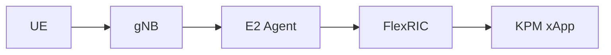

---

# 4. Data Flow

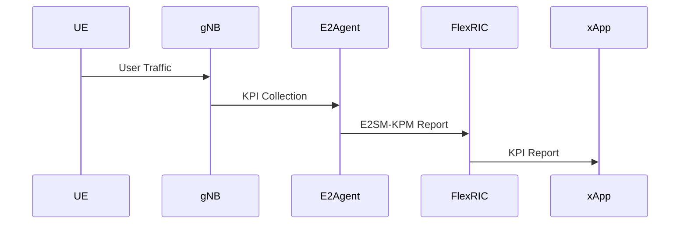

---

# 5. KPM xApp Responsibilities

The xApp performs:

### KPI Subscription

Request metrics from gNB.

---

### KPI Reception

Receive E2SM-KPM reports.

---

### KPI Parsing

Extract:

```text
CQI

MCS

PRB

Throughput

Latency
```

---

### KPI Visualization

Generate:

```text
Logs

Graphs

Dashboards
```

---

### KPI Analytics

Support:

```text
AI Models

Optimization

Decision Making
```

---

# 6. FlexRIC Software Architecture

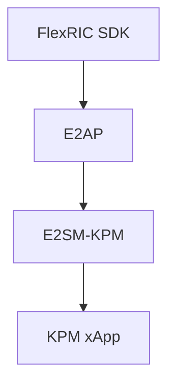

---

# 7. xApp Lifecycle

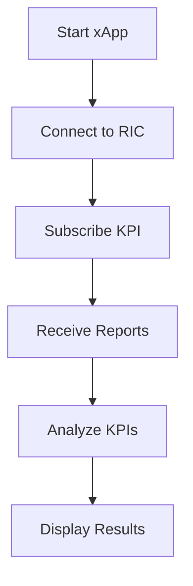

---

# 8. KPI Subscription Process

The xApp must first subscribe.

Architecture:

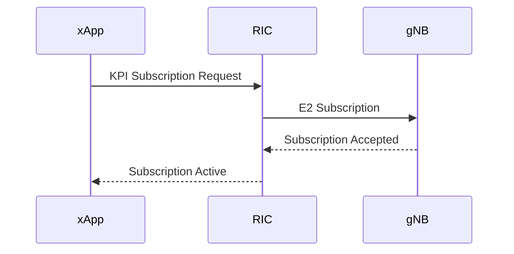

---

# 9. Example KPIs

## CQI

Channel Quality Indicator

Range:

```text
1 – 15
```

---

## MCS

Modulation and Coding Scheme

Examples:

```text
QPSK

16QAM

64QAM

256QAM
```

---

## PRB

Physical Resource Block

Measures:

```text
Resource Utilization
```

---

## Throughput

Measures:

```text
Data Rate
```

---

## Latency

Measures:

```text
Network Delay
```

---

# 10. KPI Report Structure

Example:

```json
{
  "cell_id": 1,
  "cqi": 12,
  "mcs": 20,
  "prb": 68,
  "throughput": 120,
  "latency": 10
}
```

---

# 11. KPI Processing Workflow

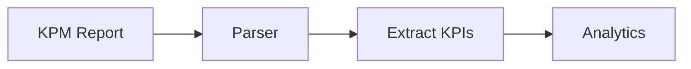

---

# 12. Basic xApp Logic

Pseudo-code:

```python
while True:

    report = receive_kpm_report()

    cqi = report.cqi

    throughput = report.throughput

    print(cqi)

    print(throughput)
```

---

# 13. CQI Monitoring Example

Pseudo-code:

```python
if cqi < 5:
    print("Poor Channel")

elif cqi < 10:
    print("Moderate Channel")

else:
    print("Good Channel")
```

---

# 14. Throughput Monitoring Example

Pseudo-code:

```python
if throughput < 20:
    print("Low Throughput")

else:
    print("Healthy Throughput")
```

---

# 15. PRB Utilization Monitoring

Pseudo-code:

```python
if prb > 80:
    print("Network Congestion")
```

---

# 16. KPI Dashboard Architecture

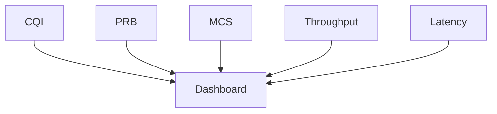

---

# 17. AI-Driven KPM xApp

Input:

```text
CQI

PRB

MCS

SINR
```

Output:

```text
Optimization Recommendation
```

---

Architecture:

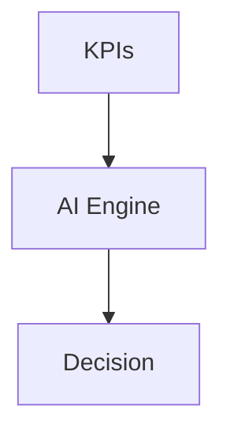

---

# 18. Relation to RIS

This is where your internship becomes unique.

RIS improves:

```text
Channel Quality
```

which affects:

```text
CQI
```

which affects:

```text
MCS
```

which affects:

```text
Throughput
```

---

# 19. RIS Monitoring Loop

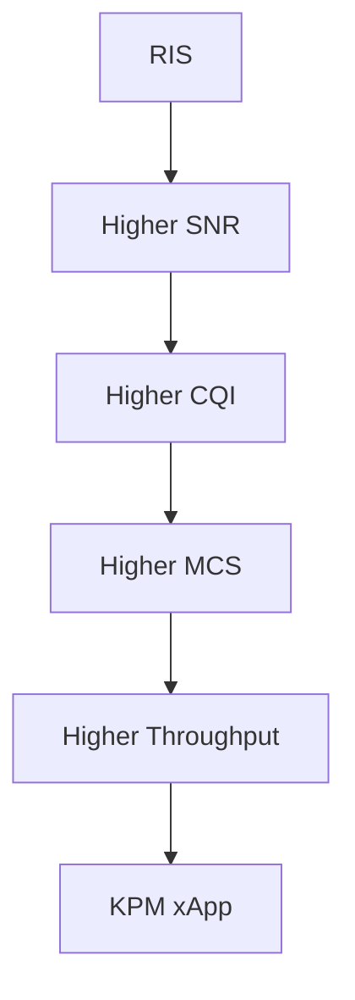

---

# 20. RIS-Aware xApp Concept

Future xApp:

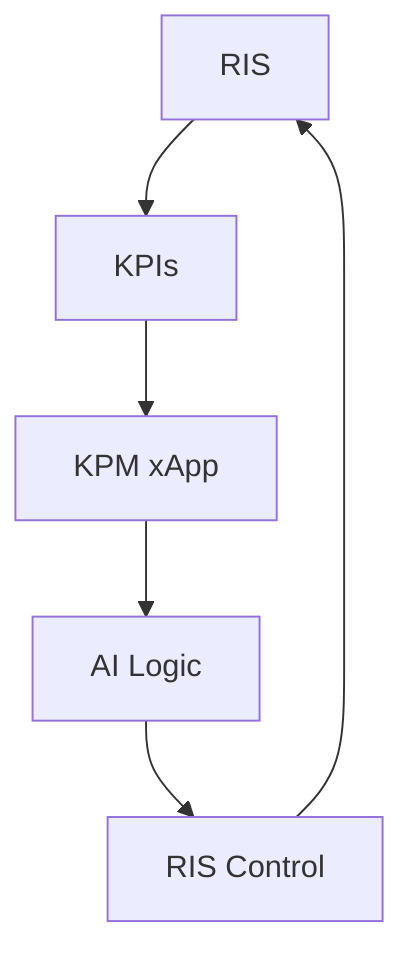

---

# 21. Future Control Loop

Current KPM xApp:

```text
Monitor Only
```

Future RC xApp:

```text
Monitor + Control
```

---

# 22. Complete O-RAN Workflow

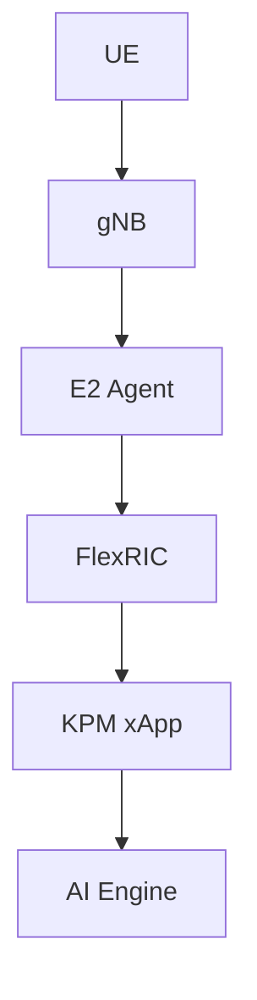

---

# 23. Mentor Discussion Questions

### What is a KPM xApp?

An xApp that receives and analyzes network KPIs.

### What is E2SM-KPM?

A service model used for KPI reporting.

### What KPIs can be collected?

CQI, MCS, PRB, Throughput, Latency, SINR.

### Why is KPM important?

It provides visibility into network performance.

### Why is KPM needed before RC?

Control decisions require KPI observations.

### How does RIS relate to KPM?

RIS performance improvements are reflected through KPI changes.

---

# 24. Implementation Roadmap

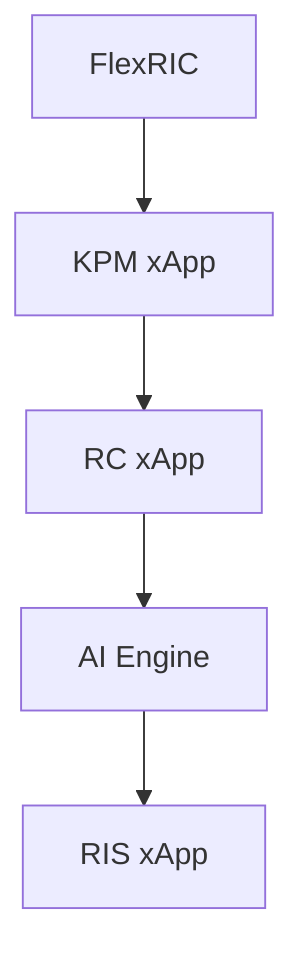

---

# 25. Research Roadmap

Current:

```text
✓ OAI Core

✓ UERANSIM

✓ O-RAN Study

✓ E2 Interface

✓ E2AP

✓ E2SM-KPM

✓ E2SM-RC

✓ FlexRIC

✓ KPM xApp
```

Next:

```text
FlexRIC Deployment
        ↓
KPM xApp Execution
        ↓
RC xApp Study
        ↓
RC xApp Development
        ↓
RIS-Aware xApp
```

---

# Conclusion

The KPM xApp is the first practical xApp developed in O-RAN environments. It subscribes to KPI measurements using E2SM-KPM, processes real-time network data, and provides the foundation for AI-driven optimization. Understanding KPM xApps is essential before developing RC xApps and RIS-aware control applications using FlexRIC and Near-RT RIC.
