# KPM xApp Study

## Key Performance Measurement (KPM) xApp for O-RAN Near-RT RIC

---

# Objective

This document provides a detailed study of:

* KPM xApp
* E2SM-KPM
* KPI Collection
* Near-RT RIC Monitoring
* FlexRIC Integration
* O-RAN Analytics
* RIS-Aware KPI Optimization

This study is important because KPM xApps are usually the first xApps developed in an O-RAN environment.

Research Progress:

```text
OAI Core
    ↓
UERANSIM
    ↓
5G SA Registration
    ↓
O-RAN Architecture
    ↓
E2 Interface
    ↓
FlexRIC
    ↓
KPM xApp
    ↓
RIS-Aware xApp
```

---

# 1. What is a KPM xApp?

KPM stands for:

```text
Key Performance Measurement
```

A KPM xApp is an analytics application running inside the Near-RT RIC.

Purpose:

```text
Collect KPIs
Analyze KPIs
Visualize KPIs
Support AI Decisions
```

---

# 2. Why KPM xApps Exist

Traditional RAN:

```text
gNB
 ↓
Internal Logs
```

Problems:

* Vendor dependent
* No centralized analytics
* Difficult AI integration

---

O-RAN introduces:

```text
gNB
 ↓
E2 Interface
 ↓
Near-RT RIC
 ↓
KPM xApp
```

Result:

```text
Centralized KPI Monitoring
```

---

# 3. KPM xApp Position in O-RAN

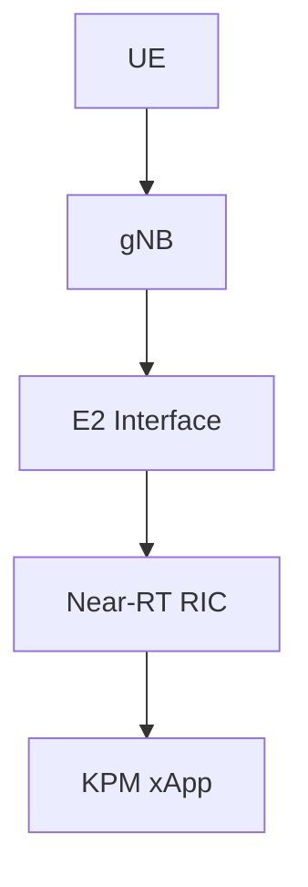

---

# 4. What are KPIs?

KPI = Key Performance Indicator

KPIs describe network performance.

Examples:

| KPI                  | Description                             |
| -------------------- | --------------------------------------- |
| CQI                  | Channel Quality Indicator               |
| SINR                 | Signal to Interference plus Noise Ratio |
| MCS                  | Modulation and Coding Scheme            |
| PRB Utilization      | Resource Usage                          |
| Throughput           | Data Rate                               |
| Latency              | Delay                                   |
| BLER                 | Block Error Rate                        |
| HARQ Retransmissions | Reliability Metric                      |

---

# 5. Importance of KPIs

KPIs enable:

```text
Monitoring
Optimization
Automation
AI Control
```

Without KPIs:

```text
No Network Visibility
```

---

# 6. KPM Architecture

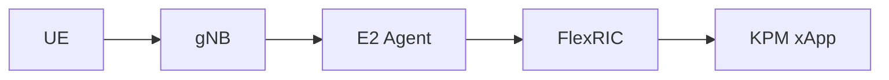

---

# 7. KPI Collection Workflow

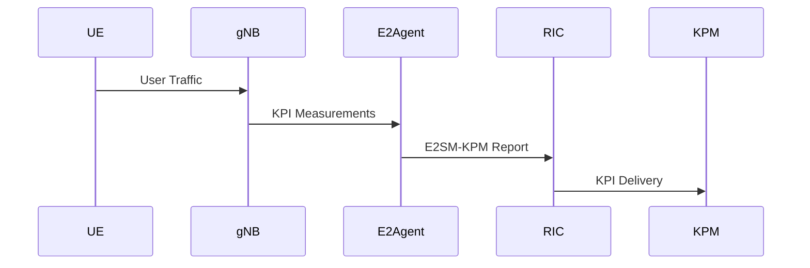

---

# 8. E2SM-KPM

Full Form:

```text
E2 Service Model – Key Performance Measurement
```

Purpose:

```text
Standardized KPI Reporting
```

---

# 9. Why E2SM-KPM?

Without KPM:

```text
Vendor Specific Reporting
```

With E2SM-KPM:

```text
Standard O-RAN Reporting
```

---

# 10. KPI Reporting Flow

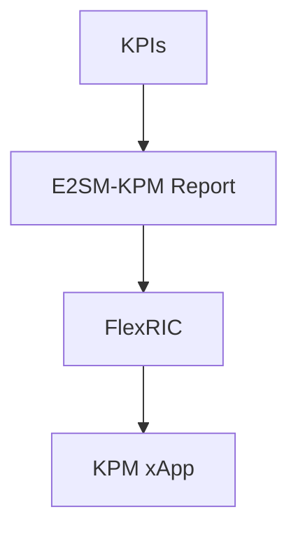

---

# 11. Important KPIs for 5G

## CQI

Channel Quality Indicator

Range:

```text
1 to 15
```

Higher:

```text
Better Channel
```

---

## MCS

Modulation and Coding Scheme

Examples:

```text
QPSK
16-QAM
64-QAM
256-QAM
```

---

## PRB Utilization

Physical Resource Block usage.

Example:

```text
70% Utilized
```

---

## Throughput

User data rate.

Example:

```text
100 Mbps
```

---

## Latency

Packet delay.

Example:

```text
10 ms
```

---

# 12. CQI Monitoring Example

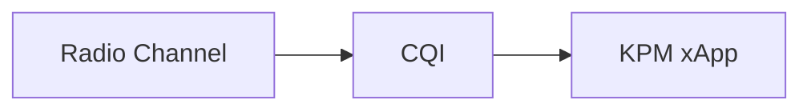

---

# 13. Throughput Monitoring

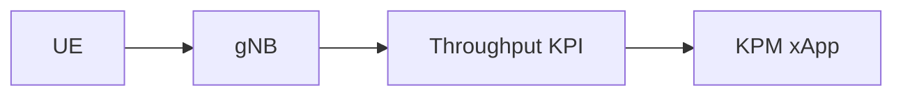

---

# 14. PRB Monitoring

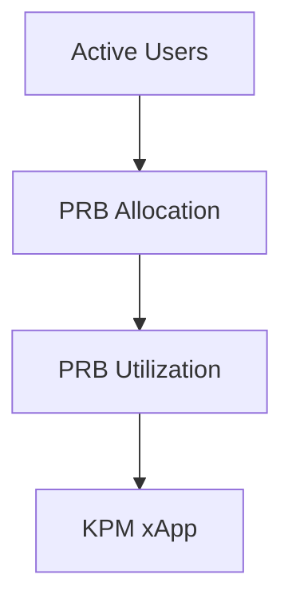

---

# 15. KPM Report Types

O-RAN supports:

### Periodic Reports

```text
Every 10 ms
Every 100 ms
Every 1 s
```

---

### Event-Based Reports

Triggered by:

```text
Threshold Crossing
Congestion
Low Throughput
```

---

# 16. KPM Data Structure

Typical report contains:

```text
Timestamp

Cell ID

CQI

MCS

PRB Usage

Throughput

Latency

BLER
```

---

# 17. KPM Dashboard Concept

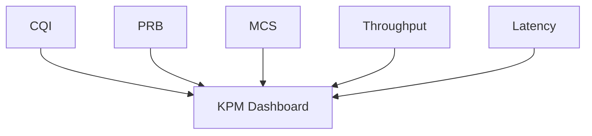

---

# 18. AI and KPM

AI requires data.

KPM xApps provide:

```text
Real-Time Network Data
```

Input:

```text
CQI

SINR

Throughput

PRB Usage
```

Output:

```text
Optimization Decisions
```

---

# 19. KPM and RIS

This is directly related to your RIS project.

Workflow:

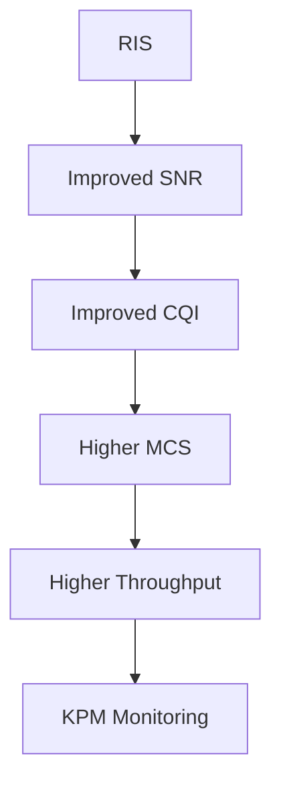

---

# 20. RIS-Aware KPI Loop

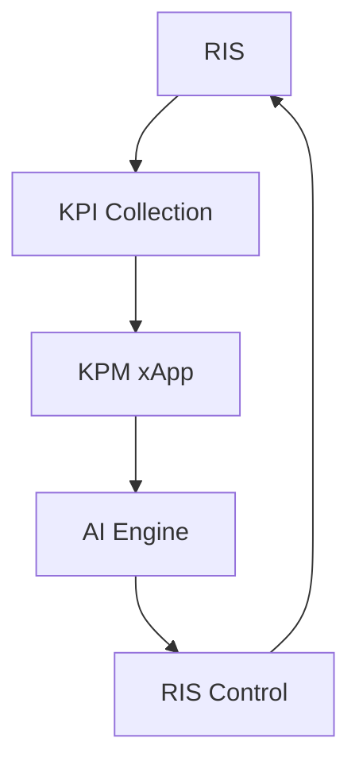

---

# 21. FlexRIC + KPM

Architecture:

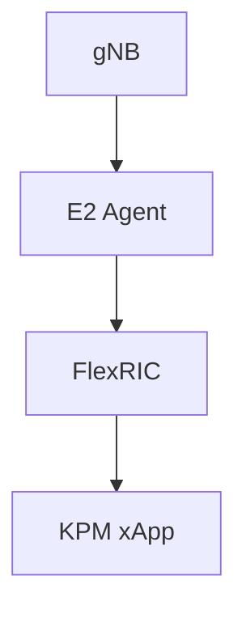

---

# 22. Typical KPM xApp Functions

* KPI Collection
* KPI Storage
* KPI Visualization
* KPI Analytics
* KPI Prediction
* AI Model Input

---

# 23. Mentor Discussion Questions

### What is a KPM xApp?

An analytics xApp that monitors network KPIs.

### What is E2SM-KPM?

The O-RAN service model used for KPI reporting.

### What KPIs are commonly collected?

CQI, MCS, PRB Utilization, Throughput, Latency, BLER.

### Why is KPM important?

It provides visibility into network performance.

### How is KPM useful for RIS?

RIS performance improvements can be observed through KPI changes.

### Why is KPM usually the first xApp?

Because monitoring is required before optimization or control.

---

# 24. Research Relevance

Current Status:

```text
✓ OAI Core Running

✓ AMF Connected

✓ SMF Connected

✓ UPF Connected

✓ UERANSIM gNB Connected

✓ UE Registered

✓ PDU Session Established

✓ FlexRIC Studied

✓ KPM Studied
```

Next:

```text
E2SM-RC
        ↓
Control xApps
        ↓
RIS-Aware xApps
```

---

# 25. Research Roadmap

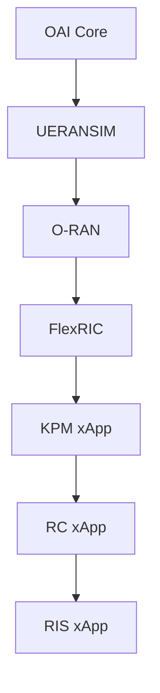

---

# Conclusion

The KPM xApp is the foundation of O-RAN analytics. Using E2SM-KPM, it collects real-time KPIs such as CQI, MCS, PRB utilization, throughput, and latency from the RAN. These measurements enable monitoring, AI-driven optimization, and future RIS-aware xApps. Understanding KPM is the first step toward developing intelligent control applications within FlexRIC and Near-RT RIC environments.
