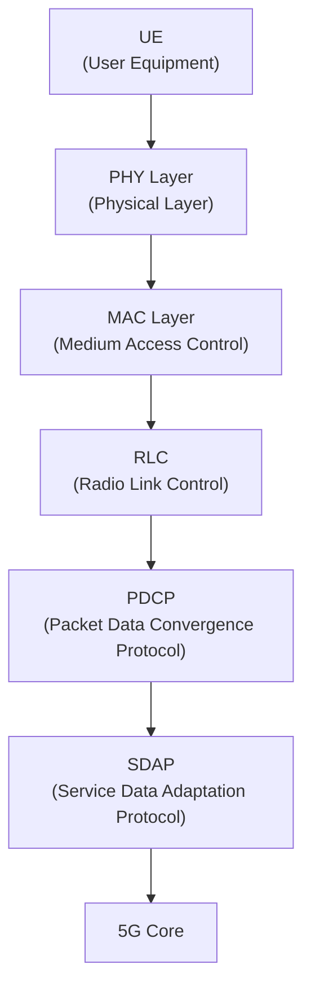
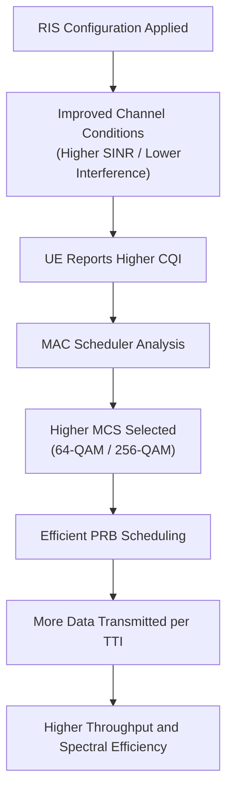

# MAC Layer Deep Study for OAI, O-RAN, IOS-MCN and RIS-Assisted 5G Networks

## 1. Introduction to MAC Layer

### Full Form

MAC = Medium Access Control

The MAC layer is a sublayer of the Data Link Layer in the OSI model and is responsible for efficient allocation of radio resources between multiple users in a cellular network.

In 5G NR, the MAC layer resides inside the O-DU (O-RAN Distributed Unit).

Architecture:

The MAC layer acts as the bridge between the Physical Layer and higher protocol layers.

Main responsibilities:

* Resource scheduling
* HARQ management
* Multiplexing and demultiplexing
* Link adaptation
* Resource allocation
* QoS enforcement

---

# 2. CQI (Channel Quality Indicator)

## Full Form

CQI = Channel Quality Indicator

CQI is a metric reported by the UE to the gNB indicating the quality of the wireless channel.

Purpose:

The gNB uses CQI reports to determine how aggressively it can transmit data.

Higher CQI:

* Better channel quality
* Higher modulation order
* Higher throughput

Lower CQI:

* Poor channel quality
* Robust modulation
* Lower throughput

Typical CQI Scale:

| CQI   | Channel Quality |
| ----- | --------------- |
| 1-3   | Poor            |
| 4-7   | Moderate        |
| 8-11  | Good            |
| 12-15 | Excellent       |

Example:

CQI = 3

Indicates poor channel conditions.

The scheduler selects:

QPSK
Low coding rate

for reliable communication.

CQI = 15

Indicates excellent channel conditions.

The scheduler may select:

256-QAM
High coding rate

for maximum throughput.

---

# 3. MCS (Modulation and Coding Scheme)

## Full Form

MCS = Modulation and Coding Scheme

MCS determines:

* Modulation order
* Coding rate

used for transmission.

Higher MCS:

* Higher throughput
* Requires better SNR

Lower MCS:

* Lower throughput
* Better reliability

Example:

| MCS       | Modulation |
| --------- | ---------- |
| Low       | QPSK       |
| Medium    | 16-QAM     |
| High      | 64-QAM     |
| Very High | 256-QAM    |

Relationship:
```text
CQI
↓
MCS Selection
↓
Data Rate
```
Example:

CQI = 14

Scheduler selects:

256-QAM

CQI = 4

Scheduler selects:

QPSK

---

# 4. PRB (Physical Resource Block)

## Full Form

PRB = Physical Resource Block

PRB is the smallest schedulable radio resource unit in 5G NR.

A scheduler allocates PRBs to users.

Think of PRBs as bandwidth chunks.

Example:

100 MHz carrier

contains hundreds of PRBs.

Scheduler:

UE1 → 50 PRBs

UE2 → 70 PRBs

UE3 → 40 PRBs

Total throughput depends on:

Number of PRBs
×
Selected MCS

More PRBs = More Capacity

---

# 5. HARQ (Hybrid Automatic Repeat Request)

## Full Form

HARQ = Hybrid Automatic Repeat Request

HARQ combines:

* Error correction
* Retransmission

for reliable communication.

Process:
```text
Transmit Packet
↓
Receiver Checks CRC
↓
ACK or NACK
↓
Retransmit if Needed
```
ACK

Acknowledgement

Packet successfully received.

NACK

Negative Acknowledgement

Packet contains errors.

Retransmission required.

Benefits:

* Reliability
* Reduced packet loss
* Improved throughput

---

# 6. MAC Scheduling

MAC Scheduling determines:

Who transmits?
When?
How much bandwidth?

Scheduler Inputs:

* CQI
* QoS
* Buffer status
* Mobility
* Traffic demand

Scheduler Outputs:

* PRB allocation
* MCS selection
* Transmission timing

Example:

User A:
CQI = 15

User B:
CQI = 4

Scheduler allocates more resources to User A.

This is called opportunistic scheduling.

---

# 7. Relationship Between SNR and CQI

## Full Form

SNR = Signal-to-Noise Ratio

SNR measures signal strength relative to noise.

High SNR:

* Cleaner signal
* Better decoding
* Higher CQI

Low SNR:

* Noisy signal
* Lower CQI

Relationship:
```text
SNR ↑
↓
CQI ↑
↓
MCS ↑
↓
Throughput ↑
```
---

# 8. RIS Impact on MAC Layer

## Full Form

RIS = Reconfigurable Intelligent Surface

RIS can intelligently reflect radio waves.

Benefits:

* Coverage enhancement
* Beam steering
* Interference reduction
* Improved SNR

Without RIS:

User in blind spot

SNR = 5 dB

CQI = 3

MCS = QPSK

Low throughput

With RIS:

SNR = 18 dB

CQI = 12

MCS = 64-QAM

High throughput

Relationship:
```text
RIS
↓
Higher SNR
↓
Higher CQI
↓
Higher MCS
↓
Higher Throughput
```
One of the most important concepts in your RIS Pilot Deployment project.

---

# 9. RIS + MAC + O-RAN Integration

Future Research Direction
```text
UE
↓
RIS
↓
O-RU
↓
O-DU
(MAC Scheduler)
↓
O-CU
↓
AMF
↓
SMF
↓
UPF
↓
Internet
```



This forms the basis of RIS-assisted MAC scheduling research.

---

# 10. Key Interview and Mentor Questions

Q1. What is CQI?

Channel Quality Indicator reported by UE to gNB indicating channel quality.

Q2. What is MCS?

Modulation and Coding Scheme used for transmission.

Q3. What is PRB?

Physical Resource Block, the smallest schedulable radio resource.

Q4. What is HARQ?

Hybrid Automatic Repeat Request combining retransmissions and error correction.

Q5. How does RIS improve throughput?

RIS improves SNR, leading to higher CQI, higher MCS, better scheduling decisions, and increased throughput.

Q6. Where does MAC reside in O-RAN?

Inside the O-DU.

Q7. Why is MAC important for RIS-assisted networks?

Because improved channel quality from RIS directly affects MAC scheduling and resource allocation decisions.

---

# Conclusion

The MAC layer is the intelligence responsible for radio resource allocation in 5G networks. Key MAC parameters such as CQI, MCS, PRB allocation, and HARQ determine network throughput and reliability. RIS technology enhances radio propagation conditions, which improves SNR, CQI, and MCS selection, enabling the MAC scheduler to allocate resources more efficiently. Therefore, RIS-assisted MAC scheduling represents a significant research direction for future 5G and 6G networks and directly aligns with the ARTPARK RIS pilot deployment project.
