# OAI gNB and UE Architecture Study

## 1. Objective

This document explains the architecture and operation of a real 5G Standalone (SA) network using OpenAirInterface (OAI), including:

* gNB Architecture
* UE Architecture
* N2 Interface
* N3 Interface
* NGAP Protocol
* GTP-U Protocol
* AMF Connectivity
* UE Registration Procedure

This study serves as the foundation for:

* OAI Deployment
* IOS-MCN Research
* O-RAN Deployment
* RIS-Assisted 5G Networks
* Future 6G Research

---

# 2. High-Level 5G SA Architecture
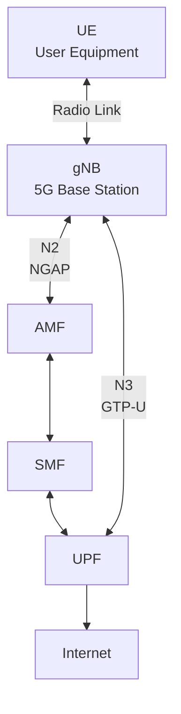
---

# 3. Full Forms

| Abbreviation | Full Form                                |
| ------------ | ---------------------------------------- |
| UE           | User Equipment                           |
| gNB          | Next Generation NodeB                    |
| AMF          | Access and Mobility Management Function  |
| SMF          | Session Management Function              |
| UPF          | User Plane Function                      |
| NGAP         | Next Generation Application Protocol     |
| GTP-U        | GPRS Tunneling Protocol - User Plane     |
| NAS          | Non-Access Stratum                       |
| N2           | Control Plane Interface                  |
| N3           | User Plane Interface                     |
| RRC          | Radio Resource Control                   |
| PDU          | Protocol Data Unit                       |
| IMSI         | International Mobile Subscriber Identity |

---

# 4. What is a gNB?

## Full Form

gNB = Next Generation NodeB

The gNB is the 5G base station.

In 4G:

```text
eNodeB
```

In 5G:

```text
gNB
```

The gNB connects:

flowchart LR

UE[UE]

gNB[gNB]

Core[5G Core]

UE <--> gNB

gNB <--> Core

Main functions:

* Radio transmission
* Radio reception
* Scheduling
* Mobility management
* Resource allocation
* UE registration support

---

# 5. gNB Architecture

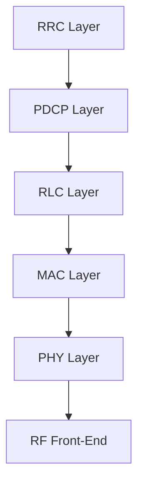
Responsibilities:

## PHY Layer

Handles:

* Modulation
* Demodulation
* OFDM
* Beamforming

---

## MAC Layer

Handles:

* Scheduling
* PRB allocation
* HARQ
* MCS selection

---

## RLC Layer

Handles:

* Segmentation
* Reassembly
* Reliability

---

## PDCP Layer

Handles:

* Encryption
* Integrity protection

---

## RRC Layer

Handles:

* Radio configuration
* Connection establishment

---

# 6. What is UE?

## Full Form

UE = User Equipment

A UE is any device connected to the cellular network.

Examples:

* Smartphone
* Laptop modem
* IoT device
* Drone modem
* Industrial sensor

In OAI:

```text
nr-ue
```

or

```text
GNBSIM UE
```

simulates a real user device.

---

# 7. UE Protocol Stack

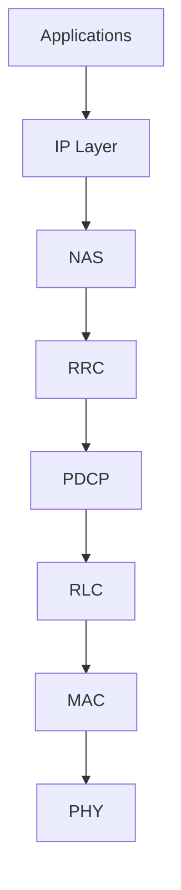

The UE continuously exchanges messages with the gNB.

---

# 8. What is N2?

N2 is the control-plane interface.

Connection:

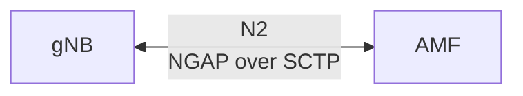


Purpose:

* Registration
* Authentication
* Mobility management
* Session control

Protocol used:

```text
NGAP
```

Transport:

```text
SCTP
```

Default port:

```text
38412
```

---

# 9. What is N3?

N3 is the user-plane interface.

Connection:

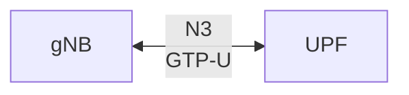

Purpose:

Transfer actual user data.

Examples:

* Web browsing
* Video streaming
* File downloads
* IoT traffic

Protocol:

```text
GTP-U
```

Default port:

```text
2152 UDP
```

---

# 10. What is NGAP?

## Full Form

NGAP = Next Generation Application Protocol

NGAP operates over:

```text
N2 Interface
```

NGAP Architecture:

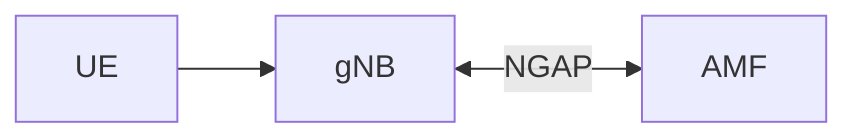

Functions:

* UE Registration
* Authentication
* PDU Session Setup
* Handover
* Context Management

Examples:

```text
NG Setup Request
NG Setup Response
Initial UE Message
Registration Request
Registration Accept
```

---

# 11. What is GTP-U?

## Full Form

GTP-U = GPRS Tunneling Protocol User Plane

GTP-U operates on:

```text
N3 Interface
```

Connection:

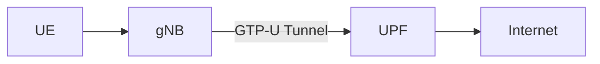

Purpose:

Tunnel user traffic.

Example:

```text
UE → gNB → UPF → Internet
```

All user data is encapsulated inside GTP-U tunnels.

---

# 12. How Does gNB Connect to AMF?

Step 1

gNB starts.

---

Step 2

gNB sends:

```text
NG Setup Request
```

to AMF.

---

Step 3

AMF validates configuration.

---

Step 4

AMF replies:

```text
NG Setup Response
```

---

Step 5

Connection established.

Architecture:

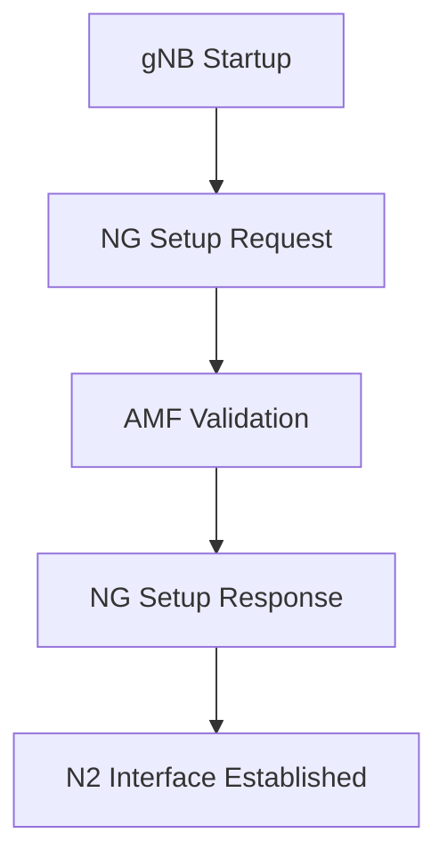

---

# 13. gNB to AMF Connection

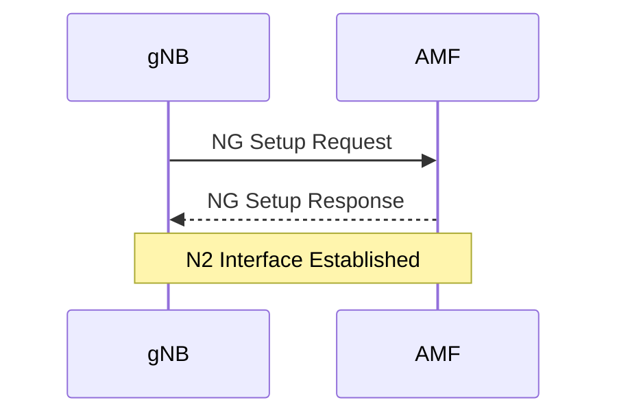

---

# 14. How Does UE Register?

The registration procedure is the first operation after power-on.

---

Step 1

UE powers on.

---

Step 2

UE finds a gNB.

---

Step 3

UE sends:

```text
Registration Request
```

---

Step 4

gNB forwards request to AMF.

---

Step 5

Authentication occurs.

---

Step 6

Security context established.

---

Step 7

AMF sends:

```text
Registration Accept
```

---

Step 8

UE becomes registered.

---

# 15. Mermaid Diagram: UE Registration

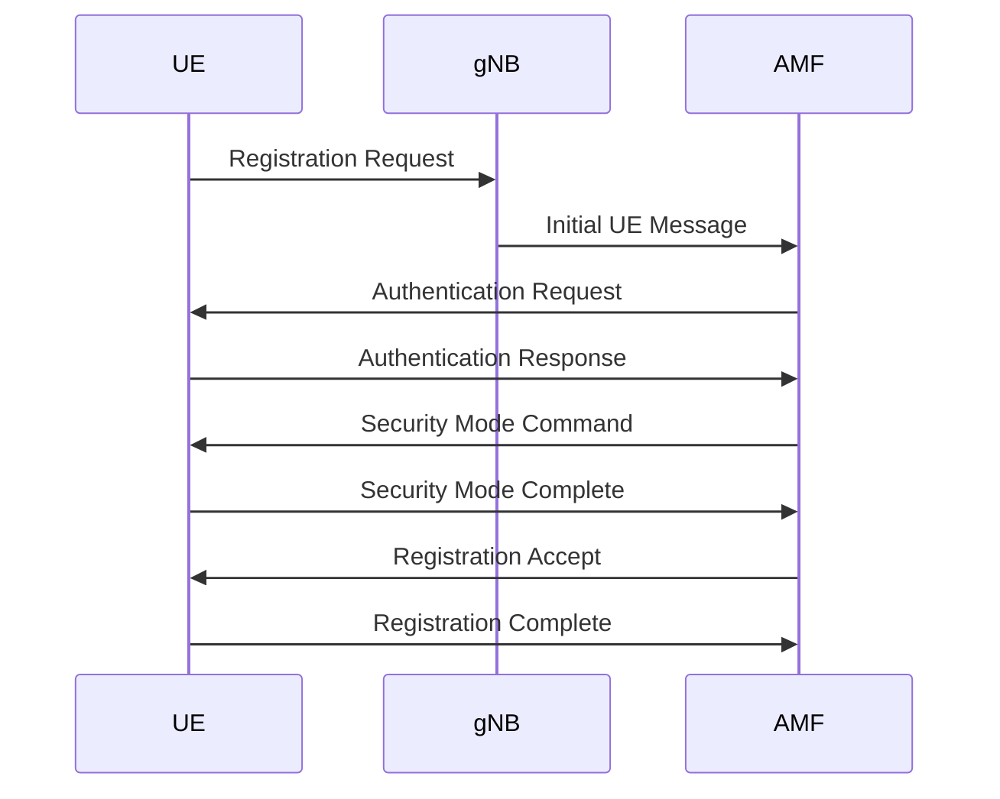

---

# 16. What Happens After Registration?

After registration:

```text
UE Registered
```

but:

```text
No Internet Yet
```

The network must create a PDU Session.

---

# 17. PDU Session Establishment

Purpose:

Provide:

```text
UE IP Address
```

Example:

```text
12.1.1.3
```

Flow:

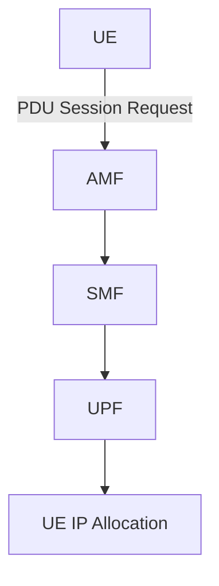

Result:

```text
UE → Internet Access
```

---

# 18. Data Flow After Registration

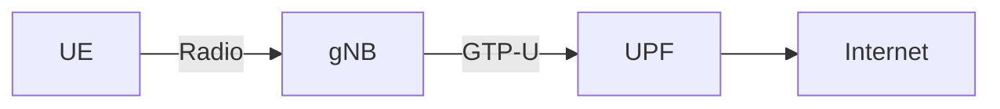

This is the path followed by user traffic.

---

# 19. Relation to OAI Deployment

Current Deployment:

```text
AMF
SMF
UPF
GNBSIM
```

GNBSIM acts as:

```text
gNB
+
UE
```

simultaneously.

Future Deployment:

```text
OAI Core
+
UERANSIM gNB
+
UERANSIM UE
```

Then:

```text
OAI Core
+
OAI gNB
+
UE
```

Then:

```text
O-RAN
+
RIC
+
SMO
```

Then:

```text
RIS
+
O-RAN
+
MAC Scheduler
```
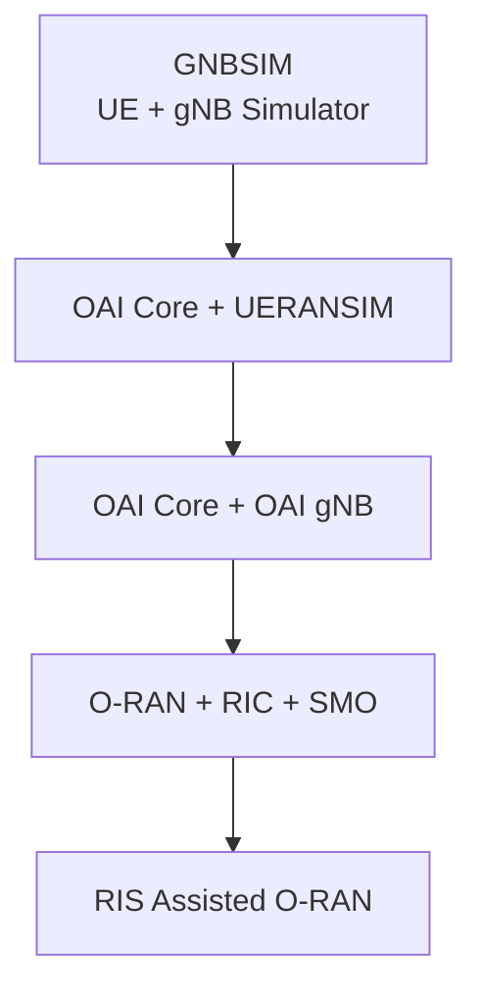
---

# 20. Mentor Discussion Questions

Q1. What is a gNB?

A 5G base station that connects UEs to the 5G Core.

---

Q2. What is UE?

User Equipment such as smartphones, IoT devices, or simulated UEs.

---

Q3. What is N2?

Control-plane interface between gNB and AMF using NGAP.

---

Q4. What is N3?

User-plane interface between gNB and UPF using GTP-U.

---

Q5. What is NGAP?

Protocol used on N2 for signaling between gNB and AMF.

---

Q6. What is GTP-U?

Protocol used on N3 for transporting user traffic.

---

Q7. How does a gNB connect to an AMF?

Using NG Setup Request and NG Setup Response messages.

---

Q8. How does a UE register?

Registration Request → Authentication → Security Setup → Registration Accept.

---

# Conclusion

The gNB is the central radio access component of a 5G network and connects UEs to the 5G Core through N2 and N3 interfaces. N2 carries control-plane signaling using NGAP, while N3 carries user-plane traffic using GTP-U. UE registration involves authentication, security establishment, and registration acceptance by the AMF. Understanding these procedures is essential before moving to UERANSIM deployment, OAI gNB deployment, O-RAN integration, and RIS-assisted 5G research.
