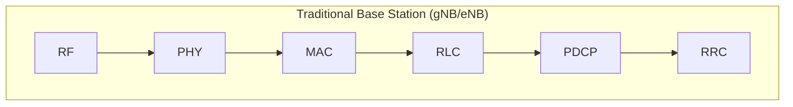
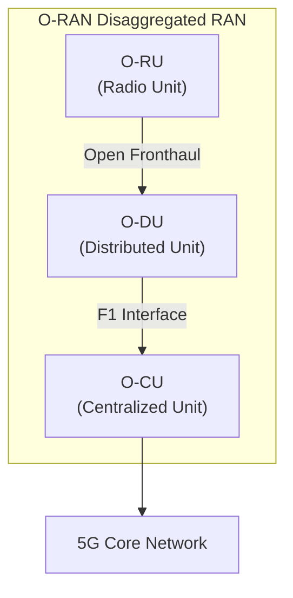
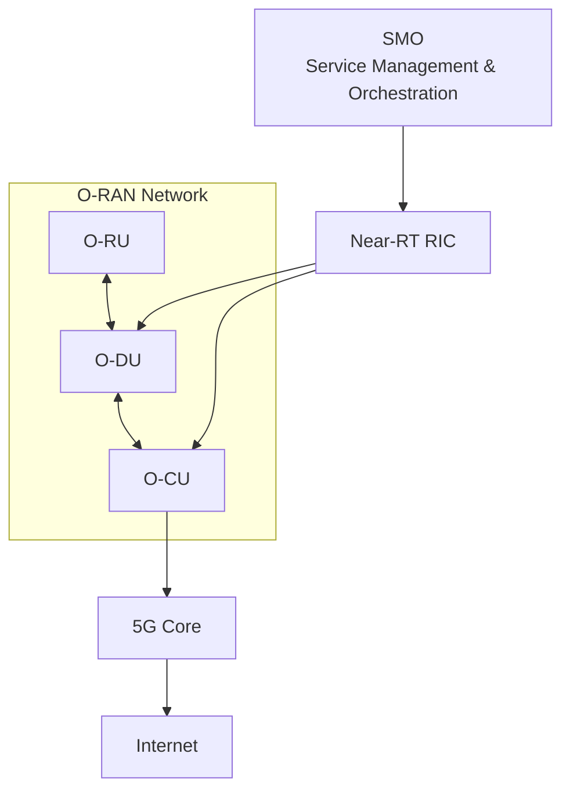
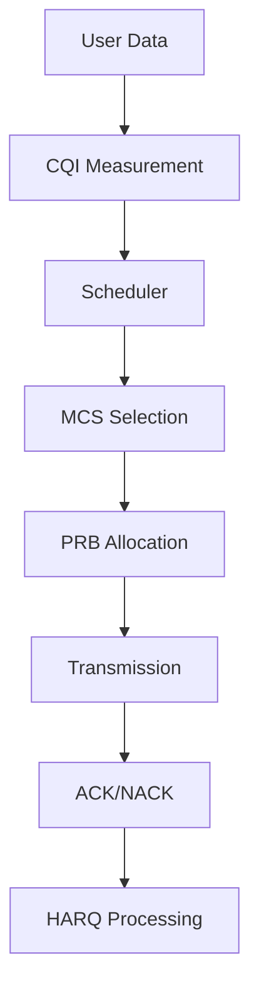
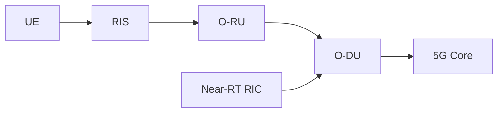

# O-RAN Architecture and MAC Layer

## Introduction

Open Radio Access Network (O-RAN) is an open and disaggregated architecture for 5G and future 6G networks. Unlike traditional monolithic base stations, O-RAN separates radio functions into independent components that can be deployed, upgraded, and optimized independently.

The O-RAN architecture forms the Radio Access Network (RAN) portion of modern 5G systems and is a core component of IOS-MCN deployments.

---

# Evolution from Traditional RAN to O-RAN

## Traditional Base Station



Everything exists inside one vendor-specific box.

Limitations:

* Vendor lock-in
* Limited flexibility
* Difficult upgrades
* Limited interoperability

---

## O-RAN Architecture



Benefits:

* Open interfaces
* Vendor interoperability
* Cloud-native deployment
* AI-driven optimization
* Lower deployment cost

---

# Complete O-RAN Ecosystem



---

# O-RU (Open Radio Unit)

## Purpose

The O-RU is responsible for RF transmission and reception.

---

## Functions

### RF Processing

* Signal transmission
* Signal reception

### Beamforming

* Analog beamforming
* Hybrid beamforming

### Antenna Management

* Radiation pattern control
* MIMO support

---

## Hardware Components

* Antennas
* Power Amplifiers
* LNAs
* RF Chains

---

## Relevance to RIS

RIS operates directly in the radio propagation environment.

```text
UE
 ↓
RIS
 ↓
O-RU
```

RIS influences:

* Signal reflection
* Beam steering
* Coverage enhancement

---

# O-DU (Open Distributed Unit)

## Purpose

The O-DU contains real-time radio processing functions.

---

## Protocol Layers

```text
PHY
↑
MAC
↑
RLC
```

---

## Responsibilities

* Scheduling
* Resource allocation
* HARQ
* Radio resource control

---

# O-CU (Open Centralized Unit)

## Purpose

The O-CU manages higher-layer radio functions.

---

## Protocol Layers

```text
RRC
↑
PDCP
↑
SDAP
```

---

## Responsibilities

* Mobility management
* Session control
* Security handling

---

# O-RAN Interfaces

## Open Fronthaul

Connects:

```text
O-RU ↔ O-DU
```

Carries:

* IQ Samples
* Timing information

---

## F1 Interface

Connects:

```text
O-DU ↔ O-CU
```

Carries:

* User data
* Control information

---

## E2 Interface

Connects:

```text
Near-RT RIC ↔ O-DU/O-CU
```

Used for:

* AI optimization
* Resource management
* Scheduling optimization

---

# Near-RT RIC

## Purpose

Provides intelligent control of the radio network.

---

## Optimization Functions

### Load Balancing

```text
Cell A overloaded
      ↓
Move users
      ↓
Cell B
```

---

### Handover Optimization

Improves mobility performance.

---

### Scheduling Optimization

Improves throughput.

---

### Beam Management

Optimizes beam selection.

---

## AI Applications

* User prediction
* Traffic prediction
* Mobility prediction
* Beam selection

---

# Service Management and Orchestration (SMO)

## Purpose

Manages the entire network.

---

## Responsibilities

* Deployment
* Monitoring
* Configuration
* Analytics
* Lifecycle management

---

# MAC Layer

## Overview

The MAC (Medium Access Control) layer is one of the most important layers in the RAN.

It determines:

```text
Who transmits?
When?
How much?
Using which resources?
```

---

# MAC Position

```text
Application
 ↓
Transport
 ↓
PDCP
 ↓
RLC
 ↓
MAC
 ↓
PHY
```

---

# MAC Responsibilities

## Scheduling

The scheduler decides:

```text
User 1 → 40 PRBs
User 2 → 20 PRBs
User 3 → 30 PRBs
```

---

## Resource Allocation

Allocates:

```text
Time Resources
Frequency Resources
Power Resources
```

---

## Multiplexing

Combines multiple flows.

---

## HARQ

Provides retransmission.

```text
Packet Lost
     ↓
Retransmit
```

---

## QoS Enforcement

Supports:

* Low latency
* High reliability
* High throughput

---

# Physical Resource Blocks (PRBs)

Basic scheduling unit.

Example:

```text
100 MHz
 ↓
273 PRBs
```

Scheduler decides:

```text
User A → PRB 1-40

User B → PRB 41-80
```

---

# Channel Quality Indicator (CQI)

Represents channel quality.

Range:

```text
CQI 1 → Poor

CQI 15 → Excellent
```

---

## Impact

Higher CQI:

```text
Higher Throughput
```

Lower CQI:

```text
Lower Throughput
```

---

# Modulation and Coding Scheme (MCS)

Determines transmission efficiency.

Examples:

| MCS       | Modulation |
| --------- | ---------- |
| Low       | QPSK       |
| Medium    | 16QAM      |
| High      | 64QAM      |
| Very High | 256QAM     |

---

# HARQ

Hybrid Automatic Repeat Request.

Provides reliability.

```text
Packet Error
      ↓
NACK
      ↓
Retransmission
```

---

# MAC Scheduling Flow



---

# RIS and MAC Layer

This is where your internship becomes interesting.

---

## Without RIS

```text
Poor Channel
     ↓
Low SNR
     ↓
Low CQI
     ↓
Low MCS
     ↓
Low Throughput
```

---

## With RIS

```text
RIS
 ↓
Beam Steering
 ↓
Higher SNR
 ↓
Higher CQI
 ↓
Higher MCS
 ↓
More Efficient Scheduling
 ↓
Higher Throughput
```

---

# RIS-Assisted O-RAN Architecture



---

# Connection to Your SoW

Your RIS project aims to achieve:

* Targeted coverage
* Secure zones
* Dynamic beam steering
* Mobility support

These directly influence:

```text
SNR
↓
CQI
↓
MAC Scheduling
↓
Throughput
↓
QoS
```

---

# Interview Questions

## What does MAC do?

Answer:

The MAC layer performs scheduling, resource allocation, HARQ processing, multiplexing, and QoS enforcement between the RLC and PHY layers.

---

## What is CQI?

Answer:

CQI is a channel quality metric used by the scheduler to determine the appropriate modulation and coding scheme.

---

## What is the role of O-DU?

Answer:

The O-DU hosts PHY, MAC, and RLC functions and performs real-time radio processing.

---

## What is the role of Near-RT RIC?

Answer:

Near-RT RIC provides AI-driven optimization for scheduling, mobility management, load balancing, and beam management.

---

# Key Takeaways

1. O-RAN separates the base station into O-RU, O-DU, and O-CU.
2. O-DU hosts the MAC layer.
3. The MAC scheduler controls resource allocation.
4. CQI influences MCS selection.
5. HARQ provides reliability.
6. Near-RT RIC introduces AI-based optimization.
7. RIS improves channel quality.
8. Improved channel quality results in better MAC scheduling and higher throughput.
9. RIS, MAC, O-RAN, and IOS-MCN are tightly connected in modern 5G deployments.
10. Understanding these interactions is critical for RIS-assisted 5G testbed development.
