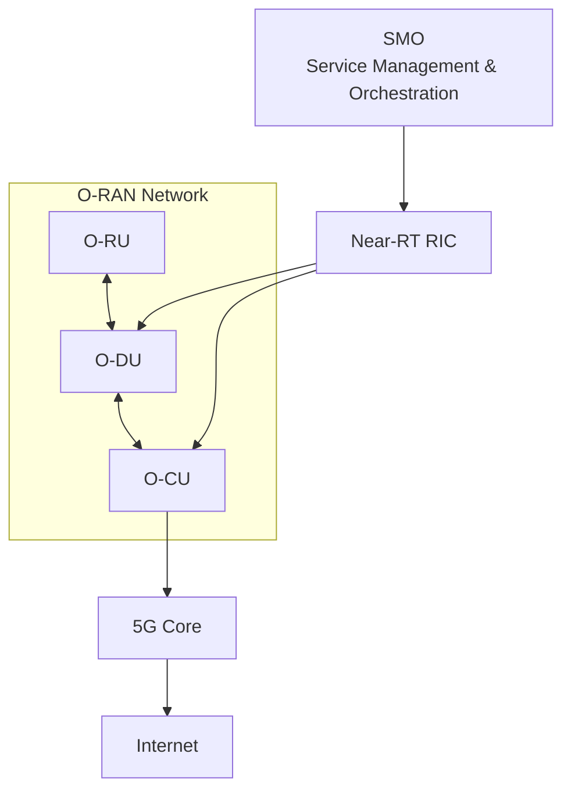
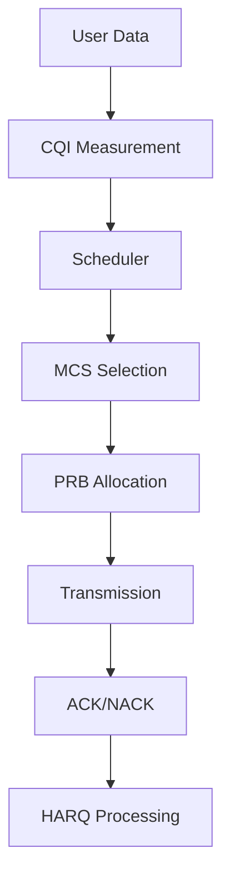
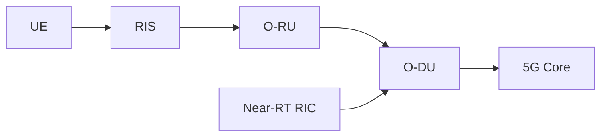
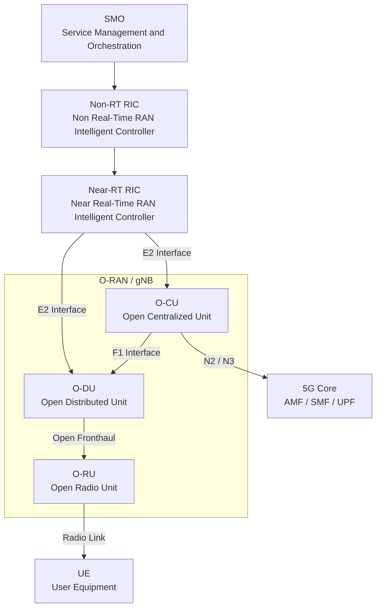
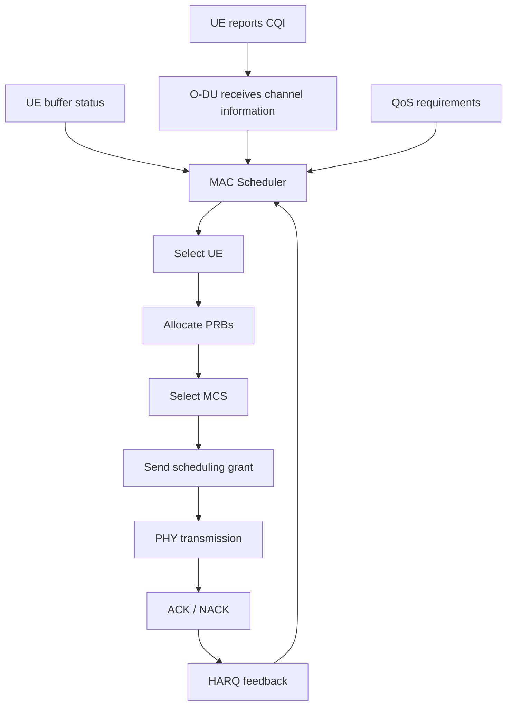
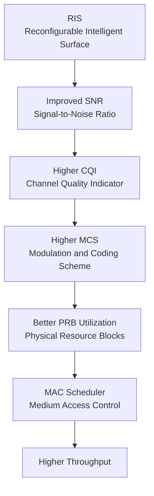
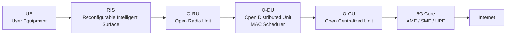

# O-RAN Architecture and MAC Layer

## Introduction

Open Radio Access Network (O-RAN) is an open and disaggregated architecture for 5G and future 6G networks. Unlike traditional monolithic base stations, O-RAN separates radio functions into independent components that can be deployed, upgraded, and optimized independently.

The O-RAN architecture forms the Radio Access Network (RAN) portion of modern 5G systems and is a core component of IOS-MCN deployments.

---

# Evolution from Traditional RAN to O-RAN

## Traditional Base Station

```text
+---------------------+
|      gNB/eNB        |
|                     |
| RF + PHY + MAC +    |
| RLC + PDCP + RRC    |
+---------------------+
```

Everything exists inside one vendor-specific box.

Limitations:

* Vendor lock-in
* Limited flexibility
* Difficult upgrades
* Limited interoperability

---

## O-RAN Architecture

```text
+---------+
|  O-RU   |
+---------+
     |
     | Open Fronthaul
     |
+---------+
|  O-DU   |
+---------+
     |
     | F1 Interface
     |
+---------+
|  O-CU   |
+---------+
     |
     |
  5G Core
```

Benefits:

* Open interfaces
* Vendor interoperability
* Cloud-native deployment
* AI-driven optimization
* Lower deployment cost

---

# Complete O-RAN Ecosystem



---

# O-RU (Open Radio Unit)

## Purpose

The O-RU is responsible for RF transmission and reception.

---

## Functions

### RF Processing

* Signal transmission
* Signal reception

### Beamforming

* Analog beamforming
* Hybrid beamforming

### Antenna Management

* Radiation pattern control
* MIMO support

---

## Hardware Components

* Antennas
* Power Amplifiers
* LNAs
* RF Chains

---

## Relevance to RIS

RIS operates directly in the radio propagation environment.

```text
UE
 ↓
RIS
 ↓
O-RU
```

RIS influences:

* Signal reflection
* Beam steering
* Coverage enhancement

---

# O-DU (Open Distributed Unit)

## Purpose

The O-DU contains real-time radio processing functions.

---

## Protocol Layers

```text
PHY
↑
MAC
↑
RLC
```

---

## Responsibilities

* Scheduling
* Resource allocation
* HARQ
* Radio resource control

---

# O-CU (Open Centralized Unit)

## Purpose

The O-CU manages higher-layer radio functions.

---

## Protocol Layers

```text
RRC
↑
PDCP
↑
SDAP
```

---

## Responsibilities

* Mobility management
* Session control
* Security handling

---

# O-RAN Interfaces

## Open Fronthaul

Connects:

```text
O-RU ↔ O-DU
```

Carries:

* IQ Samples
* Timing information

---

## F1 Interface

Connects:

```text
O-DU ↔ O-CU
```

Carries:

* User data
* Control information

---

## E2 Interface

Connects:

```text
Near-RT RIC ↔ O-DU/O-CU
```

Used for:

* AI optimization
* Resource management
* Scheduling optimization

---

# Near-RT RIC

## Purpose

Provides intelligent control of the radio network.

---

## Optimization Functions

### Load Balancing

```text
Cell A overloaded
      ↓
Move users
      ↓
Cell B
```

---

### Handover Optimization

Improves mobility performance.

---

### Scheduling Optimization

Improves throughput.

---

### Beam Management

Optimizes beam selection.

---

## AI Applications

* User prediction
* Traffic prediction
* Mobility prediction
* Beam selection

---

# Service Management and Orchestration (SMO)

## Purpose

Manages the entire network.

---

## Responsibilities

* Deployment
* Monitoring
* Configuration
* Analytics
* Lifecycle management

---

# MAC Layer

## Overview

The MAC (Medium Access Control) layer is one of the most important layers in the RAN.

It determines:

```text
Who transmits?
When?
How much?
Using which resources?
```

---

# MAC Position

```text
Application
 ↓
Transport
 ↓
PDCP
 ↓
RLC
 ↓
MAC
 ↓
PHY
```

---

# MAC Responsibilities

## Scheduling

The scheduler decides:

```text
User 1 → 40 PRBs
User 2 → 20 PRBs
User 3 → 30 PRBs
```

---

## Resource Allocation

Allocates:

```text
Time Resources
Frequency Resources
Power Resources
```

---

## Multiplexing

Combines multiple flows.

---

## HARQ

Provides retransmission.

```text
Packet Lost
     ↓
Retransmit
```

---

## QoS Enforcement

Supports:

* Low latency
* High reliability
* High throughput

---

# Physical Resource Blocks (PRBs)

Basic scheduling unit.

Example:

```text
100 MHz
 ↓
273 PRBs
```

Scheduler decides:

```text
User A → PRB 1-40

User B → PRB 41-80
```

---

# Channel Quality Indicator (CQI)

Represents channel quality.

Range:

```text
CQI 1 → Poor

CQI 15 → Excellent
```

---

## Impact

Higher CQI:

```text
Higher Throughput
```

Lower CQI:

```text
Lower Throughput
```

---

# Modulation and Coding Scheme (MCS)

Determines transmission efficiency.

Examples:

| MCS       | Modulation |
| --------- | ---------- |
| Low       | QPSK       |
| Medium    | 16QAM      |
| High      | 64QAM      |
| Very High | 256QAM     |

---

# HARQ

Hybrid Automatic Repeat Request.

Provides reliability.

```text
Packet Error
      ↓
NACK
      ↓
Retransmission
```

---

# MAC Scheduling Flow



---

# RIS and MAC Layer

This is where your internship becomes interesting.

---

## Without RIS

```text
Poor Channel
     ↓
Low SNR
     ↓
Low CQI
     ↓
Low MCS
     ↓
Low Throughput
```

---

## With RIS

```text
RIS
 ↓
Beam Steering
 ↓
Higher SNR
 ↓
Higher CQI
 ↓
Higher MCS
 ↓
More Efficient Scheduling
 ↓
Higher Throughput
```

---

# RIS-Assisted O-RAN Architecture



---

# Connection to Your SoW

Your RIS project aims to achieve:

* Targeted coverage
* Secure zones
* Dynamic beam steering
* Mobility support

These directly influence:

```text
SNR
↓
CQI
↓
MAC Scheduling
↓
Throughput
↓
QoS
```

---

# Interview Questions

## What does MAC do?

Answer:

The MAC layer performs scheduling, resource allocation, HARQ processing, multiplexing, and QoS enforcement between the RLC and PHY layers.

---

## What is CQI?

Answer:

CQI is a channel quality metric used by the scheduler to determine the appropriate modulation and coding scheme.

---

## What is the role of O-DU?

Answer:

The O-DU hosts PHY, MAC, and RLC functions and performs real-time radio processing.

---

## What is the role of Near-RT RIC?

Answer:

Near-RT RIC provides AI-driven optimization for scheduling, mobility management, load balancing, and beam management.

---

# Key Takeaways

1. O-RAN separates the base station into O-RU, O-DU, and O-CU.
2. O-DU hosts the MAC layer.
3. The MAC scheduler controls resource allocation.
4. CQI influences MCS selection.
5. HARQ provides reliability.
6. Near-RT RIC introduces AI-based optimization.
7. RIS improves channel quality.
8. Improved channel quality results in better MAC scheduling and higher throughput.
9. RIS, MAC, O-RAN, and IOS-MCN are tightly connected in modern 5G deployments.
10. Understanding these interactions is critical for RIS-assisted 5G testbed development.
# O-RAN MAC Architecture Study Notes

## 1. Objective

This document explains how the MAC layer fits inside the O-RAN architecture and how it connects with IOS-MCN, OAI, RIS-assisted communication, and future 5G/6G testbed work.

---

# 2. Full Forms

| Term        | Full Form                                 |
| ----------- | ----------------------------------------- |
| O-RAN       | Open Radio Access Network                 |
| RAN         | Radio Access Network                      |
| SMO         | Service Management and Orchestration      |
| RIC         | RAN Intelligent Controller                |
| Near-RT RIC | Near Real-Time RAN Intelligent Controller |
| Non-RT RIC  | Non Real-Time RAN Intelligent Controller  |
| O-RU        | Open Radio Unit                           |
| O-DU        | Open Distributed Unit                     |
| O-CU        | Open Centralized Unit                     |
| MAC         | Medium Access Control                     |
| PHY         | Physical Layer                            |
| RLC         | Radio Link Control                        |
| PDCP        | Packet Data Convergence Protocol          |
| SDAP        | Service Data Adaptation Protocol          |
| RRC         | Radio Resource Control                    |
| CQI         | Channel Quality Indicator                 |
| MCS         | Modulation and Coding Scheme              |
| PRB         | Physical Resource Block                   |
| HARQ        | Hybrid Automatic Repeat Request           |
| RIS         | Reconfigurable Intelligent Surface        |
| UE          | User Equipment                            |
| gNB         | Next Generation NodeB / 5G Base Station   |

---

# 3. High-Level O-RAN Architecture

```text
SMO
 ↓
Non-RT RIC
 ↓
Near-RT RIC
 ↓
O-CU
 ↓
O-DU
 ↓
O-RU
 ↓
UE
```

In a real 5G testbed:

```text
5G Core
 ↑
O-CU
 ↑
O-DU
 ↑
O-RU
 ↑
UE
```

---

# 4. Mermaid Diagram: O-RAN Architecture



---

# 5. Where MAC Layer Exists

The MAC layer mainly resides inside the:

```text
O-DU
```

O-DU handles lower-layer real-time radio processing.

Protocol placement:

```text
O-CU:
RRC
PDCP
SDAP

O-DU:
RLC
MAC
Part of PHY

O-RU:
RF
Low PHY
Antenna
Beamforming
```

---

# 6. O-CU, O-DU, O-RU Responsibilities

## 6.1 O-CU: Open Centralized Unit

O-CU handles higher-layer control and user-plane functions.

Main responsibilities:

* RRC signaling
* PDCP processing
* SDAP processing
* Mobility control
* Security management
* Session-related radio control

O-CU connects to:

* 5G Core using N2/N3 interfaces
* O-DU using F1 interface

---

## 6.2 O-DU: Open Distributed Unit

O-DU handles time-sensitive radio functions.

Main responsibilities:

* MAC scheduling
* RLC processing
* HARQ coordination
* PRB allocation
* MCS selection
* CQI handling
* Real-time radio resource management

This is the most important block for MAC-layer study.

---

## 6.3 O-RU: Open Radio Unit

O-RU handles radio transmission and reception.

Main responsibilities:

* RF signal transmission
* RF signal reception
* Antenna interface
* Low PHY processing
* Beamforming support
* RF front-end control

RIS interacts most directly with the O-RU because RIS changes the radio propagation channel.

---

# 7. O-RAN Interfaces

## 7.1 E2 Interface

Connects:

```text
Near-RT RIC ↔ O-DU / O-CU
```

Purpose:

* Near real-time optimization
* Control messages
* Radio performance monitoring
* xApp-based optimization

Example:

A Near-RT RIC xApp may monitor PRB usage, CQI, and throughput from the O-DU and suggest scheduling improvements.

---

## 7.2 F1 Interface

Connects:

```text
O-CU ↔ O-DU
```

Purpose:

* Control-plane and user-plane communication between CU and DU
* Split architecture support

---

## 7.3 Open Fronthaul Interface

Connects:

```text
O-DU ↔ O-RU
```

Purpose:

* Transport radio data
* Synchronization
* Low PHY interaction
* IQ sample transfer depending on functional split

---

# 8. MAC Layer in O-DU

MAC = Medium Access Control

The MAC layer answers these questions:

```text
Who should transmit?
When should they transmit?
How many PRBs should they receive?
Which MCS should be used?
Should retransmission happen?
```

MAC inputs:

* CQI reports
* Buffer status reports
* QoS requirements
* HARQ feedback
* Scheduling requests
* UE priority
* Channel condition

MAC outputs:

* PRB allocation
* MCS decision
* HARQ retransmission decision
* Uplink/downlink grants

---

# 9. Mermaid Diagram: MAC Scheduler Flow



---

# 10. CQI, MCS, PRB and HARQ in O-RAN MAC

## 10.1 CQI: Channel Quality Indicator

CQI tells the scheduler how good the radio channel is.

High CQI:

* Better channel
* Higher MCS possible
* Higher throughput

Low CQI:

* Poor channel
* Lower MCS needed
* Lower throughput

---

## 10.2 MCS: Modulation and Coding Scheme

MCS determines how much data can be sent per radio resource.

Low MCS:

* Robust
* Low throughput
* Suitable for poor channel

High MCS:

* Fast
* High throughput
* Requires good channel

---

## 10.3 PRB: Physical Resource Block

PRB is the schedulable frequency-time resource block.

Scheduler allocates PRBs to users.

More PRBs usually means more throughput.

But actual throughput depends on both:

```text
Number of PRBs + MCS level
```

---

## 10.4 HARQ: Hybrid Automatic Repeat Request

HARQ provides reliability using retransmission.

If a packet fails:

```text
NACK
 ↓
Retransmission
```

If packet succeeds:

```text
ACK
 ↓
Continue transmission
```

---

# 11. Near-RT RIC and MAC Optimization

Near-RT RIC can influence MAC-related decisions using xApps.

Examples of xApps:

* Traffic steering xApp
* Load balancing xApp
* Handover optimization xApp
* QoS optimization xApp
* Beam management xApp

Near-RT RIC collects telemetry from the RAN and can optimize:

* PRB usage
* User scheduling
* Load balancing
* Mobility handling
* Beam selection
* Interference control

---

# 12. RIS-Assisted MAC Scheduling

RIS = Reconfigurable Intelligent Surface

RIS improves the wireless channel by steering or shaping radio waves.

Without RIS:

```text
Poor channel
 ↓
Low SNR
 ↓
Low CQI
 ↓
Low MCS
 ↓
Low throughput
```

With RIS:

```text
RIS beam steering
 ↓
Higher SNR
 ↓
Higher CQI
 ↓
Higher MCS
 ↓
More efficient PRB usage
 ↓
Higher throughput
```

---

# 13. Mermaid Diagram: RIS to MAC Improvement Chain



---

# 14. RIS + O-RAN + MAC Architecture

```text
UE
 ↓
RIS
 ↓
O-RU
 ↓
O-DU
 ↓
MAC Scheduler
 ↓
O-CU
 ↓
5G Core
 ↓
Internet
```

In this architecture:

* RIS improves the physical radio channel.
* O-RU receives improved signal quality.
* O-DU processes CQI and scheduling.
* MAC scheduler selects MCS and PRB allocation.
* O-CU connects the RAN to the 5G Core.
* 5G Core provides session and Internet connectivity.

---

# 15. RIS-Assisted O-RAN MAC Architecture



---

# 16. How This Connects to the RIS Pilot Project

The RIS pilot includes:

* Targeted coverage
* Secure zones
* Dynamic beam control
* UGV communication
* IoT coverage
* 5G waveform demonstration

MAC-layer relevance:

| RIS Function          | MAC Impact                 |
| --------------------- | -------------------------- |
| Coverage enhancement  | Higher CQI                 |
| Beam steering         | Better MCS                 |
| Null steering         | Reduced interference       |
| Secure zones          | Controlled access          |
| Dynamic beam tracking | Stable scheduling          |
| Multi-user RIS        | Better resource allocation |

---

# 17. Research Direction: RIS-Aware MAC Scheduler

A possible research contribution:

```text
RIS-aware MAC scheduler
```

Inputs:

* UE position
* CQI
* SNR
* RIS phase state
* Traffic demand
* QoS class

Outputs:

* UE scheduling decision
* PRB allocation
* MCS selection
* RIS beam direction

Goal:

Maximize throughput while maintaining coverage and security.

---

# 18. Mentor Discussion Points

You can explain:

1. MAC layer resides inside the O-DU.
2. MAC scheduler controls PRB allocation and MCS selection.
3. CQI is a key input for MAC scheduling.
4. RIS improves SNR, which improves CQI.
5. Higher CQI allows higher MCS.
6. Better MCS improves throughput.
7. Near-RT RIC can potentially control or assist MAC optimization.
8. RIS-aware scheduling can become a research contribution.

---

# 19. Practical Next Steps

For OAI and IOS-MCN study:

1. Identify where MAC scheduler code exists in OAI.
2. Study CQI to MCS mapping.
3. Study PRB allocation logic.
4. Study HARQ feedback processing.
5. Connect logs from gNB/UE to MAC-layer behavior.
6. Later integrate RIS channel gain as an input to scheduling simulation.

---

# 20. Key Takeaways

* O-RAN separates gNB into O-RU, O-DU, and O-CU.
* MAC layer is mainly inside O-DU.
* MAC controls scheduling, PRB allocation, MCS selection, and HARQ.
* Near-RT RIC can support intelligent MAC optimization.
* RIS improves the physical channel.
* Better physical channel improves CQI.
* Better CQI improves MCS.
* Better MCS improves throughput.
* RIS-assisted MAC scheduling is a strong research direction for 5G/6G.
