# O-RAN E2 Interface Study

## 1. Objective

This document explains the E2 Interface in O-RAN architecture and its role in enabling intelligent RAN control through the Near-RT RIC.

This study serves as the foundation for:

* O-RAN Deployment
* Near-RT RIC Integration
* xApp Development
* RAN Optimization
* RIS-Assisted Scheduling
* AI-Native 6G Networks

---

# 2. What is the E2 Interface?

The E2 Interface is the communication link between:

* Near-RT RIC
* E2 Nodes

The E2 Interface allows:

* Collection of RAN telemetry
* Monitoring network performance
* Sending control actions
* Executing optimization policies

Without E2:

```text
RIC cannot see the RAN
RIC cannot control the RAN
```

With E2:

```text
RIC monitors the RAN
RIC controls the RAN
RIC runs AI-driven optimization
```

---

# 3. O-RAN Architecture Overview

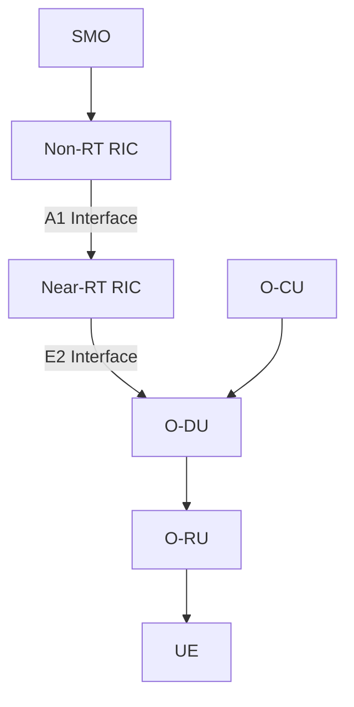

---

# 4. Full Forms

| Term        | Full Form                                 |
| ----------- | ----------------------------------------- |
| O-RAN       | Open Radio Access Network                 |
| RIC         | RAN Intelligent Controller                |
| Near-RT RIC | Near Real-Time RAN Intelligent Controller |
| Non-RT RIC  | Non Real-Time RAN Intelligent Controller  |
| E2          | O-RAN Control Interface                   |
| E2AP        | E2 Application Protocol                   |
| E2SM        | E2 Service Model                          |
| xApp        | Near-RT RIC Application                   |
| rApp        | Non-RT RIC Application                    |
| O-CU        | Open Central Unit                         |
| O-DU        | Open Distributed Unit                     |
| O-RU        | Open Radio Unit                           |
| KPI         | Key Performance Indicator                 |

---

# 5. What is an E2 Node?

An E2 Node is any RAN entity connected to the Near-RT RIC through E2.

Examples:

```text
O-DU
O-CU
gNB
CU-DU Combination
```

In most deployments:

```text
O-DU
↓
E2 Node
```

---

# 6. E2 Interface Architecture

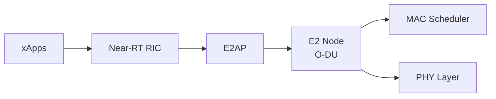

---

# 7. What is E2AP?

## Full Form

E2AP = E2 Application Protocol

It is the protocol used on the E2 Interface.

Responsibilities:

* Session establishment
* Subscription management
* Control message exchange
* Event reporting
* Policy delivery

Think of E2AP as:

```text
NGAP for O-RAN
```

Just as:

```text
gNB ↔ AMF uses NGAP
```

Similarly:

```text
Near-RT RIC ↔ O-DU uses E2AP
```

---

# 8. E2AP Procedures

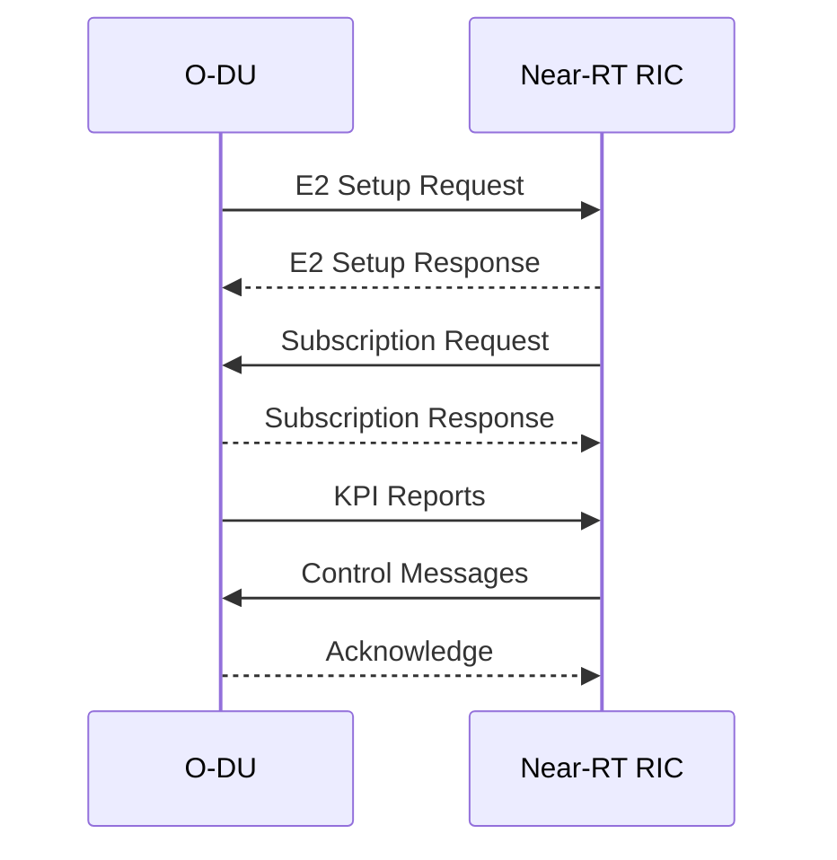

---

# 9. What are E2 Service Models (E2SM)?

E2SM defines:

```text
What information
can be exchanged
through E2
```

Examples:

* KPI reporting
* Traffic statistics
* Scheduling control
* Mobility control

---

# 10. E2SM-KPM

## Full Form

Key Performance Measurement

Purpose:

Collect RAN performance metrics.

Examples:

* Throughput
* CQI
* PRB Utilization
* HARQ Retransmissions
* Latency

Architecture:

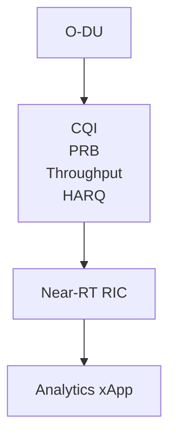

---

# 11. E2SM-RC

## Full Form

RAN Control

Purpose:

Allow Near-RT RIC to control the RAN.

Examples:

* Scheduler tuning
* Handover control
* QoS optimization
* Beam management

Architecture:

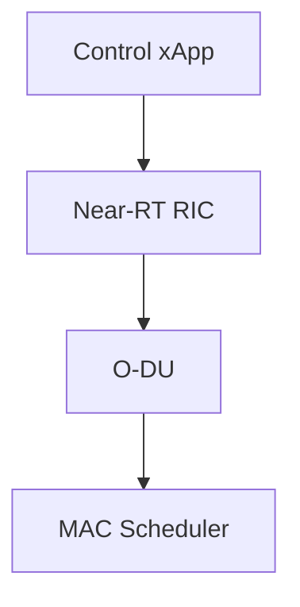

---

# 12. How xApps Work

xApps are applications running inside Near-RT RIC.

Examples:

```text
Traffic Prediction xApp
Mobility Optimization xApp
RIS Control xApp
MAC Scheduling xApp
Energy Saving xApp
```

Architecture:

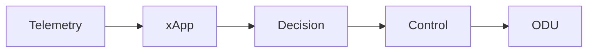

---

# 13. E2 Telemetry Flow

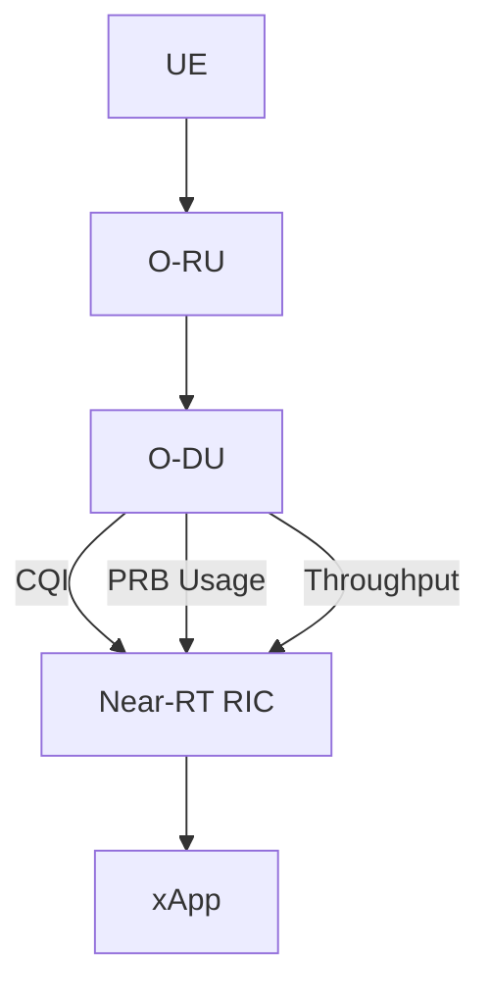

---

# 14. E2 Control Flow

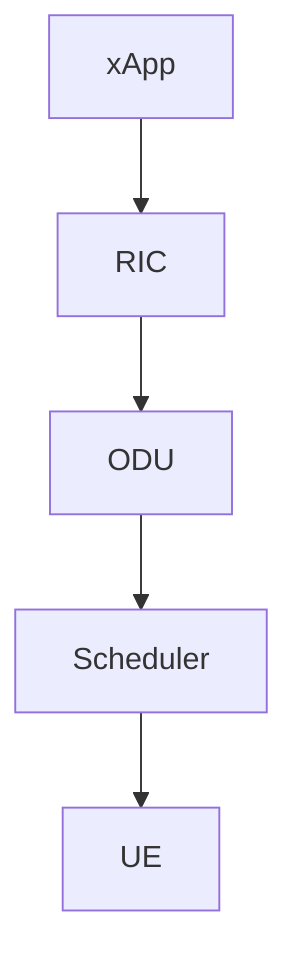

---

# 15. RIS Integration Through E2

Future Architecture:

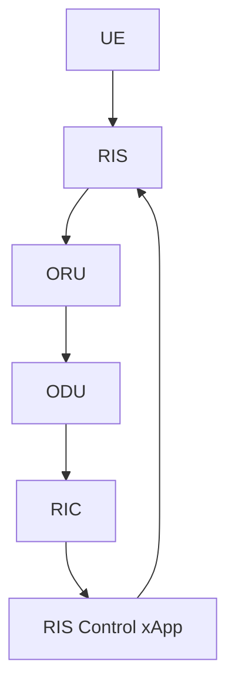

---

# 16. RIS + MAC Optimization

RIS improves:

```text
SNR
SINR
CQI
```

RIC receives:

```text
CQI Reports
```

RIC xApp decides:

```text
RIS Configuration
Scheduler Optimization
```

Result:

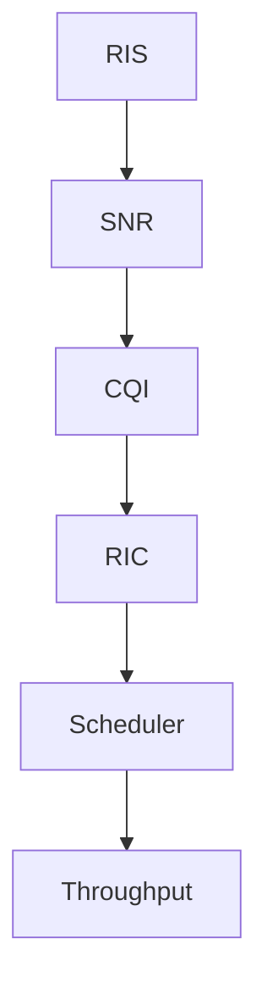

---

# 17. Research Relevance

For your internship:

### Current Stage

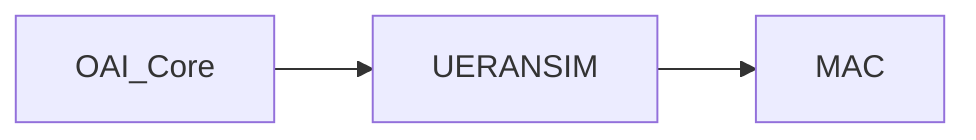

### Next Stage

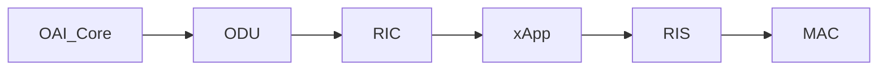

---

# 18. Mentor Discussion Questions

Q1. What is E2 Interface?

Communication interface between Near-RT RIC and E2 Nodes.

---

Q2. What protocol runs on E2?

E2AP.

---

Q3. What is E2SM?

E2 Service Model.

---

Q4. What is E2SM-KPM?

Performance measurement service model.

---

Q5. What is E2SM-RC?

RAN control service model.

---

Q6. What is an E2 Node?

A RAN node connected to the Near-RT RIC.

---

Q7. What is an xApp?

Application running inside Near-RT RIC.

---

Q8. How can RIS be integrated?

Through RIS-aware xApps using E2 telemetry and control.

---

# 19. Key Takeaways

* E2 Interface connects Near-RT RIC with O-DU.
* E2AP is the protocol running on E2.
* E2SM defines telemetry and control information.
* E2SM-KPM provides performance metrics.
* E2SM-RC enables RAN control.
* xApps provide intelligence inside Near-RT RIC.
* RIS-aware xApps can optimize MAC scheduling.
* E2 Interface is the foundation for AI-native O-RAN systems.

---

# 20. Conclusion

The E2 Interface is the most important control interface in O-RAN. It enables Near-RT RIC to observe and control the RAN through E2AP and E2 Service Models. By using E2SM-KPM and E2SM-RC, xApps can collect telemetry, perform AI-based optimization, and control MAC scheduling, beamforming, mobility, and future RIS-assisted operations. Understanding E2 is a critical step toward O-RAN deployment, RIC development, and AI-native 6G research.
