# O-RAN and RIC Study Notes

## 1. Objective

This document explains the Open Radio Access Network architecture and the role of the RAN Intelligent Controller in modern 5G and future 6G networks.

This study connects directly with:

* OAI Core deployment
* UERANSIM gNB and UE deployment
* IOS-MCN research
* MAC scheduler study
* RIS-assisted 5G testbed development
* Future O-RAN and Near-RT RIC integration

---

# 2. Full Forms

| Term        | Full Form                                        |
| ----------- | ------------------------------------------------ |
| O-RAN       | Open Radio Access Network                        |
| RAN         | Radio Access Network                             |
| RIC         | RAN Intelligent Controller                       |
| Near-RT RIC | Near Real-Time RAN Intelligent Controller        |
| Non-RT RIC  | Non Real-Time RAN Intelligent Controller         |
| SMO         | Service Management and Orchestration             |
| O-CU        | Open Centralized Unit                            |
| O-DU        | Open Distributed Unit                            |
| O-RU        | Open Radio Unit                                  |
| E2          | Interface between Near-RT RIC and RAN nodes      |
| A1          | Interface between Non-RT RIC and Near-RT RIC     |
| O1          | Management interface between SMO and O-RAN nodes |
| xApp        | Application running on Near-RT RIC               |
| rApp        | Application running on Non-RT RIC / SMO layer    |
| MAC         | Medium Access Control                            |
| PHY         | Physical Layer                                   |
| RLC         | Radio Link Control                               |
| PDCP        | Packet Data Convergence Protocol                 |
| RRC         | Radio Resource Control                           |
| CQI         | Channel Quality Indicator                        |
| MCS         | Modulation and Coding Scheme                     |
| PRB         | Physical Resource Block                          |
| HARQ        | Hybrid Automatic Repeat Request                  |
| RIS         | Reconfigurable Intelligent Surface               |

---

# 3. Why O-RAN?

Traditional RAN systems are mostly vendor-specific and tightly integrated. O-RAN introduces openness, modularity, interoperability, and intelligence into the radio access network.

Traditional RAN:

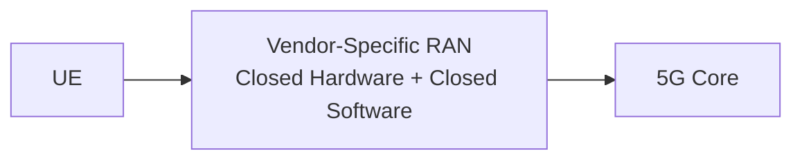

O-RAN:


Key benefits:

* Open interfaces
* Multi-vendor interoperability
* Software-defined control
* AI/ML-based optimization
* Programmable RAN behavior
* Better research flexibility

---

# 4. High-Level O-RAN Architecture

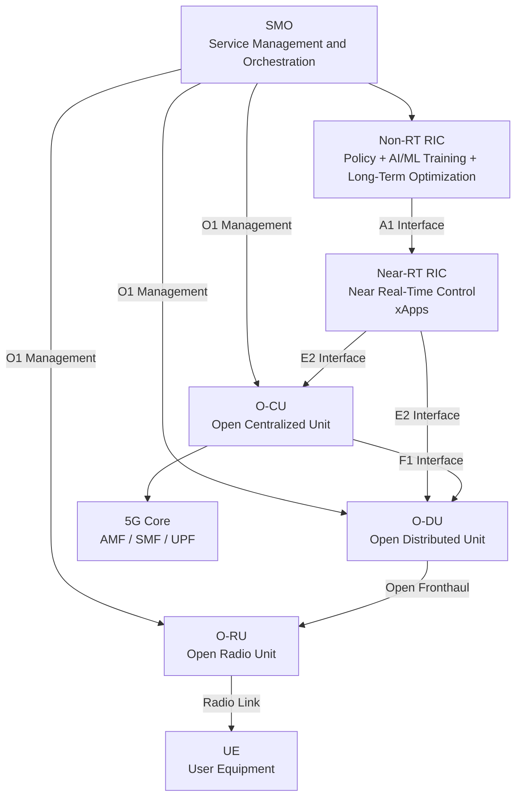

---

# 5. O-RAN Functional Split

In O-RAN, a gNB is split into multiple logical blocks.

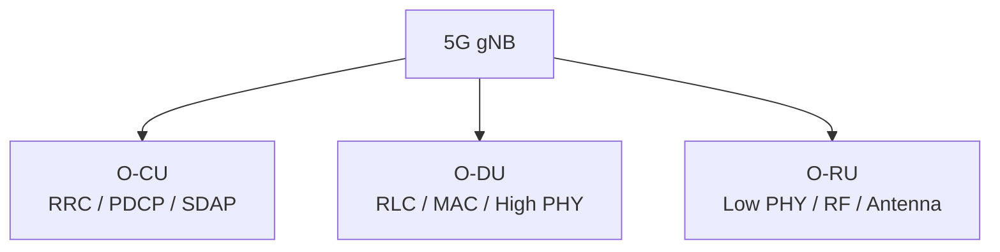

## O-CU

O-CU handles higher-layer functions:

* RRC
* PDCP
* SDAP
* Mobility control
* Security handling
* Connection to 5G Core

## O-DU

O-DU handles lower-layer real-time functions:

* RLC
* MAC
* HARQ
* PRB allocation
* MCS selection
* Scheduling
* High PHY

## O-RU

O-RU handles radio functions:

* Low PHY
* RF transmission
* RF reception
* Antenna interface
* Beamforming support

---

# 6. Where MAC Layer Exists

The MAC layer mainly resides in the O-DU.

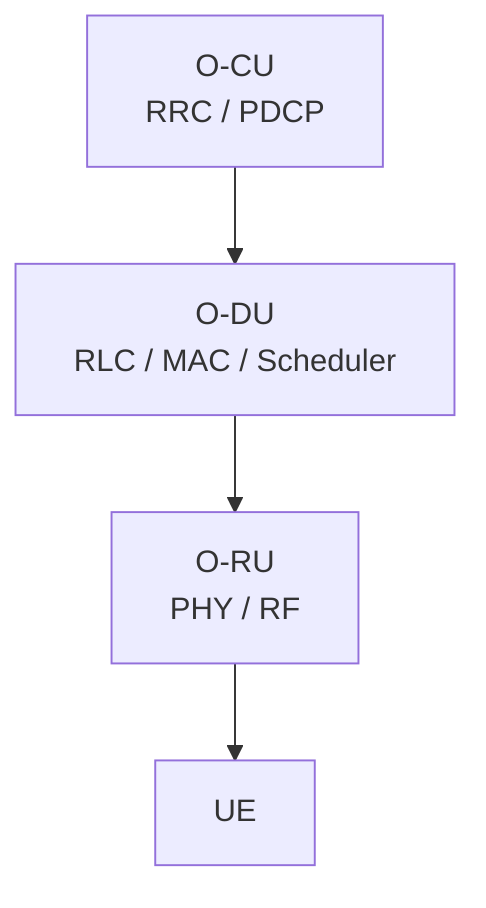

MAC layer responsibilities:

* UE scheduling
* PRB allocation
* MCS selection
* HARQ retransmission
* Buffer status handling
* CQI-based resource allocation
* QoS-aware scheduling

---

# 7. What is RIC?

RIC stands for RAN Intelligent Controller.

It introduces intelligence and programmability into the RAN.

There are two main RIC layers:

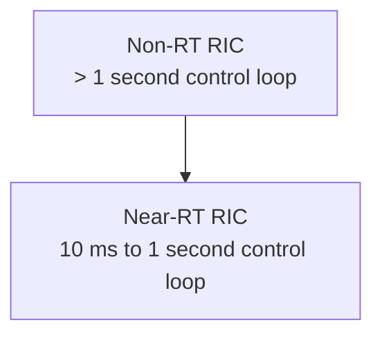

---

# 8. Non-RT RIC

Non-RT RIC operates at a time scale greater than 1 second.

It is usually part of the SMO layer.

Functions:

* Long-term optimization
* AI/ML model training
* Policy generation
* Network analytics
* Traffic prediction
* Energy optimization
* Cell-level planning

Applications running here are called:

```text
rApps
```

Example rApps:

* Traffic prediction rApp
* Energy optimization rApp
* Coverage analysis rApp
* Policy generation rApp

---

# 9. Near-RT RIC

Near-RT RIC operates at a time scale of approximately 10 ms to 1 second.

It controls near real-time RAN behavior.

Functions:

* Traffic steering
* Load balancing
* Mobility optimization
* Interference coordination
* QoS optimization
* Scheduling assistance
* Beam management support

Applications running here are called:

```text
xApps
```

Example xApps:

* Traffic steering xApp
* Handover optimization xApp
* PRB optimization xApp
* Interference management xApp
* QoS control xApp
* Beam management xApp

---

# 10. RIC Control Loop

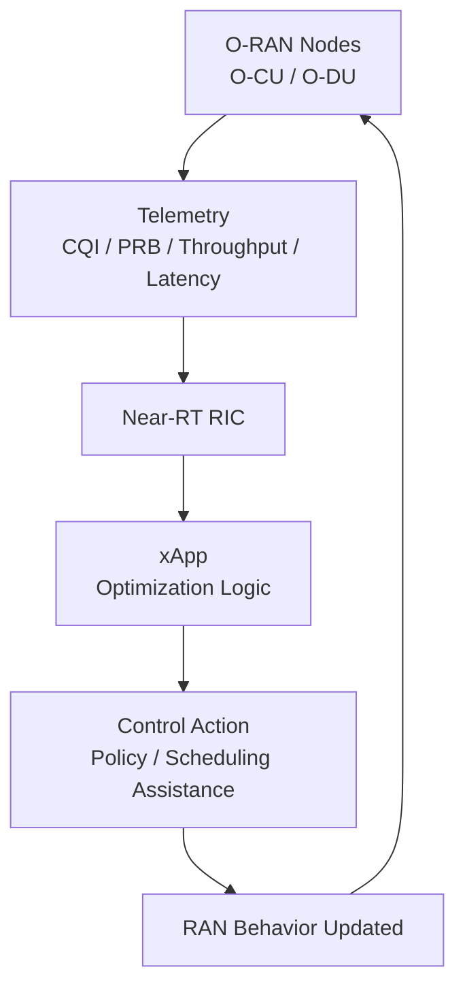

---

# 11. O-RAN Interfaces

## A1 Interface

Connects:


Purpose:

* Policy transfer
* ML model guidance
* Long-term optimization instructions

## E2 Interface

Connects:

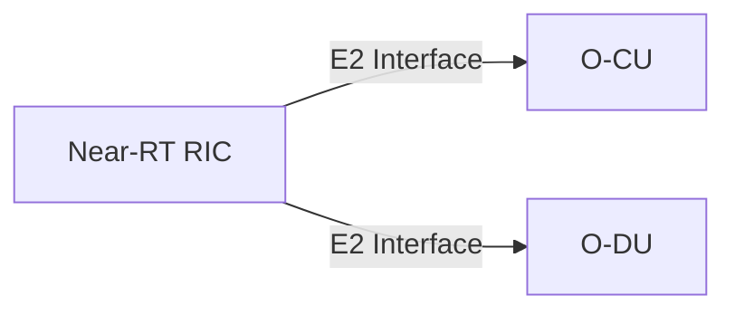

Purpose:

* Near real-time telemetry
* Control messages
* xApp interaction with RAN nodes

## O1 Interface

Connects:

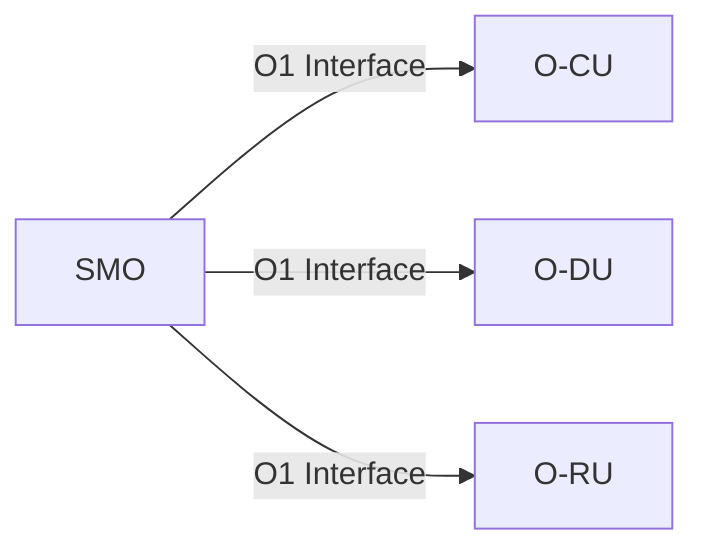

Purpose:

* Fault management
* Configuration management
* Performance monitoring
* Software lifecycle management

## Open Fronthaul

Connects:


Purpose:

* Radio sample transport
* Synchronization
* Low PHY data exchange

---

# 12. xApp Architecture

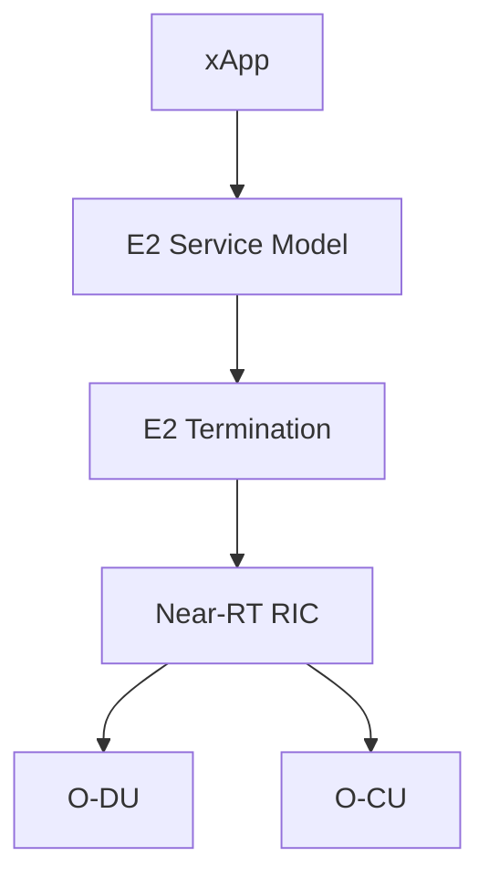

xApps use RAN telemetry to make control decisions.

Examples of xApp input:

* CQI
* RSRP
* RSRQ
* SINR
* PRB usage
* UE throughput
* Latency
* Handover statistics

Examples of xApp output:

* Traffic steering decision
* PRB optimization policy
* Mobility recommendation
* Interference control action
* Beam selection guidance

---

# 13. RIC and MAC Scheduler

The MAC scheduler is inside the O-DU. RIC can influence MAC-related behavior using telemetry and control policies.

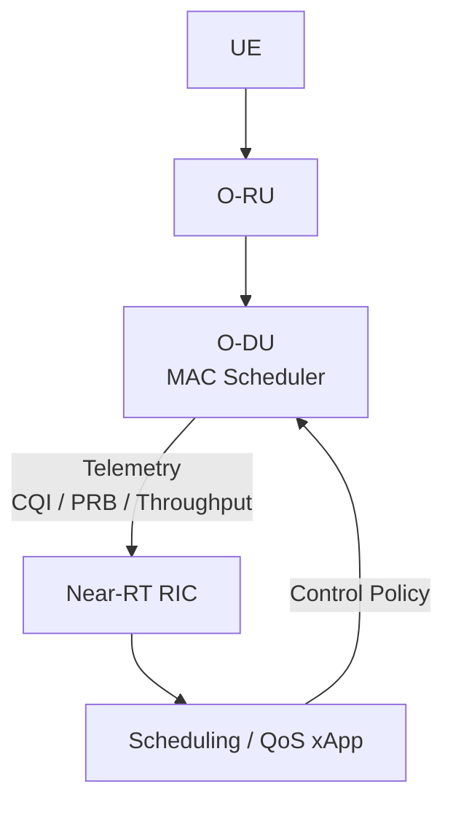

MAC scheduler parameters:

* CQI
* MCS
* PRB allocation
* HARQ feedback
* QoS class
* Buffer status
* UE priority
* Channel condition

---

# 14. RIS Connection with O-RAN and RIC

RIS can improve the physical wireless channel, while RIC can intelligently control or assist optimization decisions.

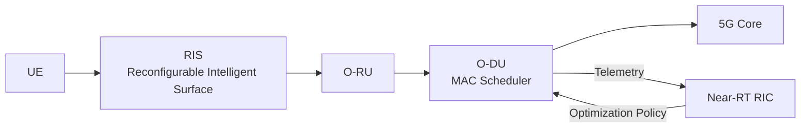

RIS improves:

* SNR
* CQI
* MCS
* Coverage
* Throughput
* Reliability

---

# 15. RIS-Aware RIC Control Concept

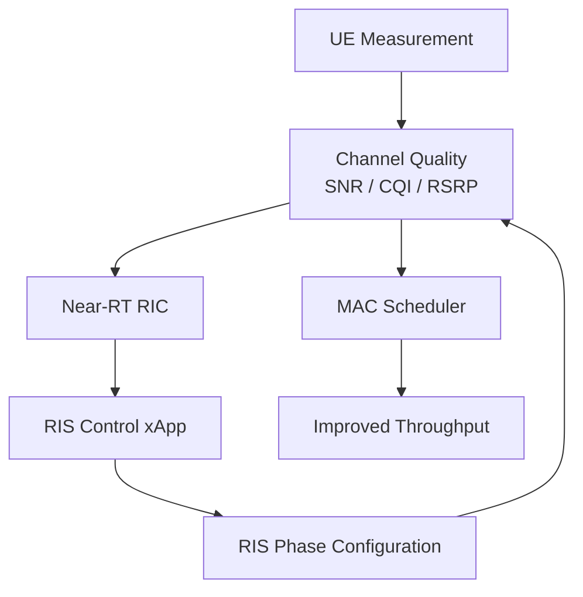

This can become a research direction:

```text
RIS-aware RIC-assisted MAC scheduling
```

---

# 16. Relation to Current OAI + UERANSIM Deployment

Current successful setup:


Next evolution:

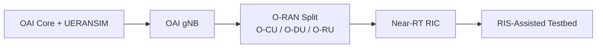

---

# 17. Practical Study Roadmap

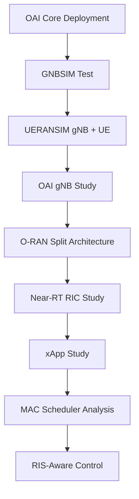

---

# 18. Mentor Discussion Points

You should be able to explain:

1. O-RAN splits gNB into O-CU, O-DU, and O-RU.
2. MAC scheduler is mainly inside O-DU.
3. Near-RT RIC controls near real-time RAN optimization.
4. xApps run inside Near-RT RIC.
5. Non-RT RIC handles long-term AI/ML policy and rApps.
6. E2 interface connects Near-RT RIC with O-CU/O-DU.
7. O1 interface is used for management and orchestration.
8. A1 interface connects Non-RT RIC with Near-RT RIC.
9. RIS improves channel quality.
10. Better channel quality improves CQI, MCS, and throughput.
11. RIS-aware MAC scheduling can be guided by RIC and xApps.

---

# 19. Key Takeaways

* O-RAN makes the RAN open, modular, and programmable.
* RIC introduces AI/ML-driven control into RAN.
* Near-RT RIC uses xApps for near real-time optimization.
* Non-RT RIC uses rApps for long-term policy and intelligence.
* MAC scheduling is a key control point for performance.
* RIS can improve channel quality before the signal reaches the O-RU.
* A strong research direction is RIS-aware RIC-assisted MAC scheduling.

---

# 20. Conclusion

O-RAN and RIC provide the programmable and intelligent control framework required for advanced 5G and 6G research. After completing OAI Core and UERANSIM deployment, the next logical step is understanding how O-RAN splits the gNB into O-CU, O-DU, and O-RU, and how Near-RT RIC can influence MAC-layer decisions. This directly connects with RIS-assisted communication because RIS improves the radio channel, while RIC and MAC scheduling can use that improved channel quality to enhance throughput, coverage, and reliability.
