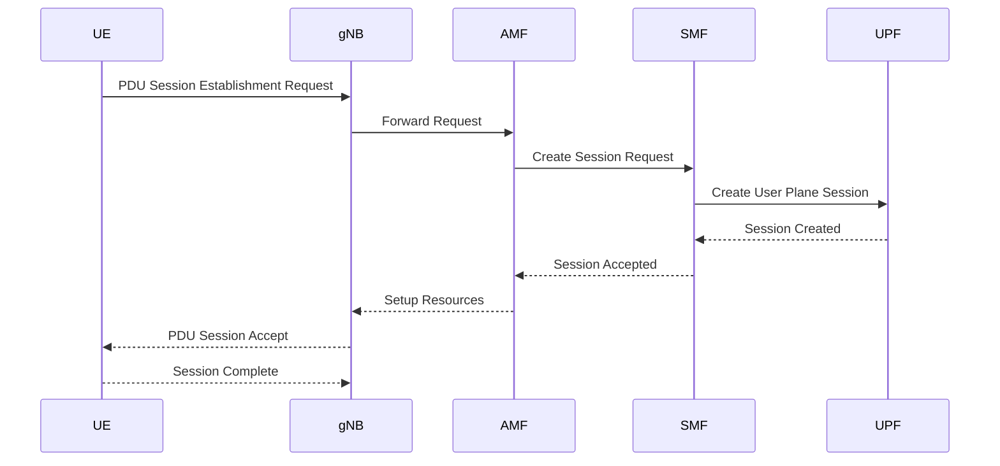
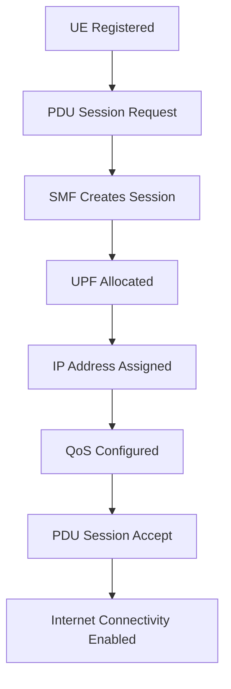

# PDU Session Establishment Procedure in 5G

## Objective

After successful registration, a User Equipment (UE) is authenticated and attached to the network but still cannot access the Internet.

To enable data connectivity, the UE must establish a PDU (Protocol Data Unit) Session.

The PDU Session Establishment Procedure creates:

* User data path
* IP address allocation
* UPF association
* Internet connectivity
* QoS enforcement

This procedure introduces two important 5G Core functions:

* SMF (Session Management Function)
* UPF (User Plane Function)

---

# Why PDU Session is Required

After Registration:

```text
UE Registered
     ↓
Authenticated
     ↓
Connected to Network
     ↓
No Internet Access Yet
```

After PDU Session Establishment:

```text
UE Registered
     ↓
PDU Session Established
     ↓
IP Address Assigned
     ↓
Internet Access Enabled
```

---

# Core Entities Involved

```text
UE
 ↓
gNB
 ↓
AMF
 ↓
SMF
 ↓
UPF
 ↓
Internet
```

---

# Responsibilities of Network Functions

| Function | Responsibility          |
| -------- | ----------------------- |
| UE       | Requests data session   |
| gNB      | Forwards signaling      |
| AMF      | Session coordination    |
| SMF      | Session management      |
| UPF      | User traffic forwarding |
| Internet | External data network   |

---

# High-Level Architecture

```text
             Control Plane

UE
 ↓
gNB
 ↓
AMF
 ↓
SMF


             User Plane

UE
 ↓
gNB
 ↓
UPF
 ↓
Internet
```

---

# Important Concept

## Control Plane

Responsible for:

* Signaling
* Session setup
* Authentication
* Mobility

Path:

```text
UE → gNB → AMF → SMF
```

---

## User Plane

Responsible for:

* Actual user traffic
* Video streaming
* Web browsing
* Downloads

Path:

```text
UE → gNB → UPF → Internet
```

---

# Complete PDU Session Flow

## Sequence Diagram



---

# Step 1: PDU Session Request

User opens:

* YouTube
* Browser
* Application

UE requests:

```text
Internet Access
```

Flow:

```text
UE
 ↓
PDU Session Establishment Request
 ↓
gNB
 ↓
AMF
```

---

# Information Included

The request contains:

* Requested Data Network (DNN)
* Session Type
* QoS Information
* Network Slice Information

Examples:

```text
internet
ims
enterprise
```

---

# Step 2: AMF Contacts SMF

AMF does not create sessions.

AMF forwards request:

```text
AMF
 ↓
SMF
```

SMF becomes responsible.

---

# SMF Responsibilities

## Session Creation

SMF creates:

```text
PDU Session
```

## UPF Selection

SMF decides:

```text
Which UPF should serve this user?
```

## IP Address Assignment

SMF allocates:

```text
10.x.x.x
```

or

```text
IPv6 Address
```

## QoS Policy Selection

SMF determines:

* Bandwidth
* Priority
* Latency Requirements

---

# Step 3: UPF Session Creation

SMF instructs UPF:

```text
Create User Plane Tunnel
```

Flow:

```text
SMF
 ↓
UPF
```

UPF creates:

```text
User Session
```

---

# UPF Responsibilities

## Packet Forwarding

Forward traffic:

```text
UE ↔ Internet
```

---

## QoS Enforcement

Apply:

* Bandwidth limits
* Priority
* Traffic policies

---

## Routing

Forward packets to:

```text
Internet
Enterprise Network
Cloud
MEC Server
```

---

# Step 4: Session Accepted

UPF confirms:

```text
Session Created
```

Flow:

```text
UPF
 ↓
SMF
 ↓
AMF
```

---

# Step 5: Radio Resource Setup

AMF informs gNB.

```text
AMF
 ↓
gNB
```

The gNB allocates:

* Radio bearers
* User resources
* QoS flows

---

# Step 6: PDU Session Accept

Network informs UE.

```text
UE
 ←
PDU Session Accept
```

The UE receives:

* IP Address
* Session Parameters
* QoS Information

---

# Step 7: User Traffic Starts

Now data flows.

```text
UE
 ↓
gNB
 ↓
UPF
 ↓
Internet
```

Internet connectivity is available.

---

# Complete User Plane Path

```text
UE
 ↓
gNB
 ↓
UPF
 ↓
Internet
```

Example:

```text
YouTube Video

YouTube Server
 ↓
Internet
 ↓
UPF
 ↓
gNB
 ↓
UE
```

---

# Complete Control Plane Path

```text
UE
 ↓
gNB
 ↓
AMF
 ↓
SMF
```

Control Plane:

* Session setup
* Signaling
* QoS management

No user traffic passes here.

---

# Session Lifecycle



---

# Role of SMF

## Main Functions

* Session Creation
* Session Modification
* Session Release
* UPF Selection
* IP Assignment
* QoS Management

### Interview Answer

SMF manages PDU sessions, assigns IP addresses, selects UPFs and enforces session policies.

---

# Role of UPF

## Main Functions

* Packet Forwarding
* QoS Enforcement
* Traffic Steering
* Routing
* Charging Support

### Interview Answer

UPF is the user-plane router responsible for forwarding traffic between the RAN and external data networks.

---

# Difference Between Registration and PDU Session

| Registration        | PDU Session         |
| ------------------- | ------------------- |
| Authentication      | Internet Access     |
| Mobility Management | User Traffic        |
| AMF Focused         | SMF + UPF Focused   |
| No IP Address       | IP Address Assigned |
| No Internet         | Internet Enabled    |

---

# Registration + PDU Session Combined

```text
UE Power ON
      ↓
Registration Procedure
      ↓
Authentication Success
      ↓
Registration Complete
      ↓
PDU Session Request
      ↓
SMF Creates Session
      ↓
UPF Allocated
      ↓
IP Address Assigned
      ↓
Internet Access Enabled
```

---

# Relevance to IOS-MCN and OpenAirInterface

When deploying:

* IOS-MCN
* OpenAirInterface
* O-RAN Testbeds

The two most important milestones are:

## Milestone 1

```text
Registration Success
```

Logs:

```text
Registration Request
Authentication
Registration Accept
```

---

## Milestone 2

```text
PDU Session Success
```

Logs:

```text
PDU Session Request
Session Created
IP Assigned
```

---

# Connection to RIS Research

RIS improves:

```text
Signal Quality
      ↓
Higher SINR
      ↓
Higher CQI
      ↓
Better MCS
      ↓
Improved Throughput
```

The user traffic benefiting from this improvement flows through:

```text
UE
 ↓
gNB
 ↓
UPF
 ↓
Internet
```

Thus RIS directly affects the performance of established PDU sessions.

---

# Key Takeaways

1. Registration authenticates the user.
2. PDU Session provides Internet connectivity.
3. SMF manages sessions.
4. UPF forwards user traffic.
5. IP addresses are assigned during PDU Session Establishment.
6. User-plane traffic does not pass through the AMF.
7. Successful PDU Session Establishment is a critical milestone in IOS-MCN deployment.
8. RIS improvements ultimately enhance throughput and QoS within active PDU sessions.
