# RC xApp Study

## O-RAN Control xApp Using E2SM-RC

---

# Objective

This document explains the concept, architecture, workflow, and implementation principles of an O-RAN RC (RAN Control) xApp using the E2SM-RC Service Model.

After completing this study, you will understand:

* What is an RC xApp?
* What is E2SM-RC?
* Difference between KPM and RC xApps
* Near-RT RIC Control Mechanisms
* Policy-Based Control
* Scheduler Control
* Slice Control
* QoS Control
* RIS-Aware Control Concepts

This study is the foundation for implementing intelligent network optimization using O-RAN.

---

# 1. Evolution of O-RAN Applications

The O-RAN journey follows a progression:

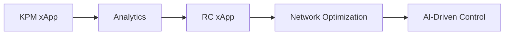

---

# 2. What is an RC xApp?

RC stands for:

```text
RAN Control
```

An RC xApp is an application running inside the Near-RT RIC that can:

* Monitor network conditions
* Make decisions
* Send control commands to the gNB

Unlike KPM xApps:

```text
KPM xApp = Observe

RC xApp = Observe + Control
```

---

# 3. Why RC xApps Are Important

Traditional networks:

```text
Static Configuration
```

O-RAN Networks:

```text
Dynamic Configuration
```

Benefits:

* Better throughput
* Reduced latency
* Intelligent scheduling
* Dynamic resource allocation
* AI-driven optimization

---

# 4. O-RAN Control Architecture

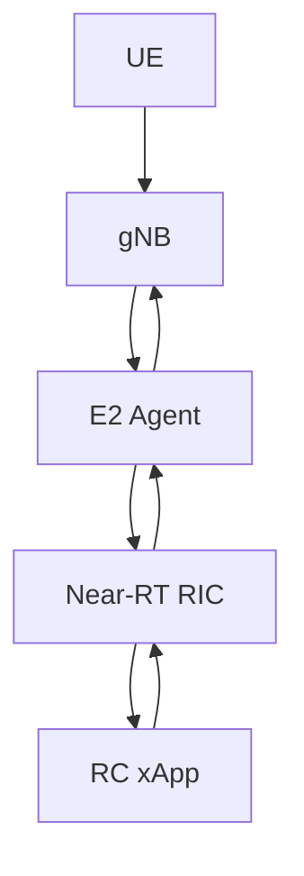

---

# 5. Monitoring vs Control

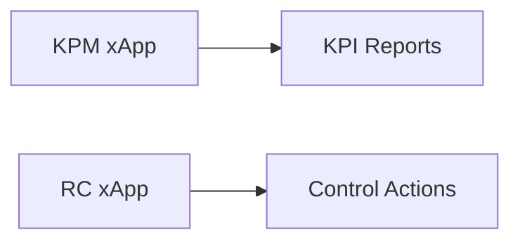

---

# 6. What is E2SM-RC?

Full Form:

```text
E2 Service Model for RAN Control
```

Purpose:

Enable Near-RT RIC to control RAN behavior.

It defines:

* Control Requests
* Control Actions
* Control Outcomes
* Policy Enforcement

---

# 7. Position of E2SM-RC

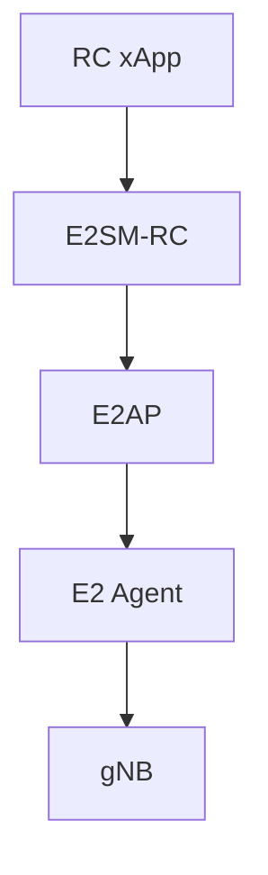

---

# 8. RC Control Workflow

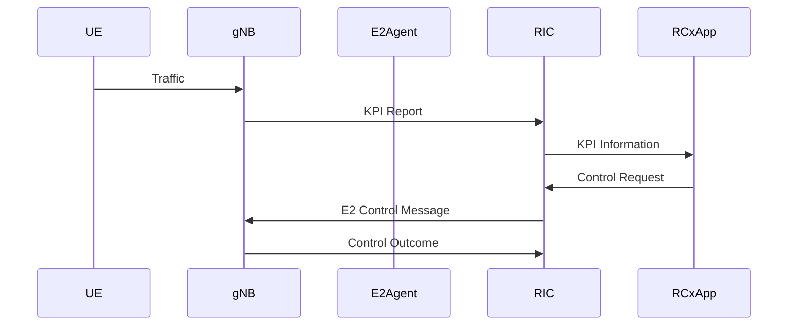

---

# 9. RC Service Model Functions

E2SM-RC supports:

```text
Policy Control

QoS Control

Slice Control

Scheduler Control

Admission Control

Mobility Control
```

---

# 10. Scheduler Control

One major application:

```text
MAC Scheduler Optimization
```

Example:

```text
Low CQI User

↓

Reduce Resource Allocation

↓

High CQI User

↓

Increase Allocation
```

---

# 11. Scheduler Optimization Workflow

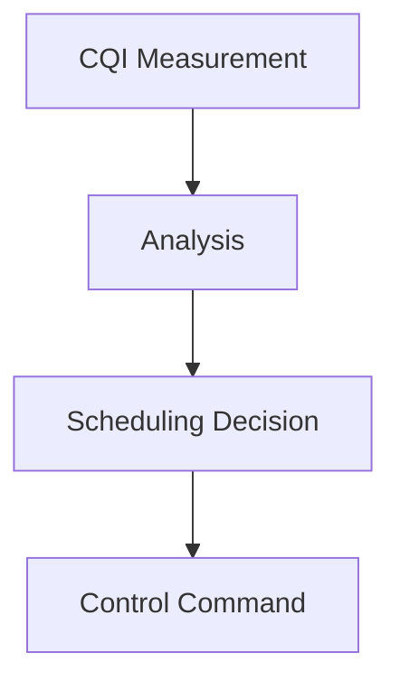

---

# 12. QoS Control

RC xApps can control:

```text
5QI

Priority

Latency

Guaranteed Bit Rate
```

Example:

```text
Video Traffic

↓

High Priority

↓

Low Latency Scheduling
```

---

# 13. QoS Decision Flow

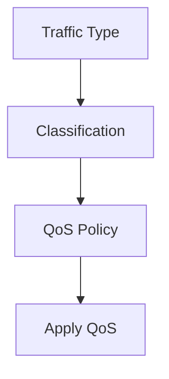

---

# 14. Slice Control

RC xApps can control:

```text
Network Slices
```

Examples:

```text
eMBB

URLLC

mMTC
```

---

# 15. Slice Management Workflow

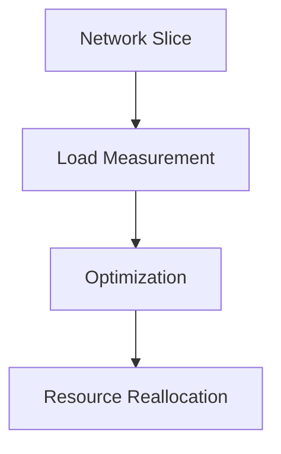

---

# 16. Admission Control

Purpose:

Determine whether a new UE can be admitted.

Process:

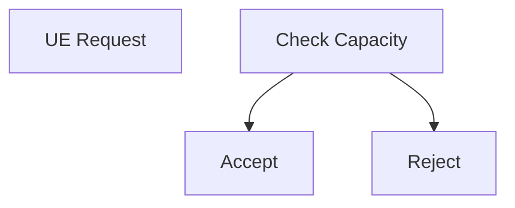

---

# 17. Mobility Control

RC xApps may influence:

```text
Handover Decisions
```

Example:

```text
UE Moving

↓

Signal Weak

↓

Trigger Handover
```

---

# 18. AI-Assisted RC xApps

Future networks use:

```text
Machine Learning

Deep Learning

Reinforcement Learning
```

Inputs:

```text
CQI

SINR

PRB

Throughput
```

Outputs:

```text
Control Actions
```

---

# 19. AI Control Loop

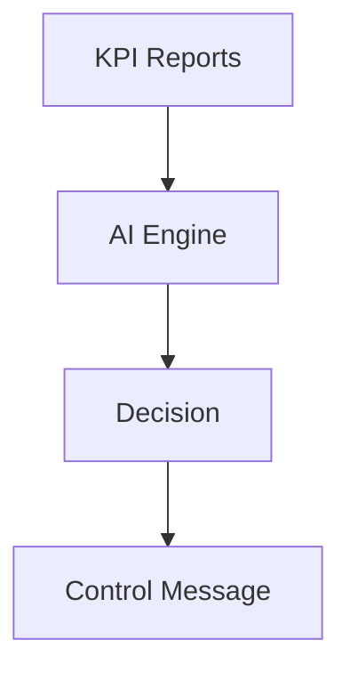

---

# 20. Relation Between KPM and RC

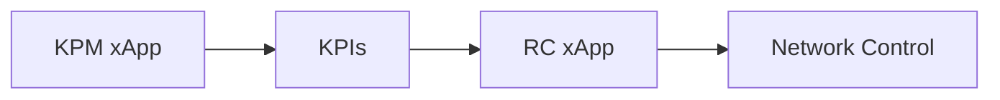

---

# 21. Why KPM Comes First

Without KPIs:

```text
No Visibility
```

Without Visibility:

```text
No Intelligent Control
```

Therefore:

```text
KPM First

↓

RC Second
```

---

# 22. RIS-Aware RC xApp

Future research goal.

RIS affects:

```text
Propagation

SINR

CQI

Throughput
```

RC xApp can react to these changes.

---

# 23. RIS Optimization Workflow

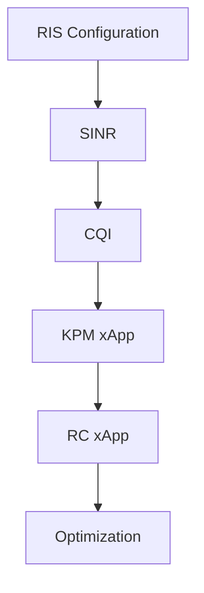

---

# 24. RIS-Aware Network Architecture

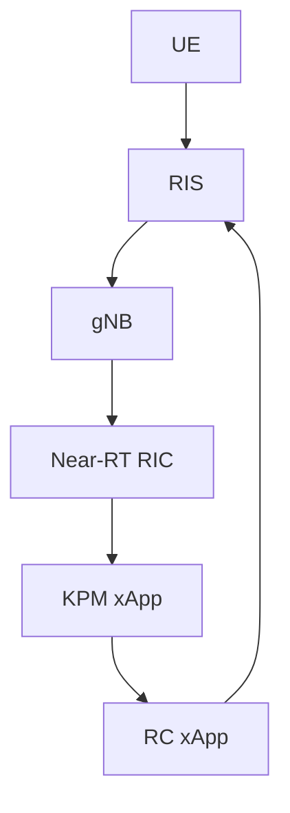

---

# 25. Example Use Case

Scenario:

```text
CQI Drops
```

Workflow:

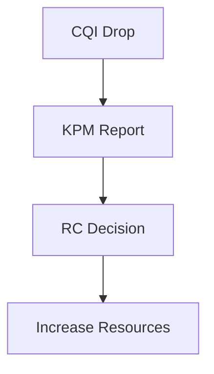

---

# 26. Control Message Flow

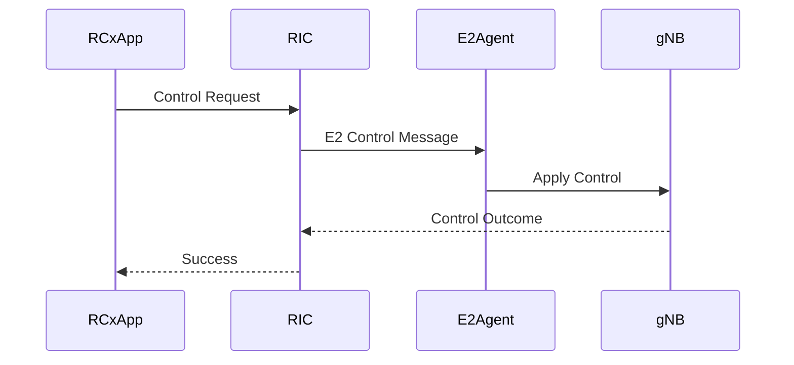

---

# 27. FlexRIC Support

FlexRIC supports:

```text
E2SM-KPM

E2SM-RC

Custom Service Models
```

This makes FlexRIC ideal for:

```text
RIS-Aware xApps

AI-Based xApps

Scheduler Control Research
```

---

# 28. Future Research Direction

Current Stage:

```text
OAI Core

UERANSIM

KPM xApp Study
```

Next Stage:

```text
RC xApp Study

↓

FlexRIC Deployment

↓

Control Message Testing

↓

RIS-Aware Control
```

---

# 29. Mentor Discussion Questions

### What is an RC xApp?

An xApp capable of controlling RAN behavior through the Near-RT RIC.

### What is E2SM-RC?

A service model enabling RAN control through O-RAN interfaces.

### Difference between KPM and RC?

KPM observes KPIs while RC issues control actions.

### Why is RC important?

It enables intelligent optimization of network resources.

### What can RC control?

Scheduling, QoS, slicing, mobility, admission control, and future RIS configurations.

### Why is RC important for RIS research?

Because RIS optimization requires intelligent control loops that react to channel conditions.

---

# 30. Complete O-RAN Evolution

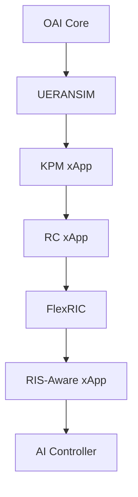

---

# Conclusion

The RC xApp is the control component of the O-RAN ecosystem. Using E2SM-RC, it enables intelligent management of scheduling, QoS, slicing, mobility, and admission control. RC xApps build upon KPI observations collected by KPM xApps and form the foundation for AI-driven optimization. For RIS-assisted 5G and future 6G systems, RC xApps will play a central role in dynamically controlling network behavior based on real-time radio conditions.
