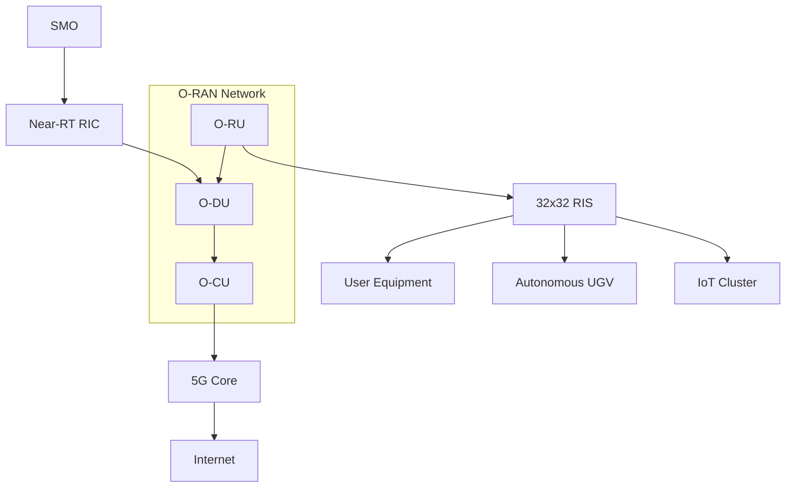
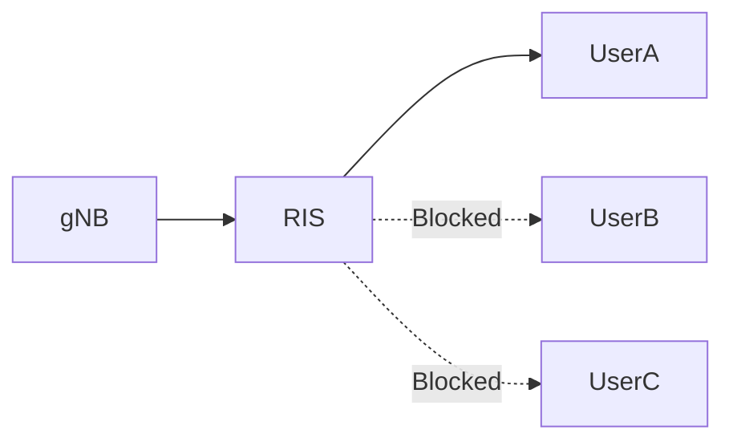
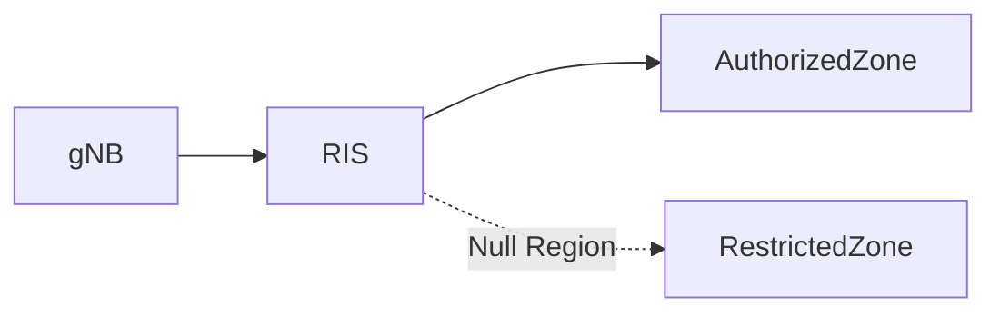
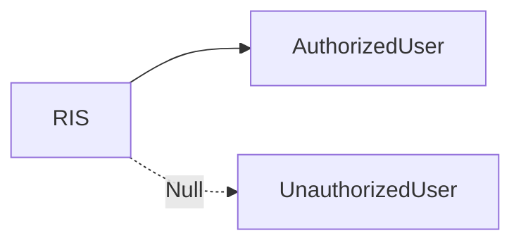
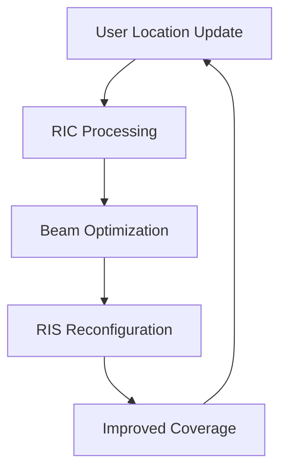
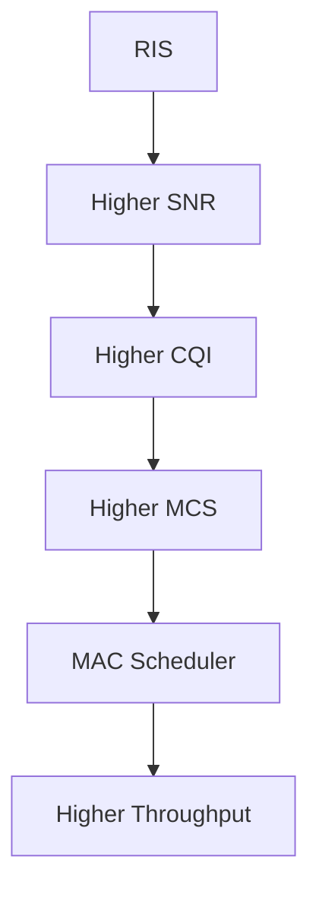
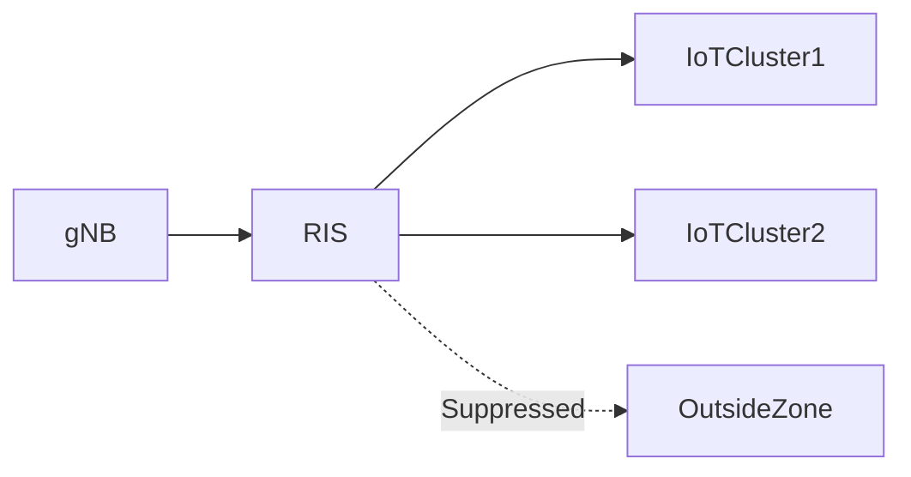

# RIS-Assisted 5G Testbed and IOS-MCN

## Introduction

Reconfigurable Intelligent Surfaces (RIS) are emerging as a key technology for Beyond-5G (B5G) and 6G networks. RIS consists of programmable reflecting elements that can intelligently manipulate electromagnetic waves to improve coverage, signal quality, energy efficiency, and network security.

The objective of this project is to integrate RIS with an IOS-MCN based 5G testbed to demonstrate:

* Targeted Coverage
* Secure Communication Zones
* Dynamic Beam Steering
* Coverage Extension
* RIS-Assisted UGV Communication
* RIS-Assisted IoT Connectivity
* O-RAN Intelligent Control

---

# Motivation

Conventional wireless communication suffers from:

* Coverage holes
* Blocked Line-of-Sight (LoS)
* Multipath fading
* High interference
* Energy inefficiency

RIS provides a software-controlled propagation environment.

```text id="x6vtqt"
Traditional Network

gNB
 ↓
User

Signal blockage
 ↓
Coverage loss
```

---

# RIS Assisted Network

```text id="f1n0nt"
gNB
 ↓
RIS
 ↓
User

Smart Reflection
 ↓
Improved Coverage
```

---

# High-Level Testbed Architecture



---

# IOS-MCN Integration

IOS-MCN provides:

* O-RAN Infrastructure
* 5G Core
* Near-RT RIC
* SMO
* Network Orchestration

RIS becomes an intelligent radio enhancement layer within the IOS-MCN ecosystem.

---

# Complete Communication Path

```text id="s3ccgk"
UE
 ↓
RIS
 ↓
O-RU
 ↓
O-DU
 ↓
O-CU
 ↓
5G Core
 ↓
Internet
```

---

# RIS Fundamentals

## Structure

RIS consists of multiple programmable reflecting elements.

### Example

16 × 16 RIS

```text id="k9h5vq"
256 Elements
```

32 × 32 RIS

```text id="vwy8gx"
1024 Elements
```

---

## Element Control

Each element can control:

* Phase
* Amplitude
* Reflection direction

Example:

```text id="6msbrm"
0°
180°
```

Binary phase control using PIN diodes.

---

# Why Upgrade from 16×16 to 32×32 RIS?

---

## Current 16×16 RIS

### Limitations

* Moderate SNR gain
* Limited coverage
* Wider beamwidth
* Limited steering flexibility

Typical values:

```text id="w6l5l0"
6-10 dB SNR Gain
30-35 m Coverage
```

---

## Proposed 32×32 RIS

Advantages:

```text id="8lmwn0"
Higher Array Gain
Narrower Beams
3D Beamforming
Extended Range
```

Expected benefits:

```text id="2e4zyx"
15-20 dB SNR Gain
50+ m Coverage
Higher Spatial Resolution
```

---

# Targeted Coverage

Objective:

Provide communication to selected users without blanket broadcasting.

---

## Concept



---

## Benefits

* Improved security
* Reduced interference
* Better energy efficiency

---

# Secure Zones

Objective:

Prevent communication in selected areas.

---

## Concept



---

## Applications

* Secure labs
* Military facilities
* Industrial environments

---

# Combined Coverage and Security

RIS can simultaneously:

```text id="mf96hp"
Enhance Desired Signal
+
Suppress Undesired Signal
```

---

## Example



---

# Dynamic Beam Steering

RIS dynamically adapts phase shifts.

---

## User Mobility

```text id="xix0oc"
Walking User
0-5 km/h

UGV
0-15 km/h
```

---

## Dynamic Control Loop



---

# RIS and MAC Layer Interaction

This is one of the most important concepts.

---

## Without RIS

```text id="t53l2v"
Low SNR
 ↓
Low CQI
 ↓
Low MCS
 ↓
Low Throughput
```

---

## With RIS

```text id="v2d4z8"
RIS
 ↓
Higher SNR
 ↓
Higher CQI
 ↓
Higher MCS
 ↓
Better Scheduling
 ↓
Higher Throughput
```

---

# RIS-MAC Relationship



---

# RIS Assisted UGV Communication

## Objective

Maintain reliable connectivity for autonomous ground vehicles.

---

## Architecture


---

## Challenges

* Mobility
* Blockage
* Handover

---

## RIS Solution

* Dynamic beam steering
* Coverage enhancement
* Link stabilization

---

# RIS Assisted Smart Surveillance

## Components

* 5G PTZ Camera
* Edge AI Gateway
* RIS
* O-RAN Network

---

## Architecture


---

# RIS Assisted IoT Coverage

---

## Objective

Provide connectivity to selected IoT clusters.

---

## Architecture



---

# Performance Metrics

---

## SNR Gain

Target:

```text id="ym4r8s"
10 dB+
```

Future:

```text id="shyjg8"
15-20 dB
```

---

## Communication Range

Current:

```text id="h3ifxf"
10-30 m
```

Future:

```text id="4g6yx4"
50 m+
```

---

## Beam Switching Latency

Target:

```text id="jclw0k"
1-5 ms
```

---

## Coverage Probability

Target:

```text id="9sm7cl"
>95%
```

---

## BER

Target:

```text id="dtf5up"
10^-5
```

---

# RIS Control Through O-RAN

Future architecture:

```text id="gh0iyl"
RIC
 ↓
E2 Interface
 ↓
O-DU
 ↓
RIS Controller
 ↓
RIS Elements
```

The Near-RT RIC can use AI algorithms to optimize:

* Beam direction
* User association
* Resource allocation

---

# Research Opportunities

---

## AI-Assisted RIS

Use ML for:

* Beam prediction
* User tracking
* Channel estimation

---

## RIS-MAC Co-Design

Joint optimization of:

```text id="a9egfx"
RIS Beamforming
+
MAC Scheduling
```

---

## RIS Assisted O-RAN

Integrate:

```text id="sgqyp7"
RIC
+
RIS
+
MAC
```

for intelligent radio control.

---

# Relevance to Internship

This project directly involves:

* IOS-MCN Deployment
* O-RAN Architecture
* MAC Layer Analysis
* RIS Design
* Beamforming
* UGV Communication
* IoT Connectivity
* 5G Core Integration

---

# Key Takeaways

1. RIS transforms the wireless environment into a programmable medium.
2. IOS-MCN provides the 5G infrastructure for RIS integration.
3. O-RAN enables open and intelligent network control.
4. Near-RT RIC can optimize RIS configurations.
5. RIS improves SNR, CQI, and throughput.
6. MAC scheduling directly benefits from RIS-enhanced channels.
7. 32×32 RIS offers significant gains over 16×16 RIS.
8. RIS enables targeted coverage, secure zones, and dynamic beam steering.
9. RIS-assisted UGV and IoT communication are key 6G use cases.
10. RIS, O-RAN, MAC, and IOS-MCN together form the foundation of intelligent programmable wireless networks.
