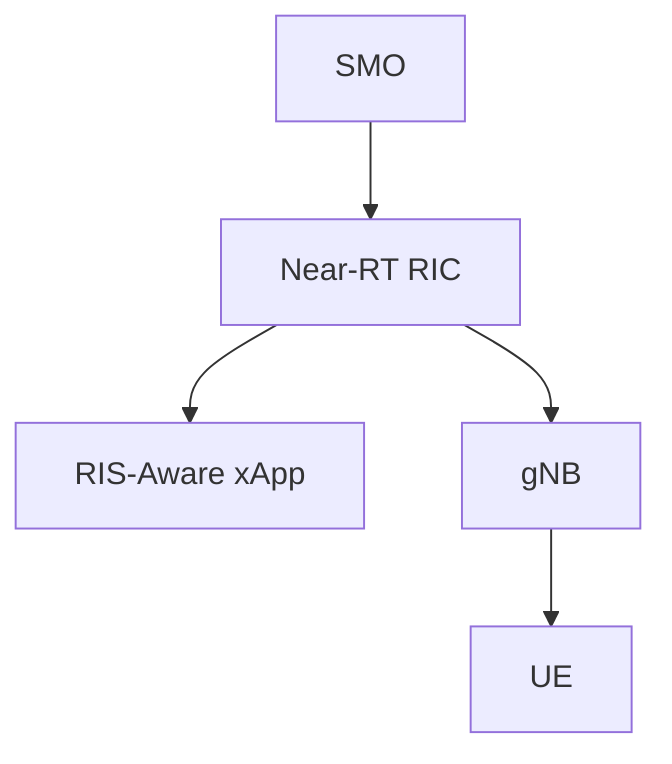
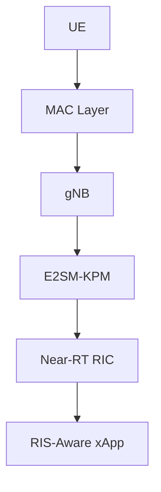
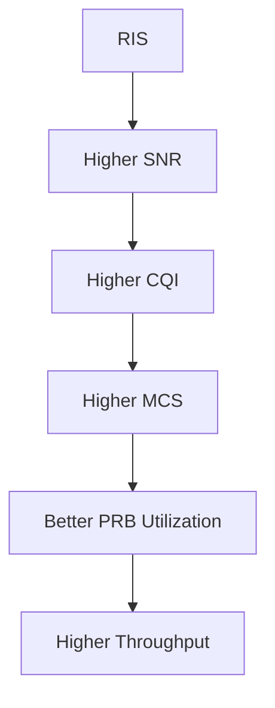
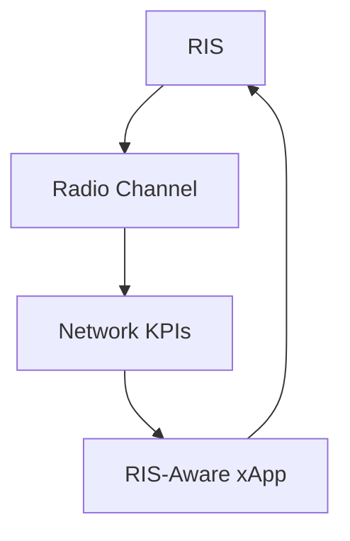
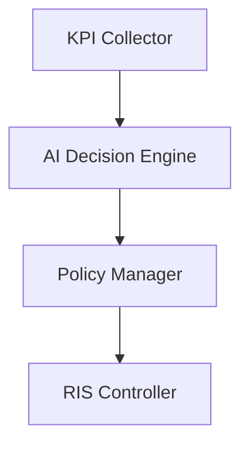
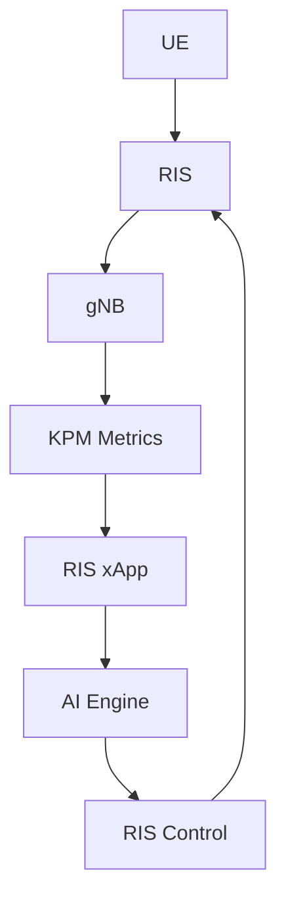
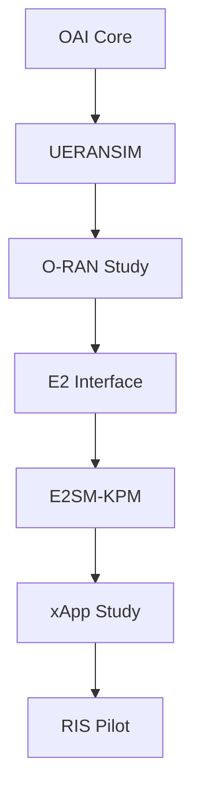

# RIS-Aware xApp Architecture

## Objective

This document presents the architecture, workflow, and design principles of a RIS-Aware xApp operating within an O-RAN ecosystem.

The goal is to combine:

* Reconfigurable Intelligent Surfaces (RIS)
* O-RAN Near-RT RIC
* E2 Interface
* E2SM-KPM KPI Monitoring
* AI-Based Optimization
* MAC Layer Scheduling

to create a closed-loop intelligent radio optimization framework.

This study forms the foundation for:

* RIS Pilot Deployment
* O-RAN Research
* AI-Native RAN
* Autonomous 6G Networks
* Future RIS-Aware xApp Development

---

# 1. Introduction

Future 6G networks are expected to become:

* Programmable
* Intelligent
* Self-Optimizing
* AI-Native

Traditional networks adapt to the environment.

RIS introduces a new concept:

```text
Environment becomes programmable
```

Instead of only controlling:

```text
UE
gNB
Core Network
```

we can now control:

```text
The Wireless Channel Itself
```

---

# 2. What is RIS?

## Full Form

RIS = Reconfigurable Intelligent Surface

RIS consists of:

```text
Large Number of Passive Elements
```

Each element can:

```text
Reflect
Refract
Modify
Phase Shift
```

incoming radio waves.

---

# 3. RIS in 5G/6G Networks


RIS helps:

* Improve coverage
* Reduce blockage
* Improve signal quality
* Enhance throughput
* Extend cell range

---

# 4. Problem Statement

Traditional optimization methods can only control:

```text
Transmit Power
Scheduling
Beamforming
```

They cannot directly modify:

```text
Propagation Environment
```

RIS solves this limitation.

However:

```text
RIS needs intelligence
```

to decide:

* Which phase profile to use
* When to reconfigure
* Which users to prioritize

This intelligence can be provided by:

```text
O-RAN xApps
```

---

# 5. O-RAN Architecture



---

# 6. Position of RIS-Aware xApp


The xApp receives network intelligence and decides how RIS should operate.

---

# 7. KPI Collection through E2SM-KPM

The RIS-aware xApp relies on:

```text
Network KPIs
```

reported through:

```text
E2SM-KPM
```

---

# 8. Important KPIs

| KPI        | Full Form                               | Importance          |
| ---------- | --------------------------------------- | ------------------- |
| CQI        | Channel Quality Indicator               | Channel condition   |
| SINR       | Signal to Interference plus Noise Ratio | Signal quality      |
| MCS        | Modulation and Coding Scheme            | Spectral efficiency |
| PRB        | Physical Resource Block                 | Resource allocation |
| Throughput | Data Rate                               | User performance    |
| HARQ       | Hybrid Automatic Repeat Request         | Reliability         |
| BLER       | Block Error Rate                        | Link quality        |
| Latency    | End-to-End Delay                        | QoS                 |

---

# 9. KPI Collection Flow



---

# 10. Why MAC Layer Matters

RIS ultimately influences MAC performance.

Example:



---

# 11. Closed-Loop RIS Optimization

The complete loop becomes:



This is known as:

```text
Closed-Loop Optimization
```

---

# 12. RIS-Aware xApp Internal Architecture



---

# 13. KPI Collector

Receives:

```text
CQI
MCS
PRB Usage
Throughput
SINR
```

from:

```text
E2SM-KPM
```

---

# 14. AI Decision Engine

Processes:

```text
Network State
```

and predicts:

```text
Optimal RIS Configuration
```

Possible algorithms:

* Random Forest
* XGBoost
* Deep Neural Networks
* Reinforcement Learning
* Deep Q Networks

---

# 15. Policy Manager

Responsible for:

```text
Policy Enforcement
```

Examples:

```text
Maximize Throughput
Minimize Latency
Improve Coverage
Reduce Power Consumption
```

---

# 16. RIS Controller

Receives:

```text
RIS Configuration Commands
```

Examples:

```text
Phase Shift Matrix
Reflection Profile
Beam Direction
```

---

# 17. Example Optimization Cycle

Step 1

User throughput drops.

---

Step 2

KPM reports:

```text
CQI = 6
Throughput = 22 Mbps
```

---

Step 3

xApp receives KPI data.

---

Step 4

AI predicts:

```text
New RIS Reflection Pattern
```

---

Step 5

RIS configuration updated.

---

Step 6

New KPI values:

```text
CQI = 12
Throughput = 95 Mbps
```

---

# 18. End-to-End Workflow



---

# 19. Future Reinforcement Learning xApp

State:

```text
CQI
SINR
PRB Usage
MCS
Throughput
```

Action:

```text
RIS Phase Configuration
```

Reward:

```text
Higher Throughput
Higher CQI
Lower Latency
```

---

# 20. Relation to Your Internship

Current Work:



---

# 21. Research Contributions

Potential contributions:

* RIS-aware KPI optimization
* AI-native RAN control
* Intelligent beam adaptation
* Dynamic coverage optimization
* Throughput-aware RIS control
* Energy-efficient RIS operation

---

# 22. Mentor Discussion Questions

### What is a RIS-Aware xApp?

An O-RAN xApp that uses KPI feedback to intelligently control RIS configurations.

### What KPIs are used?

CQI, SINR, Throughput, MCS, PRB Usage, HARQ, BLER.

### How does the xApp receive KPIs?

Through E2SM-KPM over the E2 Interface.

### Why is MAC Layer important?

RIS improvements directly affect MAC-layer metrics such as CQI, MCS, and throughput.

### What is the role of AI?

AI predicts the optimal RIS configuration to improve network performance.

### What is closed-loop optimization?

A feedback loop where KPIs are monitored, analyzed, and used to continuously optimize RIS operation.

---

# Conclusion

RIS-Aware xApps represent a major step toward AI-native 6G networks. By combining RIS technology, O-RAN intelligence, E2SM-KPM telemetry, and AI-based decision making, the network can continuously adapt the radio environment to maximize throughput, improve coverage, reduce latency, and enhance overall user experience. This architecture provides a foundation for autonomous, self-optimizing wireless systems and aligns closely with future O-RAN and 6G research directions.
