# RIS-KPM Mapping for RIS-Assisted O-RAN Networks

## Author

Mrigank Jaiswal

## Internship

COMET Foundation – IIIT Bangalore

## Domain

RIS • O-RAN • Near-RT RIC • E2SM-KPM • FlexRIC • MAC Scheduling • 5G/6G

---

# 1. Objective

This document explains how Reconfigurable Intelligent Surface (RIS) behavior maps to Key Performance Measurement (KPM) metrics in an O-RAN-based 5G/6G network.

The purpose is to connect:

* RIS configuration
* Radio channel improvement
* CQI improvement
* KPM metric changes
* Near-RT RIC analytics
* RIS-aware xApp decisions
* MAC scheduler optimization

This document supports the research pipeline:

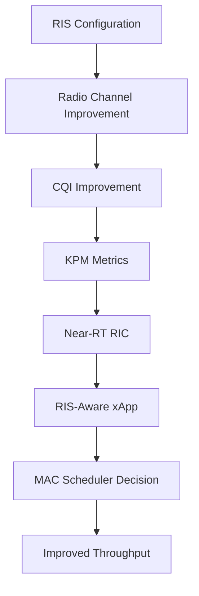

---

# 2. Background

RIS is a programmable wireless surface that can modify the propagation behavior of radio waves. By changing the phase response of its reflecting elements, RIS can improve signal quality between the gNB and UE.

O-RAN provides a programmable RAN control framework where the Near-RT RIC collects network measurements through E2SM-KPM and executes optimization logic through xApps.

In this research direction, RIS is treated as a controllable radio environment component. Its effect is evaluated through KPM metrics collected by the Near-RT RIC.

---

# 3. Why RIS Needs KPM Feedback

RIS cannot be optimized blindly. It needs feedback from the network.

Without KPM feedback:

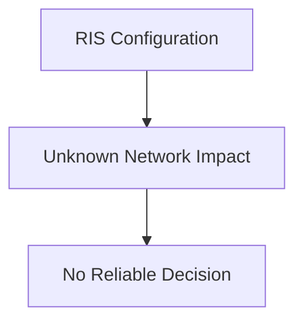

With KPM feedback:

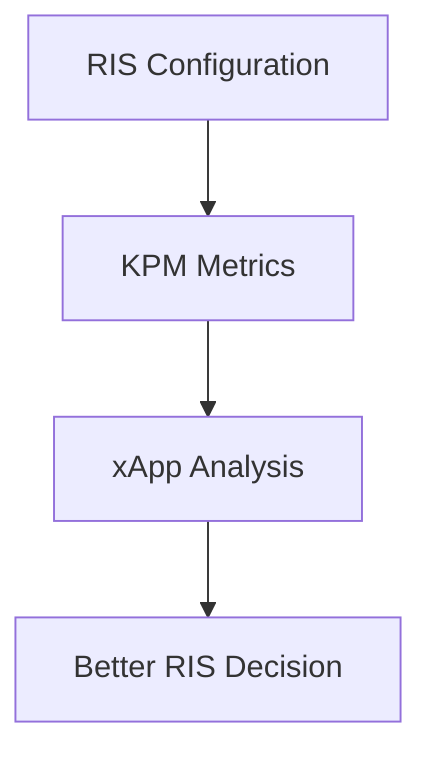

KPM reports allow the RIS-aware xApp to understand whether a RIS configuration improves or degrades the network.

---

# 4. Core RIS-to-KPM Relationship

RIS primarily affects the physical wireless channel.

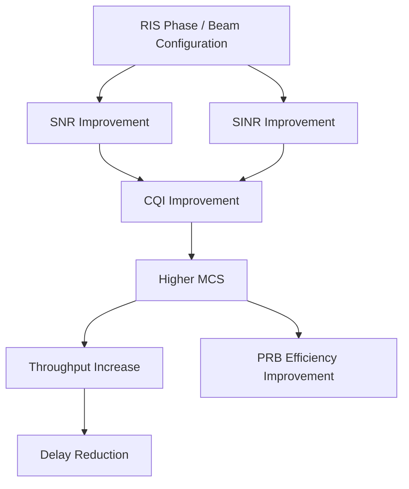

---

# 5. Main KPM Metrics Affected by RIS

| RIS Effect                      | KPM Metric              | Expected Change |
| ------------------------------- | ----------------------- | --------------- |
| Better signal strength          | CQI                     | Increase        |
| Better link quality             | DRB.UEThpDl             | Increase        |
| Better uplink reflection        | DRB.UEThpUl             | Increase        |
| Fewer retransmissions           | DRB.RlcSduDelayDl       | Decrease        |
| More successful data transfer   | DRB.PdcpSduVolumeDL     | Increase        |
| More successful uplink transfer | DRB.PdcpSduVolumeUL     | Increase        |
| Higher spectral efficiency      | RRU.PrbTotDl efficiency | Improve         |
| Better uplink scheduling        | RRU.PrbTotUl efficiency | Improve         |

---

# 6. Metric 1: CQI Mapping

CQI means Channel Quality Indicator.

RIS improves propagation quality, which can increase CQI.

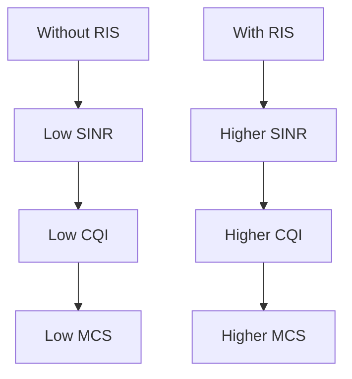

Example:

| Scenario    |  SINR | CQI | MCS |
| ----------- | ----: | --: | --: |
| Without RIS |  8 dB |   5 |   6 |
| With RIS    | 15 dB |  11 |  18 |

---

# 7. Metric 2: Downlink Throughput Mapping

KPM Metric:

```text
DRB.UEThpDl
```

RIS improves downlink link quality.

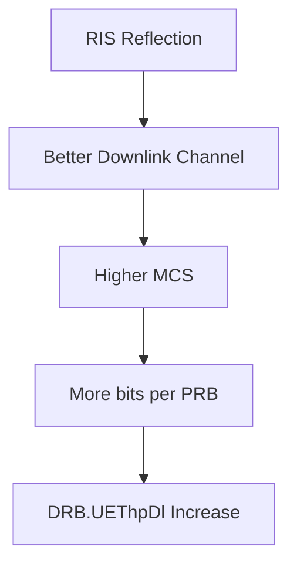

Expected behavior:

```text
If RIS configuration improves the gNB-to-UE channel,
then DRB.UEThpDl should increase.
```

---

# 8. Metric 3: Uplink Throughput Mapping

KPM Metric:

```text
DRB.UEThpUl
```

RIS can assist uplink by reflecting UE signals toward the gNB.

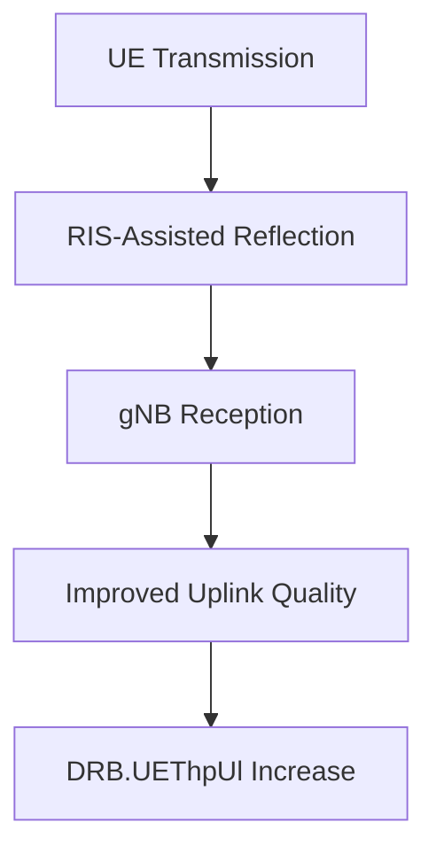

Expected behavior:

```text
If RIS improves the UE-to-gNB path,
then DRB.UEThpUl should increase.
```

---

# 9. Metric 4: RLC Delay Mapping

KPM Metric:

```text
DRB.RlcSduDelayDl
```

RIS can reduce delay by improving link reliability and reducing retransmissions.

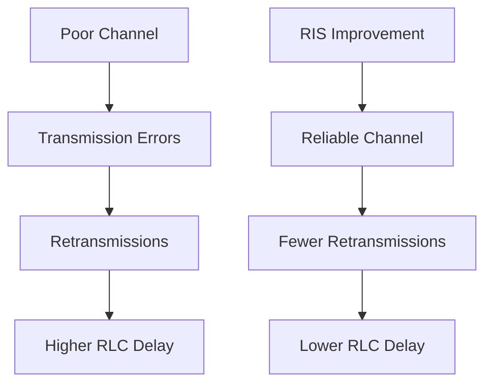

Expected behavior:

```text
Better RIS configuration should reduce DRB.RlcSduDelayDl.
```

---

# 10. Metric 5: PDCP Volume Mapping

KPM Metrics:

```text
DRB.PdcpSduVolumeDL
DRB.PdcpSduVolumeUL
```

RIS can increase the amount of successfully transmitted data.

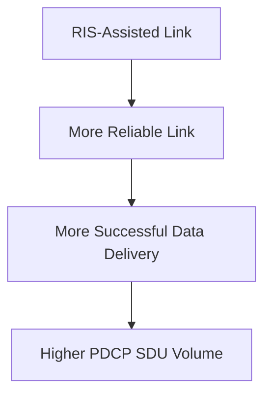

Expected behavior:

```text
If RIS improves link stability,
then PDCP SDU volume should increase over the same time window.
```

---

# 11. Metric 6: PRB Efficiency Mapping

KPM Metrics:

```text
RRU.PrbTotDl
RRU.PrbTotUl
```

RIS may not always reduce total PRB usage directly. Instead, it improves PRB efficiency.

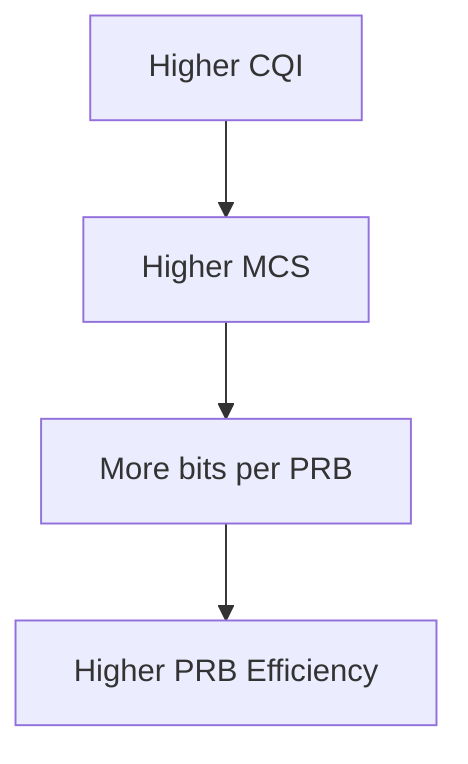

Interpretation:

```text
For the same traffic demand:
Better RIS configuration can achieve higher throughput using equal or fewer PRBs.
```

---

# 12. RIS-KPM Mapping Table

| RIS-Controlled Effect             | Physical Impact           | KPM Observation              | xApp Interpretation          |
| --------------------------------- | ------------------------- | ---------------------------- | ---------------------------- |
| Phase profile improves reflection | SINR increases            | CQI increases                | Keep current RIS state       |
| Beam direction improves UE link   | Downlink quality improves | DRB.UEThpDl increases        | Mark beam as useful          |
| Reflection improves uplink path   | Uplink quality improves   | DRB.UEThpUl increases        | Improve uplink RIS profile   |
| Fewer radio errors                | Retransmissions reduce    | RLC delay decreases          | Link is more stable          |
| Better spectral efficiency        | More bits per PRB         | Throughput per PRB increases | Scheduler can use higher MCS |
| Poor RIS direction                | Channel weakens           | Throughput decreases         | Switch RIS state             |
| Blocked path remains weak         | CQI remains low           | Low throughput / high delay  | Try alternate RIS beam       |

---

# 13. RIS-Aware xApp Decision Logic

The RIS-aware xApp uses KPM metrics to select RIS configurations.

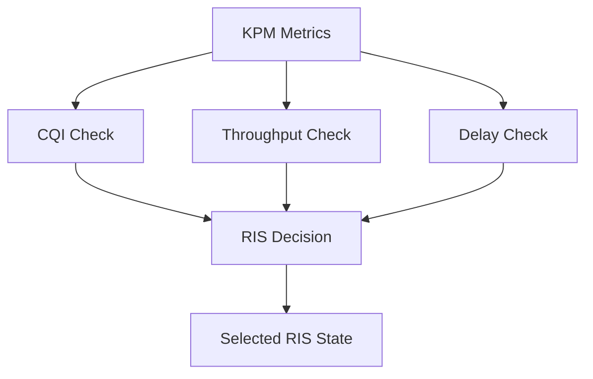

Example rule-based logic:

```python
if cqi < 6 and throughput < 20:
    ris_state = "Beam_A"

elif cqi >= 6 and cqi < 10:
    ris_state = "Beam_B"

elif cqi >= 10:
    ris_state = "Keep_Current_State"

if rlc_delay > threshold:
    ris_state = "Low_Delay_Profile"
```

---

# 14. RIS Beam Selection Concept

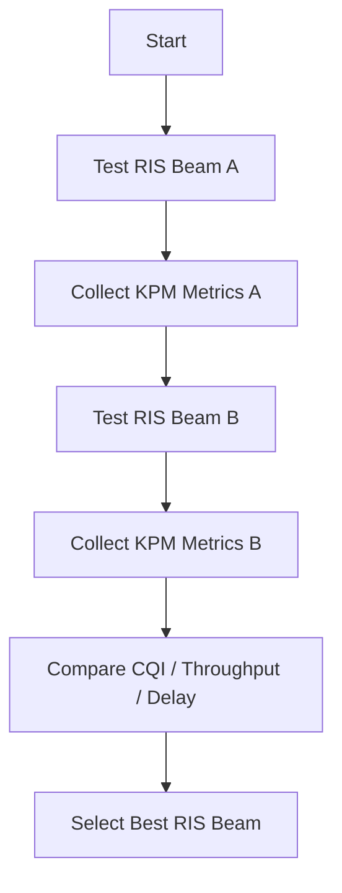

---

# 15. Closed-Loop RIS-KPM Optimization

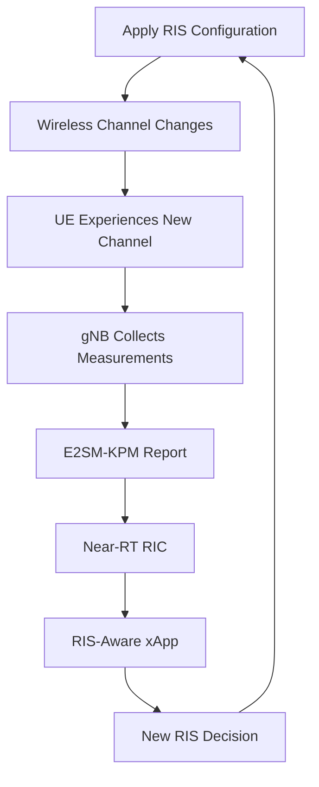

This creates a complete feedback loop.

---

# 16. Connection with MAC Scheduler

The RIS-aware xApp does not directly replace the MAC scheduler.

Instead:

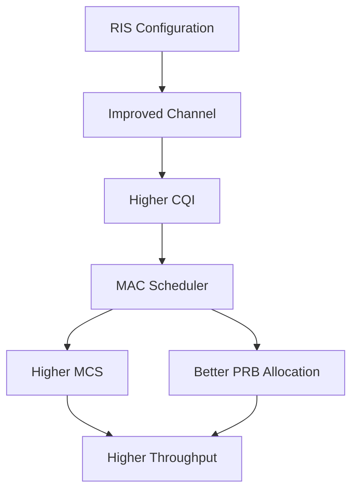

RIS improves channel quality, and the scheduler reacts by selecting better MCS and PRB allocation.

---

# 17. Research Prototype Mapping

The prototype can be developed in three levels.

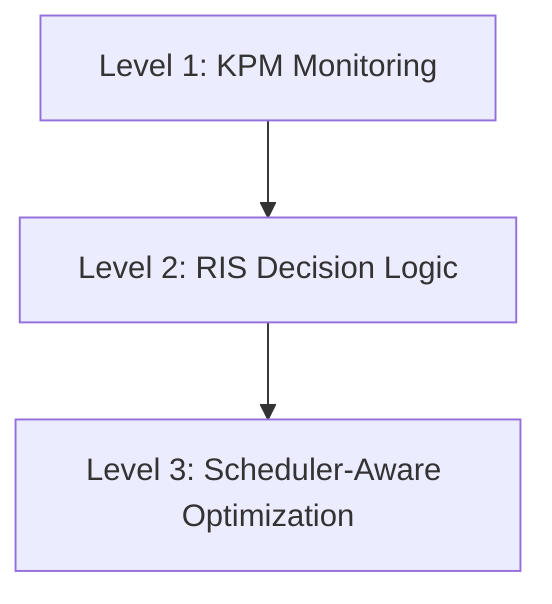

## Level 1: KPM Monitoring

Collect:

* DRB.UEThpDl
* DRB.UEThpUl
* DRB.RlcSduDelayDl
* RRU.PrbTotDl
* RRU.PrbTotUl

## Level 2: RIS Decision Logic

Use KPM values to choose:

* Beam A
* Beam B
* Beam C
* Low-delay profile
* High-throughput profile

## Level 3: Scheduler-Aware Optimization

Map RIS improvement to:

* Higher MCS
* Better PRB efficiency
* Improved throughput
* Lower latency

---

# 18. Digital Twin Approach

Before using real RIS hardware, the system can be tested using a digital twin.

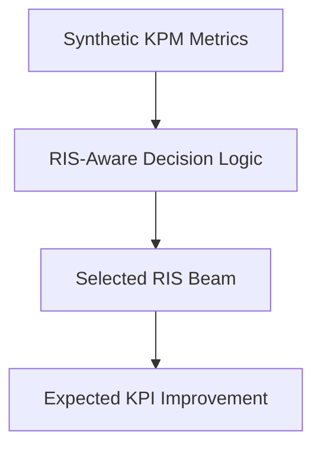

This allows algorithm testing without physical RIS hardware.

---

# 19. Expected Experimental Results

| Scenario      |    CQI | Throughput | RLC Delay | PRB Efficiency |
| ------------- | -----: | ---------: | --------: | -------------: |
| Without RIS   |    Low |        Low |      High |            Low |
| Random RIS    | Medium |     Medium |    Medium |         Medium |
| Optimized RIS |   High |       High |       Low |           High |

---

# 20. Final Research Flow

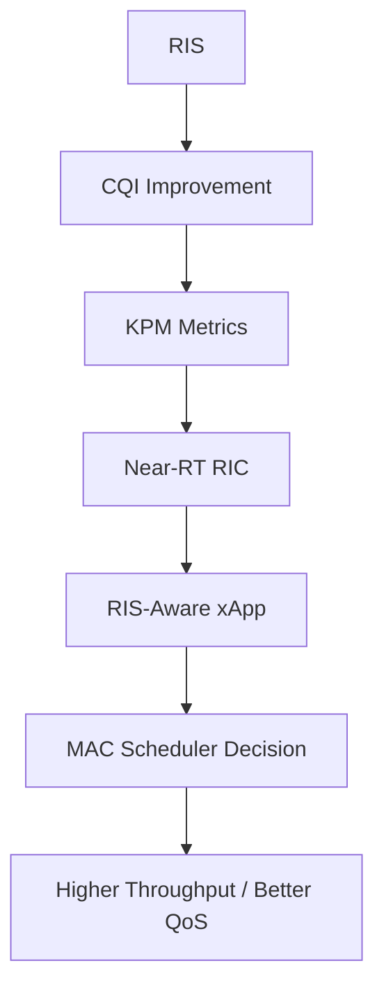

---

# 21. Mentor Discussion Points

You can explain:

1. RIS modifies the wireless channel.
2. Channel improvement increases SINR and CQI.
3. CQI improvement changes MCS selection.
4. MCS affects throughput and PRB efficiency.
5. KPM metrics provide measurable feedback.
6. Near-RT RIC receives KPM reports through E2SM-KPM.
7. A RIS-aware xApp can select RIS configurations based on KPM trends.
8. The MAC scheduler benefits indirectly from RIS-driven CQI improvement.
9. The first implementation can be a digital twin before hardware integration.
10. This creates a closed-loop RIS-assisted O-RAN optimization framework.

---

# 22. Conclusion

RIS-KPM mapping is the core bridge between programmable radio environments and intelligent O-RAN control. RIS improves the physical channel, and the effect is observed through KPM metrics such as throughput, delay, PDCP volume, and PRB utilization. A RIS-aware xApp can use these metrics to decide whether to keep, modify, or optimize the RIS configuration.

This mapping provides the foundation for the next implementation phase: building a RIS-aware xApp that uses KPM metrics to select RIS beam states and guide MAC scheduler optimization.
