# RIS and MAC Layer Interaction Study

## 1. Objective

This document explains how Reconfigurable Intelligent Surface (RIS) technology can influence the MAC layer in 5G and future 6G networks.

This note connects:

* RIS-assisted communication
* O-RAN architecture
* MAC scheduler
* CQI
* MCS
* PRB allocation
* Throughput improvement
* Near-RT RIC optimization
* IOS-MCN research direction

---

# 2. Full Forms

| Term        | Full Form                                 |
| ----------- | ----------------------------------------- |
| RIS         | Reconfigurable Intelligent Surface        |
| MAC         | Medium Access Control                     |
| CQI         | Channel Quality Indicator                 |
| MCS         | Modulation and Coding Scheme              |
| PRB         | Physical Resource Block                   |
| HARQ        | Hybrid Automatic Repeat Request           |
| SNR         | Signal-to-Noise Ratio                     |
| SINR        | Signal-to-Interference-plus-Noise Ratio   |
| RIC         | RAN Intelligent Controller                |
| Near-RT RIC | Near Real-Time RAN Intelligent Controller |
| O-RAN       | Open Radio Access Network                 |
| O-DU        | Open Distributed Unit                     |
| O-RU        | Open Radio Unit                           |
| UE          | User Equipment                            |
| gNB         | Next Generation NodeB                     |

---

# 3. What is RIS?

RIS stands for Reconfigurable Intelligent Surface.

RIS is a programmable surface made of many passive or semi-passive reflecting elements. These elements can adjust the phase, amplitude, or direction of reflected radio waves.

In simple terms:

RIS does not generate a signal like a base station. Instead, it intelligently reflects existing radio signals to improve coverage, signal strength, and link quality.

---

# 4. Basic RIS-Assisted Communication

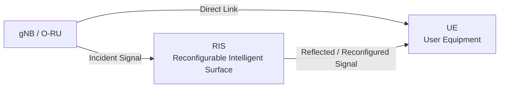

RIS can help when:

* UE is in a coverage hole
* Direct path is blocked
* Indoor penetration is weak
* Interference needs to be reduced
* Beam redirection is required

---

# 5. Why MAC Layer Matters?

MAC stands for Medium Access Control.

The MAC layer is responsible for radio resource allocation.

It decides:

* Which UE gets scheduled
* How many PRBs are allocated
* Which MCS is used
* Whether HARQ retransmission is needed
* How QoS is maintained
* How channel feedback is used

In O-RAN, the MAC scheduler mainly resides inside the O-DU.

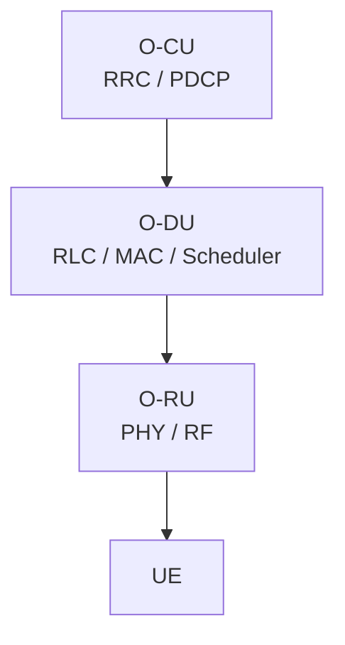

---

# 6. RIS to MAC Impact Chain

RIS improves the radio channel. The MAC layer uses radio quality indicators to make scheduling decisions.

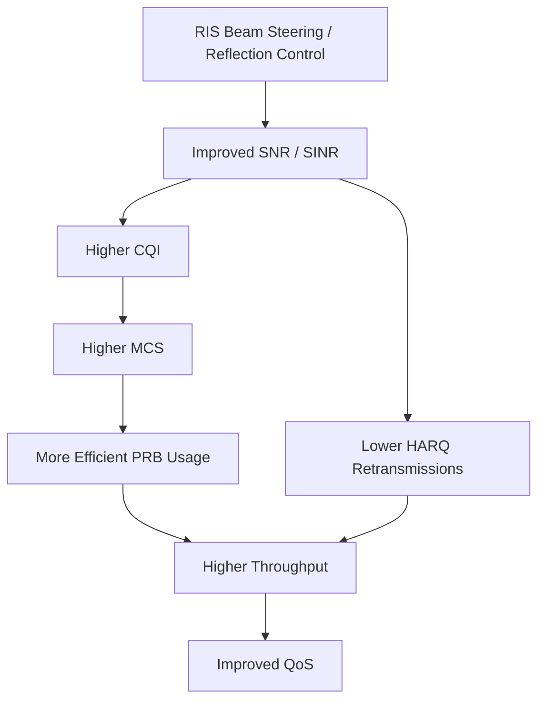

---

# 7. Relationship Between SNR, CQI, MCS and Throughput

## 7.1 SNR

SNR means Signal-to-Noise Ratio.

Higher SNR means the received signal is stronger compared to noise.

## 7.2 CQI

CQI means Channel Quality Indicator.

UE reports CQI to the gNB based on channel quality.

## 7.3 MCS

MCS means Modulation and Coding Scheme.

Higher CQI allows the scheduler to choose a higher MCS.

## 7.4 Throughput

Throughput increases when:

* Higher MCS is selected
* PRBs are used efficiently
* HARQ retransmissions reduce
* Link quality improves

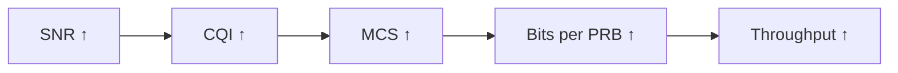

---

# 8. Without RIS vs With RIS

## Without RIS

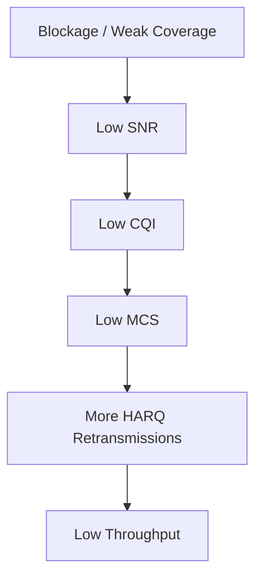

## With RIS

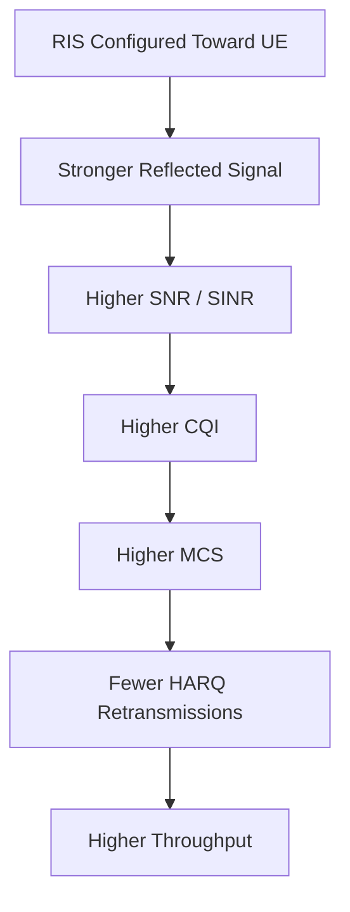

---

# 9. RIS-Assisted MAC Scheduling Concept

A normal MAC scheduler uses:

* CQI
* Buffer status
* QoS class
* PRB availability
* HARQ feedback

A RIS-aware MAC scheduler can additionally use:

* RIS phase state
* UE location
* Blockage condition
* Reflected path quality
* Beam direction
* RIS configuration history

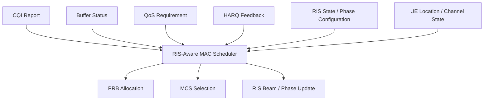

---

# 10. Where Near-RT RIC Comes In

Near-RT RIC can run xApps that monitor RAN conditions and provide optimization guidance.

A RIS-aware xApp can:

* Monitor CQI trends
* Monitor throughput
* Detect weak coverage
* Suggest RIS phase configuration
* Assist MAC scheduler
* Improve UE experience

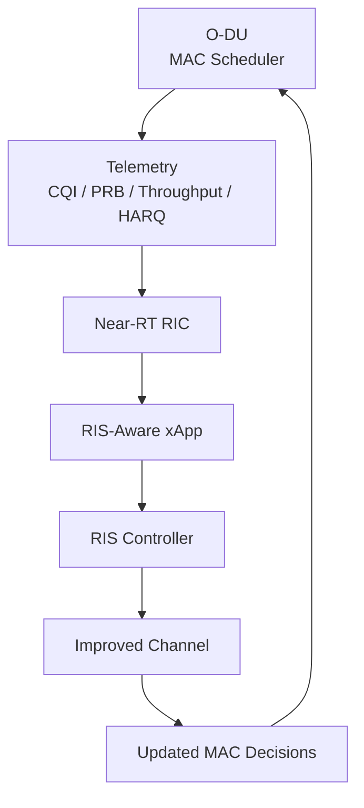

---

# 11. RIS + O-RAN + MAC Architecture

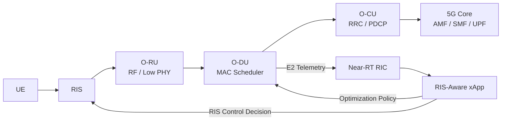

---

# 12. Possible RIS-MAC Research Problem

## Research Title

RIS-Aware MAC Scheduling for O-RAN-Based 5G and 6G Networks

## Problem

In blocked or weak-coverage environments, UE experiences poor SNR, low CQI, lower MCS, higher retransmissions, and reduced throughput.

## Proposed Idea

Use RIS to improve channel quality and allow the MAC scheduler to make better PRB and MCS decisions.

## Inputs

* CQI
* SINR
* PRB usage
* HARQ feedback
* UE location
* RIS configuration
* Traffic demand
* QoS class

## Outputs

* Improved PRB allocation
* Higher MCS selection
* Reduced retransmissions
* Better throughput
* Improved QoS
* More stable connectivity

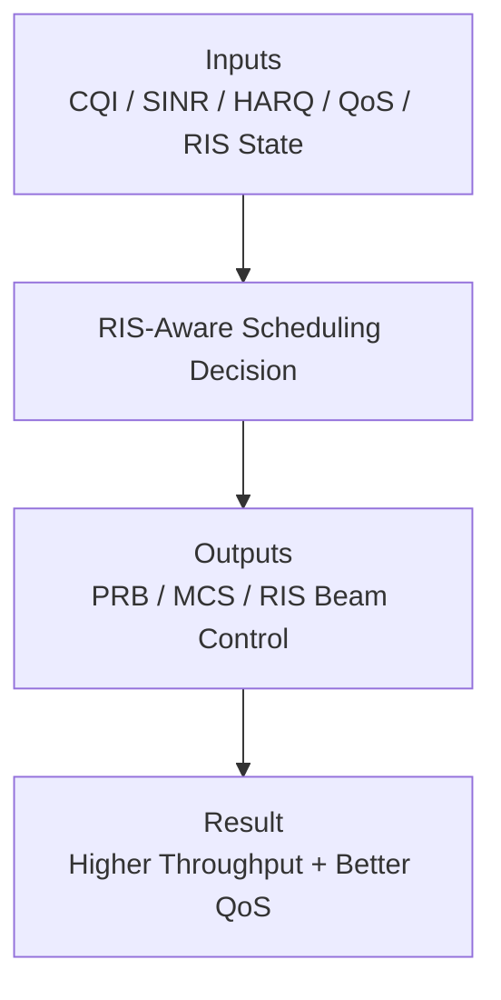

---

# 13. Experimental Metrics

To evaluate RIS-MAC improvement, measure:

| Metric               | Meaning                              |
| -------------------- | ------------------------------------ |
| SNR                  | Signal quality improvement           |
| SINR                 | Signal quality under interference    |
| CQI                  | UE-reported channel quality          |
| MCS                  | Selected modulation and coding       |
| PRB usage            | Resource block allocation efficiency |
| HARQ retransmissions | Link reliability                     |
| Throughput           | Data rate                            |
| Latency              | Delay                                |
| Packet loss          | Reliability                          |
| Coverage             | Service availability                 |

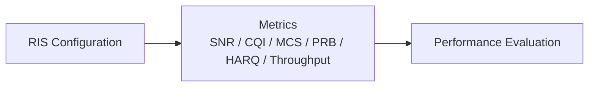

---

# 14. Experiment Workflow

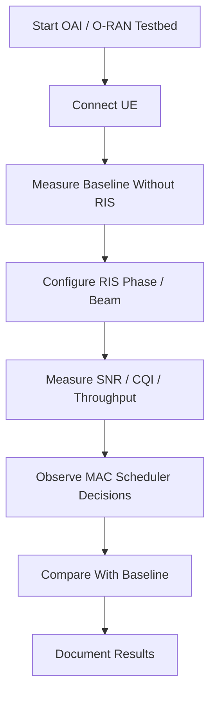

---

# 15. Connection with Current Deployment

Current completed setup:

Next evolution:

---

# 16. Mentor Discussion Points

You should be able to explain:

1. RIS improves the wireless channel by redirecting or shaping radio waves.
2. Better channel quality increases SNR or SINR.
3. Higher SNR improves UE-reported CQI.
4. Higher CQI allows higher MCS selection.
5. Higher MCS increases bits per PRB.
6. MAC scheduler uses CQI, PRB, HARQ, and QoS information.
7. RIS-aware scheduling can improve throughput and reliability.
8. Near-RT RIC can run xApps for RIS-assisted optimization.
9. RIS and MAC interact indirectly through channel quality and scheduling decisions.
10. This can become a strong research direction for O-RAN-based 5G/6G systems.

---

# 17. Key Takeaways

* RIS affects the physical radio channel.
* MAC scheduler reacts to channel quality through CQI and HARQ feedback.
* Improved channel quality enables better MCS and PRB utilization.
* Near-RT RIC can introduce intelligence into RIS and MAC decisions.
* RIS-aware MAC scheduling is a meaningful research direction.
* This connects directly to the current OAI/UERANSIM testbed and future O-RAN deployment.

---

# 18. Conclusion

RIS and MAC layer interaction is an important research direction for next-generation wireless networks. RIS improves the radio channel, while the MAC scheduler uses channel feedback such as CQI, HARQ, and buffer status to allocate resources efficiently. When RIS is combined with O-RAN and Near-RT RIC, intelligent xApps can guide both RIS configuration and MAC scheduling decisions. This creates a strong foundation for RIS-assisted, RIC-controlled, MAC-aware 5G and 6G testbeds.
