# RIS-Aware xApp Design Document

## Author

Mrigank Jaiswal

## Internship

COMET Foundation – IIIT Bangalore

## Project Phase

Phase 3 – RIS-Aware xApp Design

## Domain

O-RAN • Near-RT RIC • FlexRIC • RIS • E2SM-KPM • E2SM-RC • MAC Scheduling • 5G/6G

---

# 1. Introduction

The evolution of 5G-Advanced and 6G networks requires intelligent control of the radio environment. Reconfigurable Intelligent Surfaces (RIS) provide a programmable propagation environment capable of improving signal quality, reducing interference, and increasing spectral efficiency.

However, RIS requires a decision-making framework capable of:

* Monitoring network conditions
* Evaluating RIS effectiveness
* Selecting optimal RIS configurations
* Triggering network adaptation

The O-RAN architecture provides such a framework through:

* Near-RT RIC
* E2 Interface
* E2SM-KPM
* E2SM-RC
* xApps

This document presents the design of a RIS-Aware xApp that utilizes KPM metrics to optimize RIS behavior and influence MAC scheduling decisions.

---

# 2. System Objective

The RIS-Aware xApp will:

1. Collect KPM metrics from the RAN.
2. Analyze network performance.
3. Detect degraded radio conditions.
4. Estimate RIS optimization opportunities.
5. Generate RIS control recommendations.
6. Deliver control decisions using E2SM-RC.
7. Improve scheduling efficiency.

---

# 3. Overall Architecture

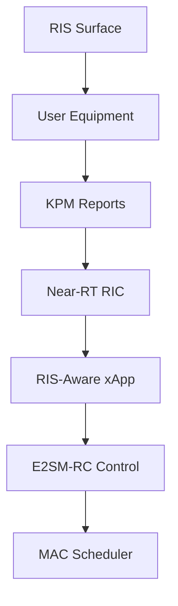

---

# 4. End-to-End Data Flow

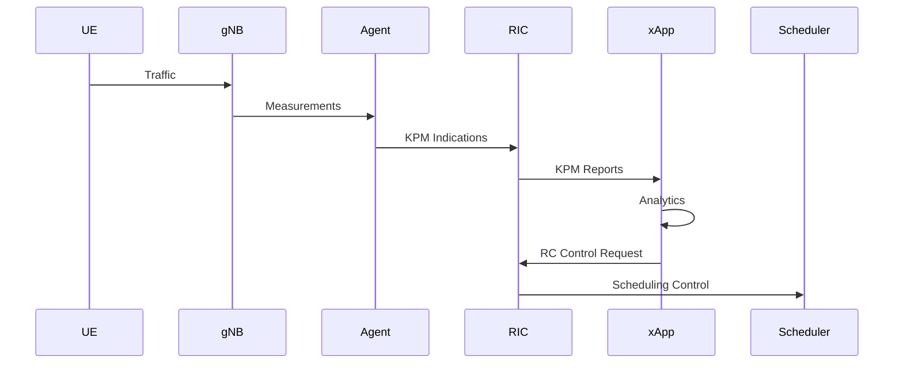

---

# 5. Functional Components

The xApp consists of six logical modules.

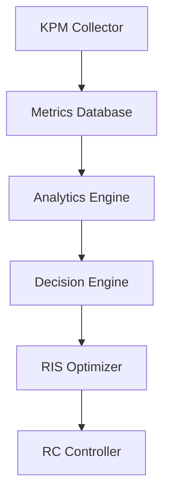

---

# 6. KPM Collector Module

Purpose:

Receive E2SM-KPM reports.

Input:

```text
DRB.UEThpDl
DRB.UEThpUl
DRB.RlcSduDelayDl
RRU.PrbTotDl
RRU.PrbTotUl
PDCP Volume
```

Output:

```text
Time-series KPI database
```

---

# 7. Analytics Engine

Purpose:

Analyze radio performance trends.

Inputs:

* Throughput
* Delay
* PRB utilization
* CQI

Outputs:

```text
Network Quality Score
```

---

# 8. Analytics Workflow

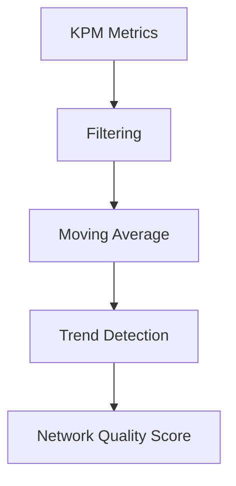

---

# 9. RIS Optimization Logic

The xApp estimates whether RIS reconfiguration could improve performance.

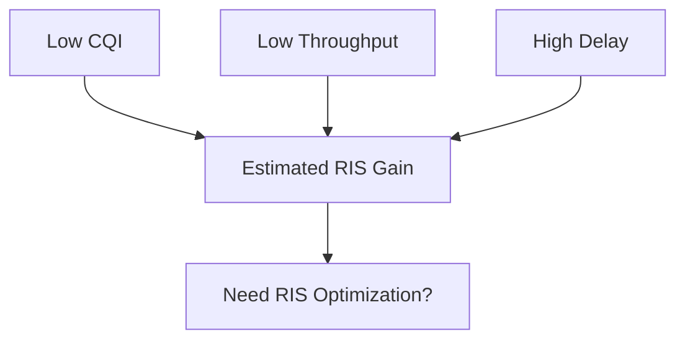

---

# 10. RIS State Selection

RIS may have multiple beam states.

Example:

```text
State A
State B
State C
State D
```

Selection process:

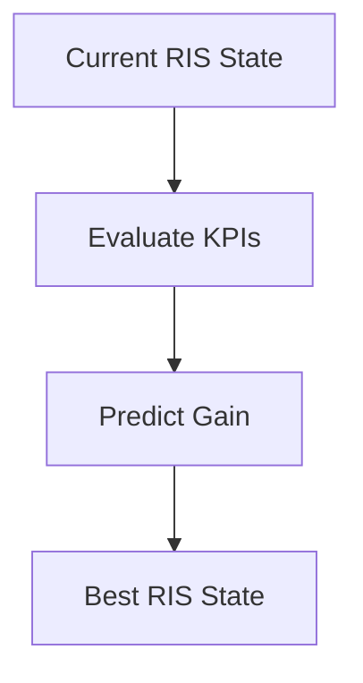

---

# 11. Decision Engine

The decision engine determines whether intervention is required.

Example logic:

```python
if CQI < 6:
    optimize_RIS()

if throughput < threshold:
    optimize_RIS()

if delay > threshold:
    optimize_RIS()
```

---

# 12. xApp Decision Pipeline

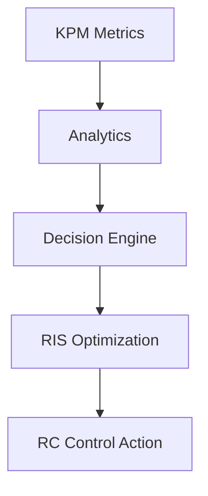

---

# 13. E2SM-RC Integration

The xApp communicates through E2SM-RC.

Purpose:

* Radio control
* Resource control
* Scheduler guidance

Architecture:

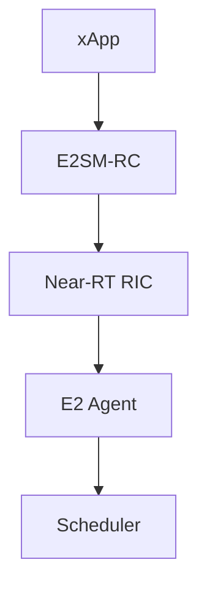

---

# 14. Scheduler Interaction

The xApp does not replace the scheduler.

Instead it provides guidance.

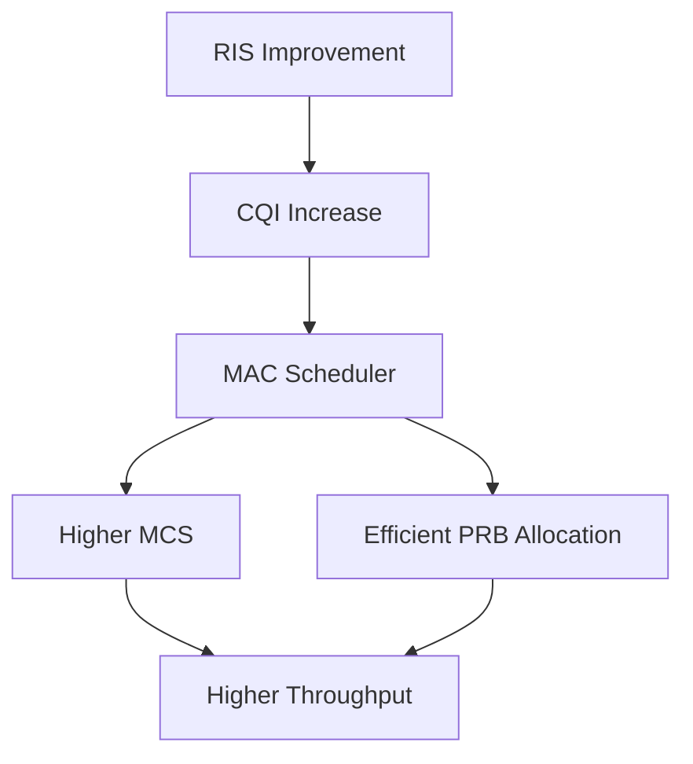

---

# 15. CQI-Based Scheduler Optimization

Example:

| CQI | MCS    |
| --- | ------ |
| 4   | QPSK   |
| 8   | 16QAM  |
| 12  | 64QAM  |
| 15  | 256QAM |

Workflow:

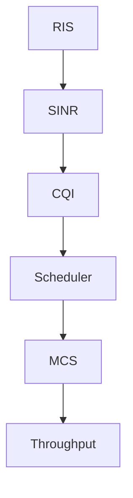

---

# 16. KPM-to-RC Mapping

| KPM Observation | xApp Action             |
| --------------- | ----------------------- |
| CQI low         | RIS Optimization        |
| Throughput low  | RIS Optimization        |
| Delay high      | Low-latency RIS profile |
| PRB usage high  | Scheduler optimization  |
| SINR poor       | Beam reconfiguration    |
| KPI improving   | Keep current state      |

---

# 17. Closed-Loop Control Framework

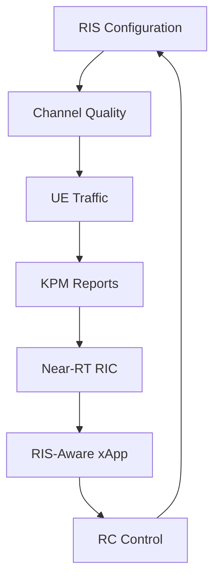

---

# 18. Digital Twin Deployment

Before real RIS hardware:

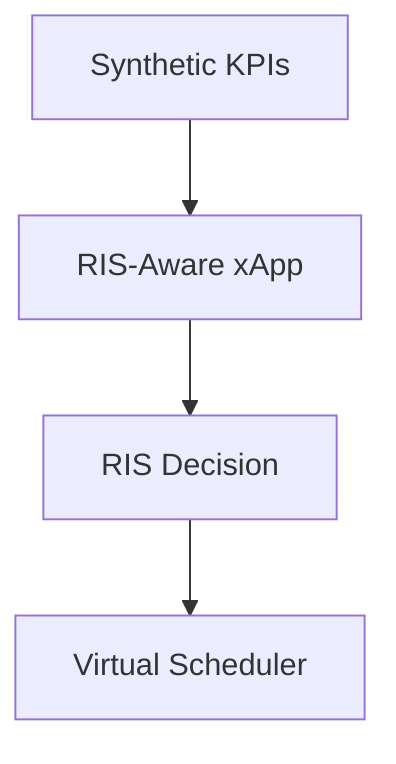

Advantages:

* Safe testing
* Fast iteration
* No hardware dependency

---

# 19. Future AI Extension

The rule-based decision engine can later be replaced by AI.

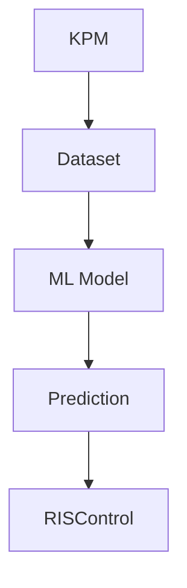

Potential AI methods:

* Random Forest
* XGBoost
* Deep Learning
* Reinforcement Learning

---

# 20. Research Implementation Roadmap

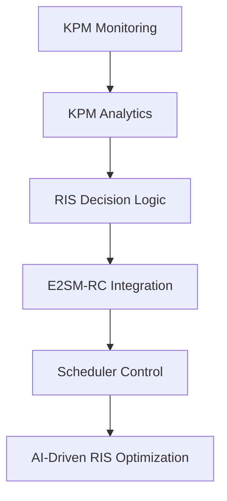

---

# 21. Expected Benefits

The RIS-Aware xApp is expected to provide:

* Improved CQI
* Higher throughput
* Reduced delay
* Better PRB utilization
* Better spectral efficiency
* Adaptive scheduler behavior
* Autonomous radio optimization

---

# 22. Final Architecture

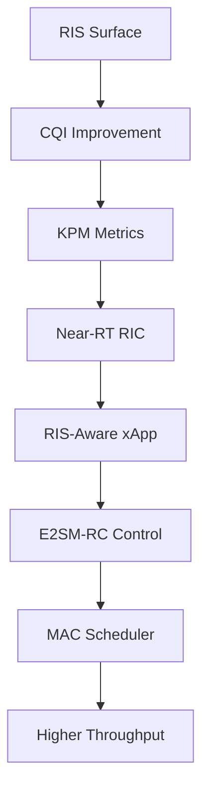

---

# 23. Conclusion

The RIS-Aware xApp represents the first practical step toward integrating programmable radio environments into the O-RAN ecosystem. By combining E2SM-KPM monitoring with E2SM-RC control, the xApp can create a closed-loop optimization framework where RIS configurations are continuously adapted based on real network measurements.

This architecture forms the foundation for future AI-driven RIS control systems and provides a clear path toward 6G intelligent radio environments.
