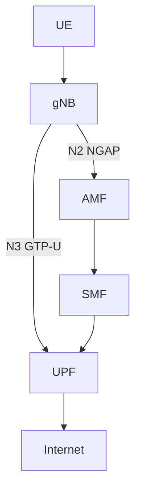

# Successful 5G SA Deployment

Date: 23 June 2026

## Objective

Deploy a complete 5G Standalone architecture using:

- OAI Core
- UERANSIM gNB
- UERANSIM UE

## Architecture

## Achievements

AMF deployed
SMF deployed
UPF deployed
NG Setup Successful
UE Registration Successful
Authentication Successful
PDU Session Established
UE IP Allocated
UE IP

12.1.1.131

## Key Learning

N2 = NGAP

N3 = GTP-U

AMF = Control Plane

UPF = User Plane

gNB = Radio Access Network

UE = User Equipment