# UERANSIM Deployment Guide with OAI 5G Core

## 1. Objective

This guide explains how to prepare and deploy UERANSIM with an OAI 5G Core.

The target architecture is:

* Terminal 1: OAI 5G Core
* Terminal 2: UERANSIM gNB
* Terminal 3: UERANSIM UE

This gives a more realistic setup than GNBSIM because gNB and UE run as separate components.

---

# 2. Target Architecture

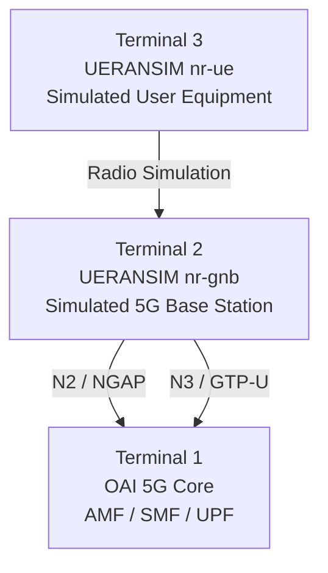

---

# 3. Why UERANSIM After GNBSIM?

GNBSIM combines gNB and UE simulation into one container.

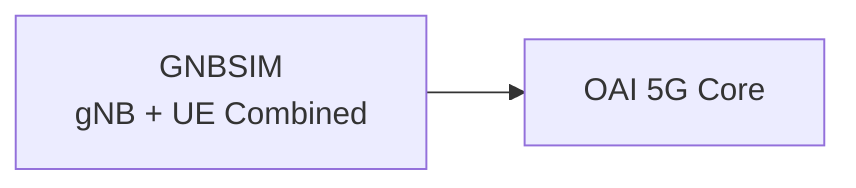

UERANSIM separates them.

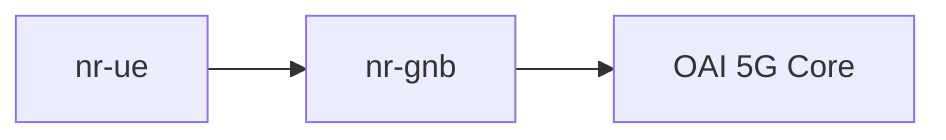

This is closer to a real 5G network.

---

# 4. Prerequisites

Before starting UERANSIM deployment, the following should already be completed:

* Ubuntu 22.04 installed
* Docker installed
* Docker Compose installed
* OAI CN5G repository cloned
* OAI Core successfully deployed
* GNBSIM test completed
* UE Registration and PDU Session tested with GNBSIM

---

# 5. Install Required Packages

Run:

```bash
sudo apt update
sudo apt install make gcc g++ libsctp-dev lksctp-tools iproute2 git cmake -y
```

Explanation:

| Package      | Purpose                 |
| ------------ | ----------------------- |
| make         | Build automation        |
| gcc/g++      | C/C++ compiler          |
| libsctp-dev  | SCTP support            |
| lksctp-tools | SCTP testing tools      |
| iproute2     | Network interface tools |
| git          | Clone repository        |
| cmake        | Build configuration     |

---

# 6. Clone UERANSIM

```bash
cd ~/Research

git clone https://github.com/aligungr/UERANSIM.git

cd UERANSIM
```

Check repository:

```bash
ls
```

Expected important folders:

```text
config
src
build
```

---

# 7. Build UERANSIM

Run:

```bash
make
```

After successful build, binaries are generated:

```text
build/nr-gnb
build/nr-ue
```

Verify:

```bash
ls build
```

Expected:

```text
nr-gnb
nr-ue
```

---

# 8. UERANSIM Important Files

Main configuration files are usually inside:

```bash
config/
```

Important files:

```text
open5gs-gnb.yaml
open5gs-ue.yaml
```

For OAI Core, we may copy and modify these files.

Recommended:

```bash
cp config/open5gs-gnb.yaml config/oai-gnb.yaml
cp config/open5gs-ue.yaml config/oai-ue.yaml
```

---

# 9. Configuration Parameters to Understand

## gNB Config Parameters

| Parameter  | Meaning             |
| ---------- | ------------------- |
| mcc        | Mobile Country Code |
| mnc        | Mobile Network Code |
| nci        | NR Cell Identity    |
| idLength   | gNB ID length       |
| tac        | Tracking Area Code  |
| linkIp     | gNB local IP        |
| ngapIp     | N2 interface IP     |
| gtpIp      | N3 interface IP     |
| amfConfigs | AMF IP and port     |

---

## UE Config Parameters

| Parameter        | Meaning                         |
| ---------------- | ------------------------------- |
| supi             | Subscriber identity             |
| mcc              | Mobile Country Code             |
| mnc              | Mobile Network Code             |
| key              | Authentication key              |
| op/opc           | Operator code                   |
| amf              | Authentication Management Field |
| sessions         | PDU session configuration       |
| configured-nssai | Slice information               |

---

# 10. OAI Core Network Check

Before starting UERANSIM, first start OAI Core.

Terminal 1:

```bash
cd ~/Research/OAI/oai-cn5g-fed

docker-compose -f docker-compose/docker-compose-mini-nonrf.yaml up -d
```

Check:

```bash
docker ps
```

Expected containers:

```text
mysql
oai-amf
oai-smf
oai-upf
oai-ext-dn
```

All should be healthy.

---

# 11. Find AMF IP Address

Run:

```bash
docker inspect oai-amf | grep IPAddress
```

or:

```bash
docker network inspect demo-oai-public-net
```

Note the AMF IP address.

This IP must be used in the UERANSIM gNB configuration.

---

# 12. Network Architecture for UERANSIM

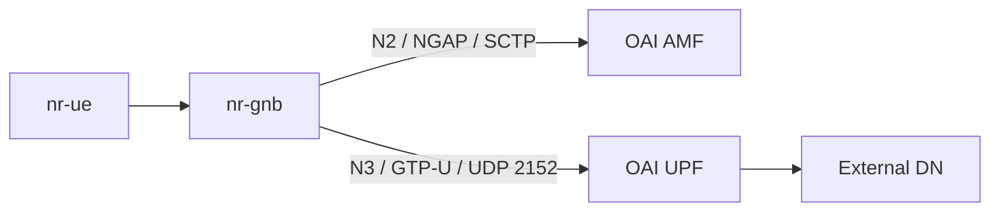

---

# 13. Configure nr-gnb

Open:

```bash
code ~/Research/UERANSIM/config/oai-gnb.yaml
```

Important fields:

```yaml
mcc: '208'
mnc: '95'

nci: '0x000000010'
idLength: 32
tac: 1

linkIp: 192.168.70.130
ngapIp: 192.168.70.130
gtpIp: 192.168.70.130

amfConfigs:
  - address: 192.168.70.132
    port: 38412
```

Important:

* `mcc`, `mnc`, and `tac` must match OAI Core configuration.
* `amfConfigs.address` must point to OAI AMF IP.
* `ngapIp` and `gtpIp` should be reachable from AMF/UPF.

---

# 14. Configure nr-ue

Open:

```bash
code ~/Research/UERANSIM/config/oai-ue.yaml
```

Important fields:

```yaml
supi: 'imsi-208950000000031'
mcc: '208'
mnc: '95'

key: '0C0A34601D4F07677303652C0462535B'
op: '63bfa50ee6523365ff14c1f45f88737d'
opType: 'OP'

amf: '8000'

sessions:
  - type: 'IPv4'
    apn: 'oai'
```

Important:

* IMSI must exist in OAI database.
* Key and OP/OPC must match subscriber database.
* APN/DNN must match OAI SMF configuration.

---

# 15. Start nr-gnb

Terminal 2:

```bash
cd ~/Research/UERANSIM

sudo ./build/nr-gnb -c config/oai-gnb.yaml
```

Expected behavior:

```text
NG Setup Request sent
NG Setup Response received
```

This means gNB successfully connected to AMF.

---

# 16. Start nr-ue

Terminal 3:

```bash
cd ~/Research/UERANSIM

sudo ./build/nr-ue -c config/oai-ue.yaml
```

Expected behavior:

```text
Registration successful
PDU Session established
UE IP allocated
```

---

# 17. Expected Flow

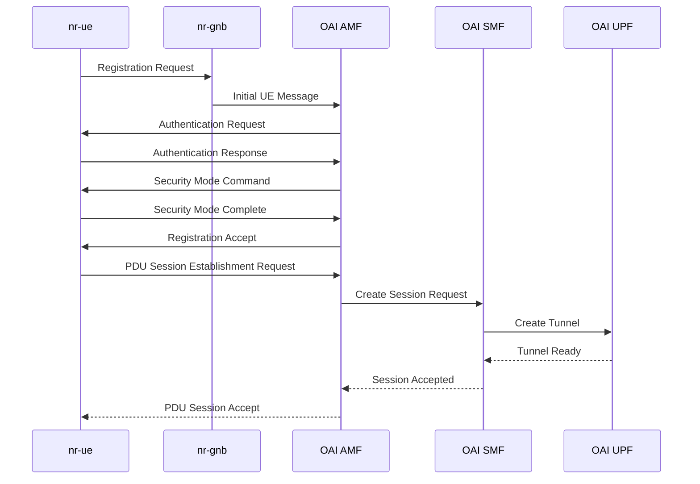

---

# 18. Verification Commands

## Check OAI Core

```bash
docker ps
```

## Check AMF logs

```bash
docker logs oai-amf --tail 100
```

## Check SMF logs

```bash
docker logs oai-smf --tail 100
```

## Check UPF logs

```bash
docker logs oai-upf --tail 100
```

## Check UE Interface

After nr-ue starts:

```bash
ip a
```

Look for a tunnel interface such as:

```text
uesimtun0
```

---

# 19. Test Internet Connectivity

If UE gets an IP address:

```bash
ping -I uesimtun0 8.8.8.8
```

If DNS works:

```bash
ping -I uesimtun0 google.com
```

---

# 20. Common Issues

## Issue 1: gNB Cannot Connect to AMF

Possible causes:

* Wrong AMF IP
* SCTP blocked
* AMF container not healthy
* Docker network mismatch

Check:

```bash
docker logs oai-amf --tail 100
```

---

## Issue 2: UE Registration Fails

Possible causes:

* IMSI mismatch
* Key mismatch
* OP/OPC mismatch
* MCC/MNC mismatch
* TAC mismatch

---

## Issue 3: PDU Session Fails

Possible causes:

* Wrong APN/DNN
* SMF configuration mismatch
* UPF unreachable
* Route issue

---

## Issue 4: UE Gets IP But Cannot Ping

Possible causes:

* Missing route
* NAT issue
* UPF forwarding issue
* DNS issue

Try:

```bash
ping -I uesimtun0 8.8.8.8
```

---

# 21. Three-Terminal Workflow

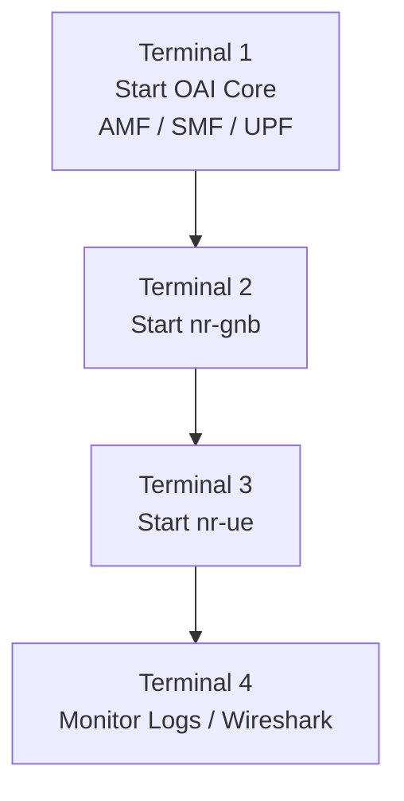

---

# 22. Difference Between GNBSIM and UERANSIM

| Feature                   | GNBSIM | UERANSIM |
| ------------------------- | ------ | -------- |
| gNB and UE separated      | No     | Yes      |
| Realistic workflow        | Medium | Higher   |
| Good for first test       | Yes    | Yes      |
| Three-terminal workflow   | No     | Yes      |
| Closer to real deployment | Less   | More     |
| Useful before OAI gNB     | Yes    | Yes      |

---

# 23. Relation to O-RAN

UERANSIM prepares us for O-RAN because it separates:

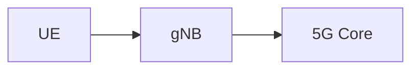

O-RAN further splits gNB into:

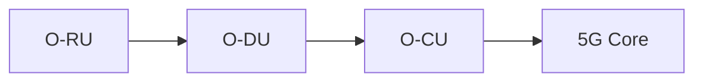

---

# 24. Relation to RIS

Future RIS-assisted architecture:

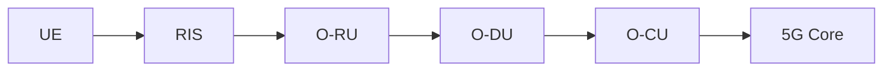

RIS improves:

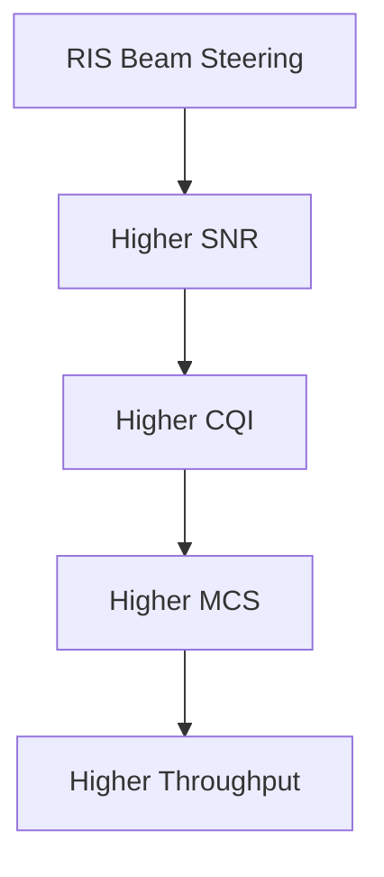

---

# 25. Mentor Update After Successful UERANSIM Test

After successful deployment, report:

```text
Sir, I completed UERANSIM study and deployment preparation. I understood the separation of nr-gnb and nr-ue, N2/NGAP signaling, N3/GTP-U user-plane flow, and how UERANSIM connects to the OAI Core. This is the next step after GNBSIM because it gives a closer real-world three-terminal architecture: Core, gNB, and UE.
```

---

# 26. Final Takeaway

UERANSIM is the bridge between basic GNBSIM simulation and real OAI gNB/O-RAN deployment.

Progression:

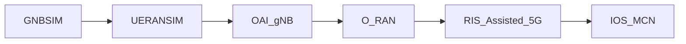
