# UERANSIM Study

## 1. Objective

This document provides a detailed study of UERANSIM and its role in a 5G Standalone (SA) network.

The objective is to understand:

* UERANSIM Architecture
* nr-gnb
* nr-ue
* Integration with OAI Core
* NGAP Signaling
* GTP-U Data Plane
* Registration Procedure
* PDU Session Establishment
* End-to-End Traffic Flow

This study forms the foundation for:

* OAI Core + UERANSIM Deployment
* OAI gNB Deployment
* O-RAN Deployment
* IOS-MCN Research
* RIS-Assisted 5G Networks

---

# 2. What is UERANSIM?

UERANSIM is an open-source 5G User Equipment and gNB simulator.

It allows developers and researchers to test a complete 5G network without requiring actual radio hardware.

UERANSIM provides:

* Simulated UE
* Simulated gNB
* NGAP Support
* NAS Support
* GTP-U Support
* Registration Procedures
* PDU Session Establishment

---

# 3. Why UERANSIM?

Without UERANSIM:


Requires:

* SDR Hardware
* Real Radio
* Antennas
* RF Environment

---

With UERANSIM:

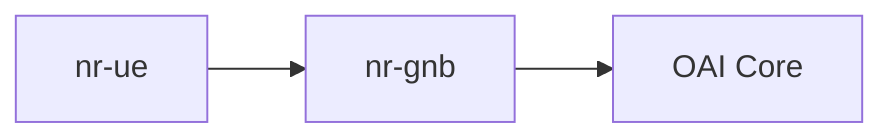

Everything runs in software.

---

# 4. UERANSIM Components

UERANSIM consists of two main modules.

## nr-gnb

Simulates:

* 5G Base Station
* NG-RAN Node

Responsibilities:

* Connect to AMF
* Handle NGAP
* Forward NAS Messages
* Create GTP-U Tunnels

---

## nr-ue

Simulates:

* 5G Smartphone
* IoT Device
* Industrial Device

Responsibilities:

* Registration
* Authentication
* PDU Session Setup
* Data Transmission

---

# 5. UERANSIM Architecture

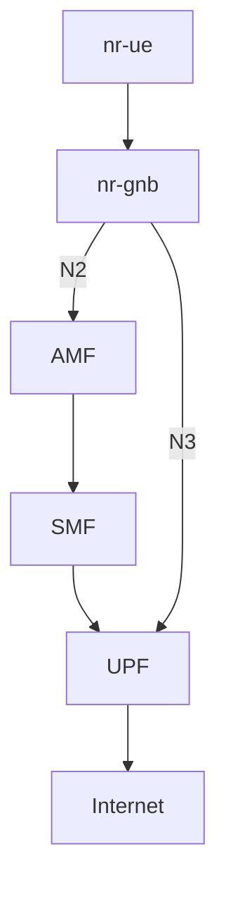

---

# 6. UERANSIM and OAI Core

Current Deployment:

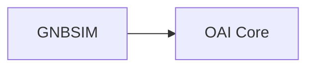

GNBSIM acts as:

* UE
* gNB

at the same time.

---

Future Deployment:


This separates:

* User Equipment
* Base Station

just like a real network.

---

# 7. What is nr-gnb?

nr-gnb is the simulated 5G base station.

Functions:

* Connects to AMF
* Handles N2 Interface
* Creates N3 Interface
* Exchanges NGAP Messages
* Manages UE Context

---

# 8. nr-gnb Interfaces

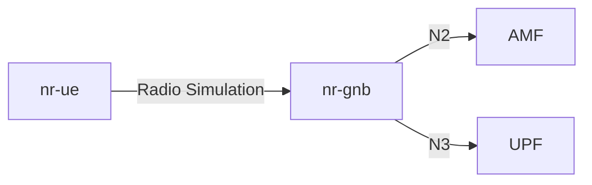

---

# 9. What is nr-ue?

nr-ue is the simulated User Equipment.

It behaves like:

* Smartphone
* Modem
* IoT Device

Functions:

* Cell Selection
* Registration
* Authentication
* PDU Session Establishment
* Internet Access

---

# 10. UERANSIM Configuration Files

Two important configuration files:

## gNB Configuration

```text
open5gs-gnb.yaml
```

Contains:

* AMF IP Address
* TAC
* MCC
* MNC
* gNB ID

---

## UE Configuration

```text
open5gs-ue.yaml
```

Contains:

* IMSI
* Key
* OP/OPC
* APN
* Slice Information

---

# 11. Understanding IMSI

Full Form:

International Mobile Subscriber Identity

Example:

```text
208950000000031
```

Structure:


---

# 12. Understanding MCC and MNC

## MCC

Mobile Country Code

Example:

```text
208
```

Country identifier.

---

## MNC

Mobile Network Code

Example:

```text
95
```

Operator identifier.

---

# 13. Understanding TAC

Full Form:

Tracking Area Code

Example:

```text
000001
```

Used by AMF for mobility management.

---

# 14. How nr-gnb Connects to AMF

When nr-gnb starts:

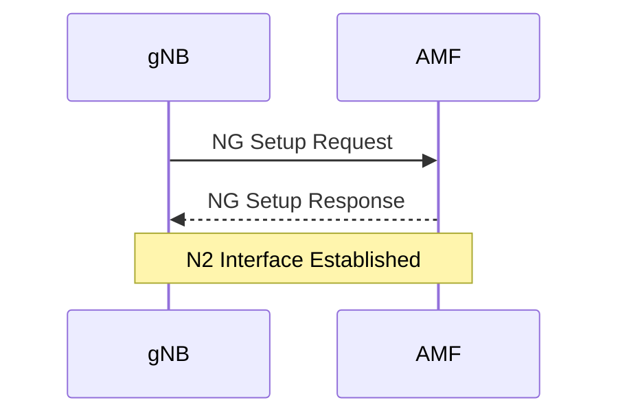

---

# 15. N2 Interface

N2 = Control Plane Interface

Protocols:

* SCTP
* NGAP

Used for:

* Registration
* Authentication
* Mobility
* Session Management

---

# 16. N3 Interface

N3 = User Plane Interface

Protocol:

* GTP-U

Used for:

* Internet Traffic
* Application Data
* User Packets

---

# 17. Registration Procedure

The UE registration process.

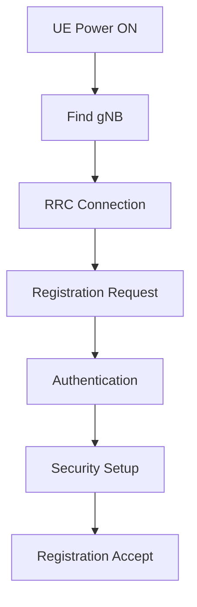

---

# 18. Registration Signaling

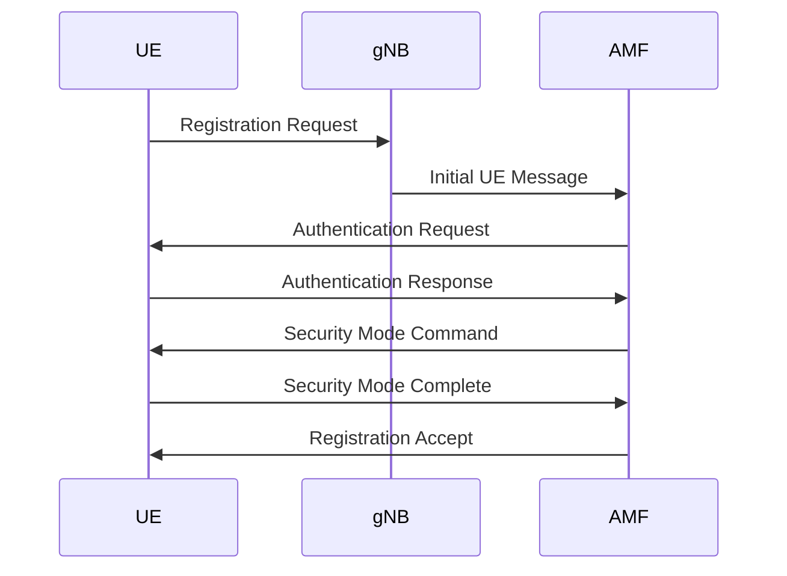

---

# 19. PDU Session Establishment

Purpose:

Provide UE with:

* IP Address
* Internet Connectivity

---

# PDU Session Flow

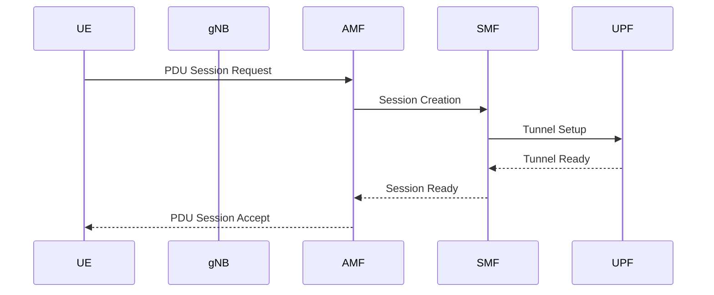

---

# 20. User Plane Data Flow

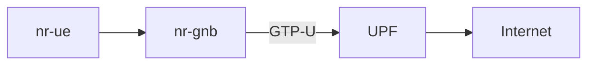

---

# 21. Three-Terminal Deployment Architecture

This is the architecture your senior explained.

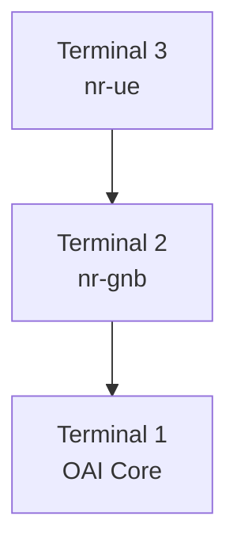

---

# 22. Deployment Sequence

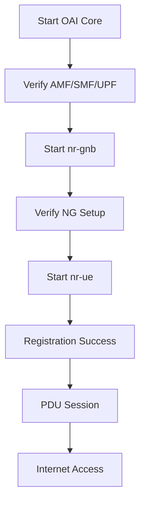

---

# 23. Relation to O-RAN

UERANSIM helps understand:


Before deploying O-RAN, one must understand:

* gNB
* UE
* N2
* N3
* NGAP
* GTP-U

which UERANSIM demonstrates clearly.

---

# 24. Relation to RIS Research

Future architecture:

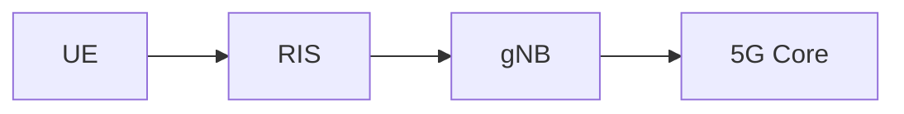

RIS affects:

* Signal Strength
* SNR
* CQI
* MCS
* Throughput

which ultimately improves UE performance.

---

# 25. Mentor Discussion Points

1. What is UERANSIM?

   * Open-source 5G UE and gNB simulator.

2. What is nr-gnb?

   * Simulated 5G Base Station.

3. What is nr-ue?

   * Simulated User Equipment.

4. What is N2?

   * Control Plane Interface using NGAP.

5. What is N3?

   * User Plane Interface using GTP-U.

6. Why use UERANSIM?

   * Realistic software-based 5G testing without SDR hardware.

7. What comes after UERANSIM?

   * OAI gNB Deployment → O-RAN → RIS Integration.

---

# 26. Conclusion

UERANSIM provides a realistic software implementation of a 5G gNB and UE. It allows researchers to study registration procedures, NGAP signaling, GTP-U tunnels, and PDU session establishment before moving toward real OAI gNB deployments, O-RAN architectures, and RIS-assisted 5G/6G systems.
