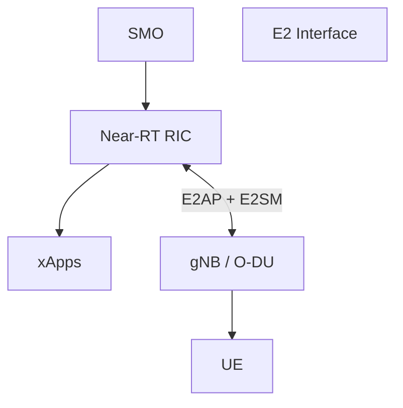
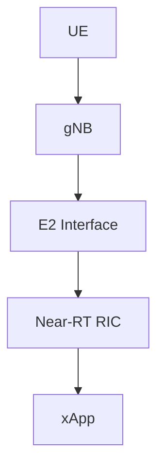
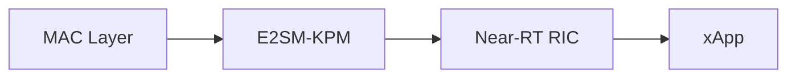
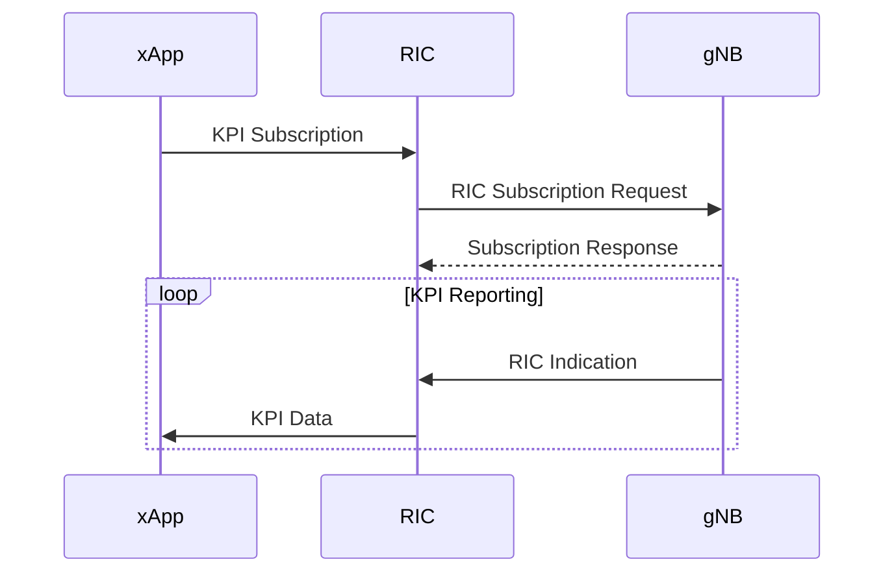
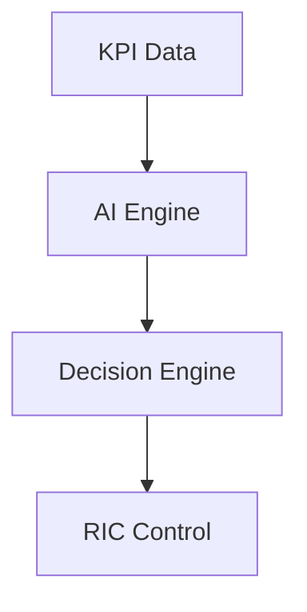
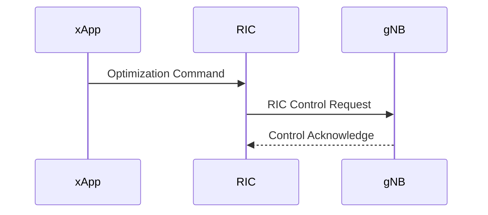
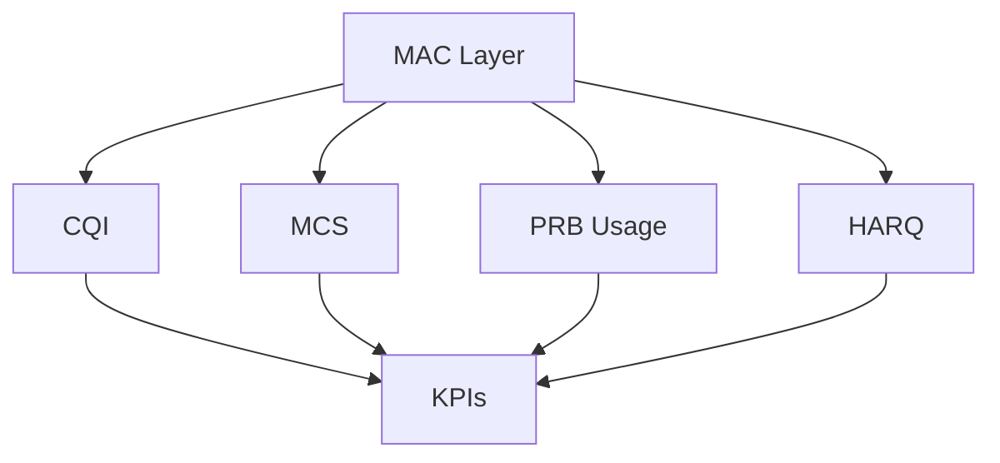
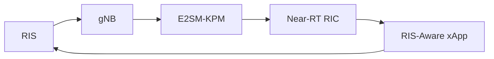
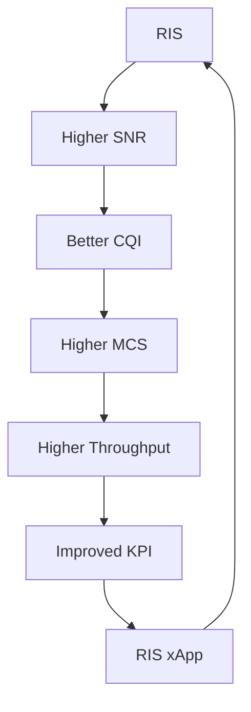
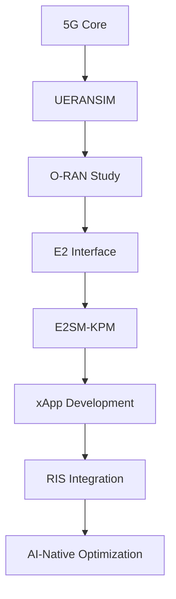

# xApp Development Roadmap

## Objective

This document provides a complete roadmap for understanding and developing xApps in the O-RAN ecosystem.

The study covers:

* What is an xApp?
* Near-RT RIC Architecture
* xApp Lifecycle
* KPI Collection
* E2AP Integration
* E2SM-KPM Integration
* AI-Based Decision Making
* RAN Control
* RIS-Aware xApp Design
* Future AI-Native RAN Optimization

This study serves as the foundation for:

* O-RAN Research
* Near-RT RIC Development
* AI-Native Networks
* RIS-Assisted Networks
* 6G Autonomous Networks

---

# 1. O-RAN Intelligent Architecture



---

# 2. What is an xApp?

An xApp is an application running inside the Near-RT RIC.

Purpose:

```text
Observe Network
Analyze Network
Optimize Network
Control Network
```

An xApp is similar to:

```text
Mobile App
      ↓
Smartphone

xApp
      ↓
Near-RT RIC
```

---

# 3. Why xApps Exist

Traditional RAN:

```text
Fixed Rules
Static Optimization
Vendor Specific
```

O-RAN introduces:

```text
Programmable Intelligence
```

Through:

```text
Near-RT RIC
+
xApps
```

Benefits:

* Vendor Independence
* AI Integration
* Dynamic Optimization
* Real-Time Decision Making

---

# 4. Near-RT RIC Overview

## Full Form

Near-RT RIC

= Near Real-Time RAN Intelligent Controller

Decision Time:

```text
10 ms
to
1 second
```

Responsibilities:

* KPI Monitoring
* Traffic Steering
* Load Balancing
* Mobility Optimization
* Beam Management
* Resource Optimization

---

# 5. Position of xApp



The xApp never directly talks to the UE.

The xApp communicates through:

```text
Near-RT RIC
```

---

# 6. How xApp Receives Information

The xApp receives:

```text
CQI
PRB Usage
Throughput
Latency
Packet Loss
MCS
HARQ Statistics
```

Source:

```text
gNB MAC Layer
```

Path:



---

# 7. KPI Collection Workflow



---

# 8. Typical KPIs Used by xApps

| KPI             | Purpose          |
| --------------- | ---------------- |
| CQI             | Channel Quality  |
| SINR            | Signal Quality   |
| PRB Utilization | Resource Usage   |
| Throughput      | Network Capacity |
| MCS             | Link Efficiency  |
| HARQ Success    | Reliability      |
| Latency         | Delay            |
| Packet Loss     | QoS              |

---

# 9. xApp Decision Engine

An xApp usually contains:



The AI engine processes network telemetry and generates optimization actions.

---

# 10. Types of xApps

### KPI Monitoring xApp

Monitors network health.

---

### Traffic Steering xApp

Redirects traffic.

---

### Mobility xApp

Optimizes handovers.

---

### Load Balancing xApp

Balances cell utilization.

---

### Energy Saving xApp

Reduces power consumption.

---

### Beam Management xApp

Optimizes beamforming.

---

### RIS-Aware xApp

Controls RIS-assisted optimization.

---

# 11. RIC Control Procedure

After analyzing KPIs:



---

# 12. AI-Based xApp

Modern xApps often use:

```text
Machine Learning
Deep Learning
Reinforcement Learning
```

Inputs:

```text
CQI
SINR
Throughput
Latency
PRB Usage
```

Outputs:

```text
Scheduling Decisions
Beam Decisions
RIS Configuration
Traffic Steering
```

---

# 13. Relation to MAC Layer

Most xApps rely on MAC Layer information.



---

# 14. RIS-Aware xApp Concept

Future Architecture:



---

# 15. RIS Optimization Loop



---

# 16. Future Research Direction

Your internship roadmap:



---

# 17. Mentor Questions

### What is an xApp?

An application running inside the Near-RT RIC that monitors and optimizes RAN performance.

### What does an xApp receive?

KPIs from E2SM-KPM through the E2 Interface.

### What protocol is used?

E2AP.

### What service model is commonly used?

E2SM-KPM.

### What can an xApp control?

Scheduling, mobility, traffic steering, beam management, and future RIS optimization.

### Why is xApp important?

It enables AI-driven, vendor-independent, real-time network optimization.

### How is RIS related?

RIS improves radio conditions, and a RIS-aware xApp can use KPI feedback to dynamically optimize RIS configurations.

---

# Conclusion

xApps are the intelligence layer of O-RAN. They receive KPI telemetry through E2SM-KPM, analyze network behavior using AI algorithms, and issue optimization decisions through the Near-RT RIC. In future RIS-assisted networks, RIS-aware xApps will continuously optimize the radio environment, creating a closed-loop AI-native 6G architecture capable of autonomous network management.
