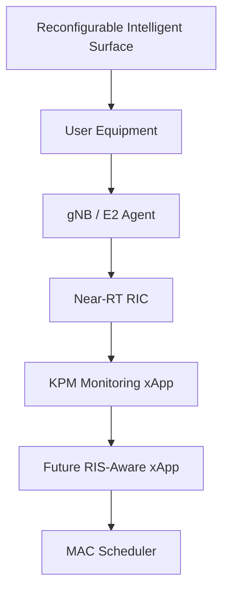
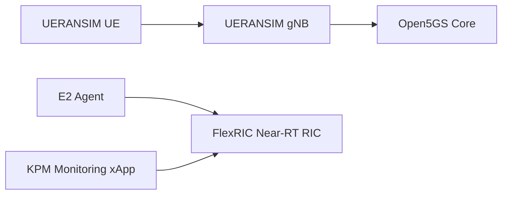
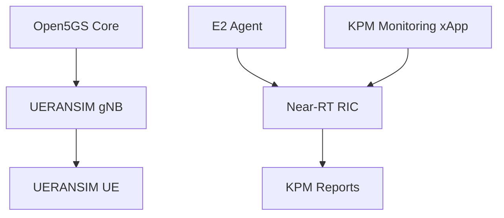
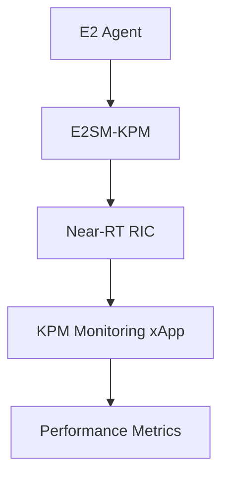
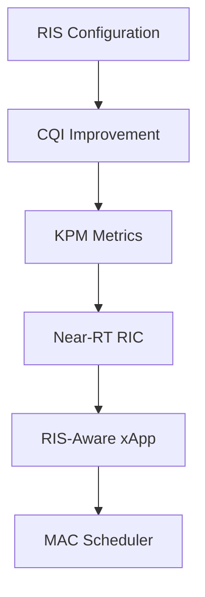
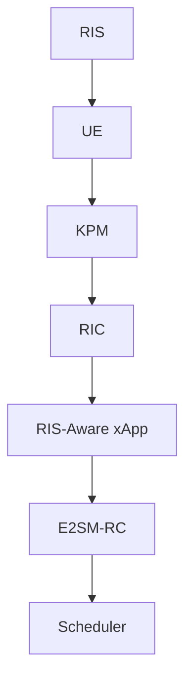

# Deployment and Evaluation of Open5GS, UERANSIM, FlexRIC and KPM Monitoring xApp for RIS-Assisted O-RAN Research

## Overview

This repository documents the deployment, integration, and evaluation of an end-to-end Open RAN research environment consisting of:

- Open5GS 5G Core Network
- UERANSIM gNB and UE Emulator
- FlexRIC Near-RT RIC
- E2 Agent Emulator
- E2SM-KPM Service Model
- KPM Monitoring xApp
- RIS-Aware O-RAN Research Framework

The objective of this work is to establish a complete O-RAN experimentation platform capable of collecting real-time network performance metrics and enabling future development of RIS-aware intelligent control applications.

---

## Research Motivation

Reconfigurable Intelligent Surfaces (RIS) are expected to become a key enabling technology for 6G networks.

RIS can improve:

- Signal Quality
- Coverage
- Spectral Efficiency
- Throughput
- Reliability

However, current RAN architectures have limited visibility into how RIS impacts network performance.

This project investigates how:

- RIS influences radio quality indicators
- KPM Service Models expose network KPIs
- Near-RT RIC can collect these KPIs
- xApps can make intelligent control decisions
- MAC Scheduler optimization can be performed through O-RAN interfaces

---

## System Architecture



---

## Deployment Architecture



---

## Components

### Open5GS

Provides:

- AMF
- SMF
- UPF
- NRF
- UDM
- AUSF

Functions:

- UE Registration
- Authentication
- Session Management
- User Plane Routing

---

### UERANSIM

Used for:

- 5G gNB Emulation
- 5G UE Emulation

Capabilities:

- NGAP Signaling
- NAS Procedures
- PDU Session Establishment

---

### FlexRIC

Provides:

- Near-RT RIC
- E2 Interface
- Service Model Framework
- xApp Runtime

---

### E2 Agent

Publishes:

- KPM Measurements
- MAC Statistics
- RLC Statistics
- PDCP Statistics

to the Near-RT RIC.

---

### KPM Monitoring xApp

Subscribes to:

- ORAN-E2SM-KPM-v02.03

Receives:

- UE Throughput
- PDCP Volume
- PRB Utilization
- RLC Delay

in real time.

---

## Experimental Workflow



---

## KPM Monitoring Workflow



---

## Collected KPM Metrics

### Radio Resource Metrics

- PRB Total DL
- PRB Total UL

### PDCP Metrics

- PDCP Volume DL
- PDCP Volume UL

### RLC Metrics

- RLC SDU Delay

### Throughput Metrics

- UE Throughput DL
- UE Throughput UL

---

## Sample KPM Output

```text
DRB.PdcpSduVolumeDL = 971 [kb]
DRB.PdcpSduVolumeUL = 108 [kb]

DRB.RlcSduDelayDL = 5.38 [µs]

DRB.UEThpDl = 5.09 [kbps]
DRB.UEThpUl = 6.30 [kbps]

RRU.PrbTotDl = 282 [PRBs]
RRU.PrbTotUl = 597 [PRBs]
```

---

## RIS to KPM Mapping



---

## Future RIS-Aware O-RAN Control Loop



---

## Key Achievements

### 5G Core

✅ Open5GS deployed successfully

### RAN

✅ UERANSIM gNB operational

✅ UERANSIM UE registration successful

### Connectivity

✅ PDU Session established

✅ Internet connectivity verified

### O-RAN

✅ FlexRIC Near-RT RIC deployed

✅ E2 Agent connected

✅ KPM Service Model loaded

### Monitoring

✅ KPM xApp subscribed successfully

✅ Real-time KPI collection demonstrated

### Research

✅ RIS-KPM-MAC interaction framework designed

✅ RIS-aware xApp architecture proposed

---

## Research Outcomes

This work demonstrates a complete proof-of-concept O-RAN research environment capable of:

- Collecting real-time KPM measurements
- Monitoring RAN performance
- Supporting future RIS-aware optimization
- Enabling AI-driven Near-RT RIC applications
- Providing a foundation for intelligent MAC scheduling research

---

## Author

**Mrigank Jaiswal**

B.Tech Electronics and Communication Engineering

Central University of Jammu

Research Intern – COMET Foundation, IIIT Bangalore

Research Areas:

- O-RAN
- 5G/6G Networks
- RIS
- Near-RT RIC
- FlexRIC
- AI-Native Wireless Networks
- Intelligent Radio Resource Management

---

## Acknowledgement

This work was carried out under the guidance of:

**Prof. Ajay Bakre**

COMET Foundation

IIIT Bangalore

as part of ongoing research activities in Open RAN, FlexRIC, and RIS-assisted wireless communication systems.